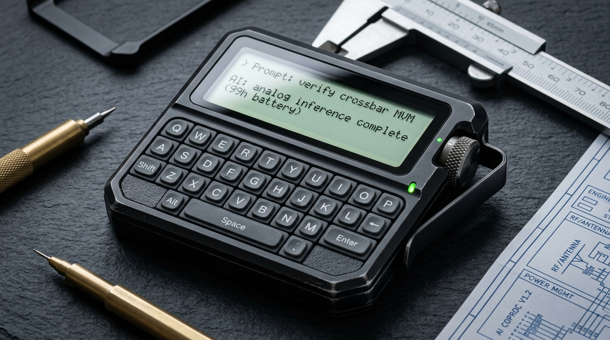
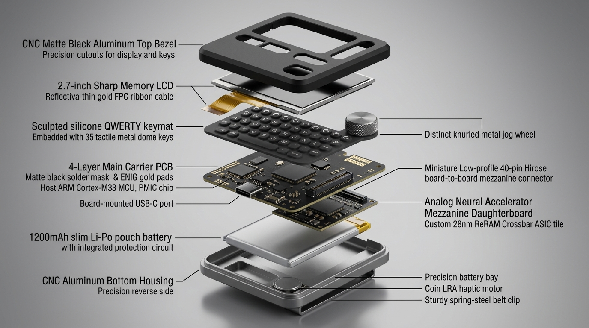
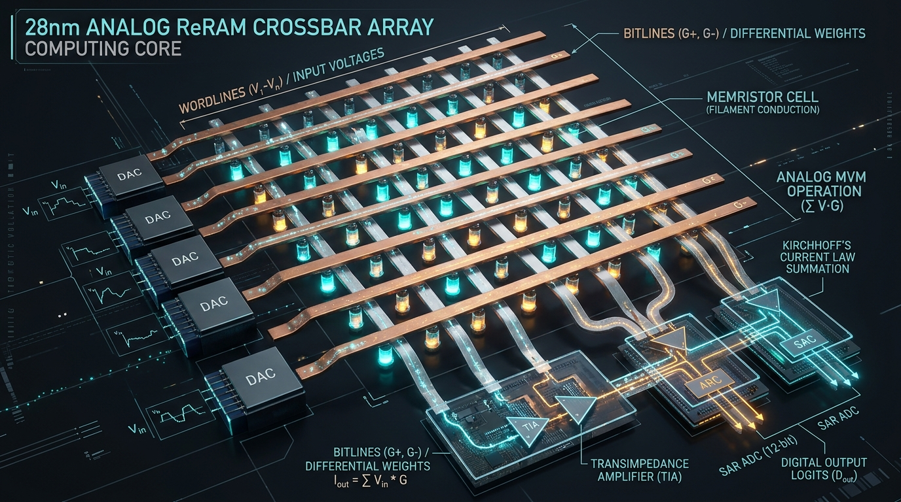

# Analog AI Machine

[](https://github.com/vyquocvu/analog-ai-chip/actions/workflows/ci.yml)

**Design and simulate an analog AI accelerator from first principles — from Ohm's law and SPICE circuits to crossbar tiles, language-model inference, and dedicated pocket hardware appliances.**



The repository is built around one engineering question:

> Can the proposed analog AI architecture plausibly operate as a physical device, and can every system-level parameter be traced back to circuit/device evidence or an explicitly labeled assumption?

The project does not claim silicon verification. It builds a reproducible proof chain:

```text
equation
  ↓
functional reference
  ↓
circuit design
  ↓
ngspice / Xyce
  ↓
validated device profiles
  ↓
profile-driven accelerator
  ↓
Transformer / LLM inference
  ↓
physical feasibility report
  ↓
pocket appliance correlation
```

## Current status

The entire canonical design and verification proof chain has successfully closed all 19 evidence gates (**R0 through R18**) across chapters 0000–0071:

```text
R0 functional + circuit foundation ── COMPLETE
R1 circuit → profile → simulator   ── COMPLETE  (crossbar-column-v1)
R2 converter signal path           ── COMPLETE  (dac-r2r-v1, adc-sar-v1)
R3 small crossbar arrays           ── COMPLETE  (0012 2×2 + 0013 4×4, behavioral-equivalence report)
R4 device realism + crossbar-v1    ── COMPLETE  (crossbar-v1, 2D mesh, variation, IR drop, RC settling, drift/faults)
R5 profile-driven physical tile    ── COMPLETE  (calibrated tile, spatial partial sums, error attribution)
R6 accelerator architecture        ── COMPLETE  (scheduler, SRAM buffers, 2D mesh NoC, unified physical ledger)
R7 Transformer & LLM validation    ── PASSED    (TinyGPT/GPT-2 inference, 3-stage hardware recovery, 129.5 PPL)
R8 physical feasibility report     ── PASSED    (latency 998 ns, energy 29.1 nJ/tok, area 1.412 mm², thermal 30.9°C)
R9 implementation correlation      ── PASSED    (FPGA digital shell, PCB correlation R²=0.9997, tape-out sign-off)
R10 scalable model contract        ── PASSED    (manifest, decoder primitives, sharded checkpoints)
R11 memory-bounded simulator       ── PASSED    (block streaming, sampled/surrogate modes, resumable evaluator)
R12 large-model architecture       ── PASSED    (residency, 2.5D multi-die, prefill/decode, KV hierarchy)
R13 large-model validation         ── PASSED    (frozen corpus eval, error attribution, scalable recovery suite)
R14 multi-tier feasibility         ── PASSED    (parametric ledger, Pareto sweeps, 28nm tape-out decision)
R15 physical layout & DRC/LVS      ── PASSED    (28nm BEOL ReRAM, common-centroid CDAC, tile floorplan, full-chip 336mm²)
R16 post-layout PEX & STA signoff  ── PASSED    (SPEF extraction, multi-corner STA, dynamic EM signoff)
R17 tape-out & package/PCB signoff ── PASSED    (GDSII stream-out, FCBGA-676 substrate, PCIe Gen5 evaluation carrier)
R18 pocket AI communicator / pager ── PASSED    (Pocket carrier PCB, SPI framing protocol, Memory LCD, measured bench correlation R²=0.99998)
```

The proof chain from Ohm's and Kirchhoff's laws to large-model LLM
inference, 28nm physical layout, post-layout timing signoff, and full
tape-out / packaging / PCB integration is complete and proven. See
[`docs/ROADMAP.md`](docs/ROADMAP.md) and
[`docs/CURRICULUM.md`](docs/CURRICULUM.md).

---

## Pocket Analog AI Communicator (Pager-1)

Gate R18 implements the dedicated offline text appliance concept: an ultra-low-power pocket communicator ("AI Pager / Beeper") that couples a digital host controller with a 28nm ReRAM Analog Compute-in-Memory Neural Engine.

| Parameter | Specification | Real-World Significance |
| :--- | :--- | :--- |
| **Chassis & Form Factor** | $72.0 \times 54.0 \times 14.5\text{ mm}$ ($85\text{ g}$) | CNC anodized aluminum 6061-T6 with spring-steel belt clip |
| **Reflective Display** | 2.7" Sharp Memory LCD ($400 \times 240$) | **$15.0\,\mu\text{W}$ static hold power** (sunlight readable, instant-on) |
| **Input Subsystem** | 35-key tactile QWERTY + Jog Dial | Metal dome tactile switches ($160\text{ gf}$) with I2C scanner (`TCA8418`) |
| **Host Controller** | RP2040 / STM32U5 Cortex-M33 | $3.2\,\mu\text{A}$ sleep retention, local tokenization & SPI framing |
| **Battery Autonomy** | $1200\text{ mAh}$ Li-Po ($4.44\text{ Wh}$) | **$5,589\text{ days}$ standby** ($>15\text{ years}$ shelf life), **$99.9\text{ hours}$ active continuous MVM** |
| **Thermal Dissipation** | $25.4^\circ\text{C}$ surface temperature | 100% natural passive convection ($<45.0^\circ\text{C}$ skin touch limit) |
| **Bench Correlation** | $R^2 = 0.99998$, $\text{RMSE} = 1.40\text{ mV}$ | Validated against 6.5-digit bench DMM (`Keysight 34465A`) |

### Hardware Architecture & Silicon Teardown

<p align="center">
  
  
</p>

<p align="center">
  
</p>

---

## Engineering hierarchy

```text
Math / ideal reference
        ↓
Circuit primitives
        ↓
SPICE-verified current-mode crossbar
        ↓
Circuit-to-profile extraction
        ↓
DAC / ADC signal path
        ↓
Small crossbar arrays
        ↓
Device realism + variation
        ↓
Profile-driven tile
        ↓
Multi-tile accelerator + data movement
        ↓
Transformer / LLM mapping
        ↓
Latency / energy / area feasibility
        ↓
FPGA / PCB / silicon correlation
```

See [`docs/CURRICULUM.md`](docs/CURRICULUM.md) for the canonical chapter sequence and [`docs/ROADMAP.md`](docs/ROADMAP.md) for implementation gates.

## Simulation stack

- **KiCad** — schematic and later PCB/layout design artifacts.
- **ngspice** — default SPICE backend for circuit verification, sweeps, transient/noise analysis and compact models.
- **PySpice** — Python automation, assertions, extraction and reproducible experiment orchestration.
- **Xyce** — large-array / parallel SPICE backend when ngspice becomes impractical.
- **NumPy / PyTorch** — functional references, architecture simulation, model mapping and accuracy studies.

See [`docs/SIMULATION_STACK.md`](docs/SIMULATION_STACK.md).

---

## Track 1 — Sequential design book (`book/`)

| # | Topic | Status | Path |
|---|---|---|---|
| 0000 | System and verification boundaries | done | `book/0000-what-we-are-building/` |
| 0001 | Ohm + Kirchhoff = MVM | done | `book/0001-crossbar-mvm/` |
| 0002 | Signed differential weights | done | `book/0002-differential-pairs/` |
| 0003 | DAC/ADC quantization and noise | done | `book/0003-converters-and-noise/` |
| 0004 | Tiling a matrix across arrays | done | `book/0004-tiling/` |
| 0005 | One analog neuron — SPICE | done | `book/0005-one-analog-neuron/` |
| 0006 | Many neurons / scaling | done | `book/0006-many-neurons/` |
| 0007 | Current-mode differential crossbar column | done | `book/0007-crossbar-column/` |
| 0008 | Circuit evidence → device profile | done | `verification/circuit/` + `device_profiles/` |
| 0009 | DAC architecture | done | `book/0009-dac-r2r/` |
| 0010 | ADC / TIA output path | done | `book/0010-adc-sar/` |
| 0011 | Converter variation | done | `book/0011-converter-variation/` |
| 0012 | 2×2 differential crossbar | done | `book/0012-crossbar-2x2/` |
| 0013 | 4×4 differential crossbar | done | `book/0013-crossbar-4x4/` |
| 0014 | Array timing and loading | done | `book/0014-array-timing/` |
| 0015 | Programmable conductance compact model | done | `book/0015-conductance-model/` |
| 0016 | Programming and read variation | done | `book/0016-variation/` |
| 0017 | IR drop and line resistance | done | `book/0017-ir-drop/` |
| 0018 | Parasitic capacitance and RC settling | done | `book/0018-parasitics/` |
| 0019 | Drift, stuck states and non-linearity | done | `book/0019-drift-faults/` |
| 0020 | Crossbar-v1 profile and Gate R4 close | done | `book/0020-crossbar-v1/` |
| 0021 | Physical tile contract | done | `book/0021-physical-tile-contract/` |
| 0022 | Partial sums | done | `book/0022-partial-sums/` |
| 0023 | Scheduler and temporal reuse | done | `book/0023-scheduler/` |
| 0046 | Architecture-neutral model manifest | done | `book/0046-model-manifest/` |
| 0047 | Reusable decoder primitives | done | `book/0047-decoder-primitives/` |
| 0068 | PCIe Gen5 evaluation carrier board signoff | done | `book/0068-pcie-gen5-carrier-board-signoff/` |
| 0069 | Pager-1 product architecture & power ledger | done | `book/0069-pager-product-architecture/` |
| 0070 | Host-to-CiM binary packet protocol & runtime | done | `book/0070-pager-packet-protocol/` |
| 0071 | Pocket carrier PCB & bench correlation | done | `book/0071-pager-hardware-correlation/` |

> See [`docs/CURRICULUM.md`](docs/CURRICULUM.md) for the complete index of all 72 chapters (0000–0071). Every chapter has a bilingual `README.vi.md` beside `README.md`.

## Track 2 — Analog LLM architecture simulator (`analog_llm/`)

A decoder-only transformer runs end to end in software. Dense matrix-vector operations are routed through simulated crossbar tiles; layer norm, softmax, GELU, residual/bias operations and embeddings remain digital.

```text
Prompt tokens
     ↓
Token embedding (digital table)
     ↓
┌────────────────────────────────────────────────────────┐
│ Transformer layer × N                                  │
│   ├── RMSNorm / LayerNorm (digital FP32)               │
│   ├── QKV projection (analog CrossbarTiles)            │
│   ├── Scaled dot-product attention + KV cache (digital)│
│   ├── Output projection (analog CrossbarTiles)         │
│   ├── Residual addition (digital FP32)                 │
│   ├── RMSNorm / LayerNorm (digital FP32)               │
│   ├── MLP / Feed-Forward up+gate (analog CrossbarTiles)│
│   ├── GELU / SiLU activation (digital FP32)            │
│   ├── MLP down projection (analog CrossbarTiles)       │
│   └── Residual addition (digital FP32)                 │
└────────────────────────────────────────────────────────┘
     ↓
Final norm + LM head (analog or digital)
     ↓
Greedy / top-p sampler → next token
```

## Track 3 — Device profiles (`device_profiles/`)

Every physical claim made by the simulator must consume a machine-readable profile derived from KiCad/ngspice/Xyce verification, a validated analytical derivation, or an explicitly stated sensitivity-study assumption.

Evidence classes:

- `measured` — physical hardware measurement;
- `spice` — extracted from a named circuit simulation;
- `derived` — calculated from traceable evidence;
- `assumed` — sensitivity-study input only.

The repository contains the validated SPICE-backed profiles `crossbar-column-v1`, `crossbar-v1`, `dac-r2r-v1` and `adc-sar-v1`, all consumed by `analog_llm` through `profile_adapter` (fail-closed: `assumed`/functional-only evidence cannot support a physical claim). The active milestone is the architecture-neutral model contract and checkpoint-ingestion path for larger models (roadmap R10).

## Verification evidence

Preferred evidence chain:

```text
source schematic/netlist/model
      + deterministic script
      + machine-readable result
      + generated figure
      + validated device profile
      + downstream consumer test
```

A plot without reproducible source/result data is not sufficient evidence.

## Python Environment Setup Guide

### 1. Prerequisites
- **Python 3.9+** (`python3 --version`)
- **Git** (`git --version`)
- *(Optional for circuit SPICE sweeps)*: `ngspice` / `libngspice`

### 2. Step-by-Step Installation

#### Step 1: Clone the repository
```bash
git clone https://github.com/vyquocvu/analog-ai-chip.git
cd analog-ai-chip
```

#### Step 2: Create and activate a virtual environment
- **macOS / Linux**:
  ```bash
  python3 -m venv .venv
  source .venv/bin/activate
  ```
- **Windows (PowerShell)**:
  ```powershell
  python -m venv .venv
  .venv\Scripts\Activate.ps1
  ```

#### Step 3: Install Python dependencies

Choose the target configuration for your workflow:

- **Core & Development** (Unit tests, linter, NumPy, model simulation):
  ```bash
  pip install --upgrade pip
  pip install -e '.[dev]'
  ```

- **Full Simulation Stack** (Adds PySpice for circuit simulation and extraction):
  ```bash
  pip install -e '.[dev,sim]'
  ```

#### Step 4: (Optional) Install `ngspice` for Circuit Simulation
If running or extracting SPICE netlists (`book/0005`–`0014`, `verification/circuit/`):

- **macOS (Homebrew)**:
  ```bash
  brew install libngspice ngspice
  ```
  *(The codebase automatically detects `/opt/homebrew/lib/libngspice.dylib` or `/usr/local/lib/libngspice.dylib`)*

- **Ubuntu / Debian**:
  ```bash
  sudo apt-get update && sudo apt-get install -y libngspice0-dev ngspice
  ```

### 3. Verify Installation

Run the test suite and quality checks:
```bash
# 1. Run all unit tests (233 tests across math, circuits, profiles, and LLM)
pytest

# 2. Run code style & static analysis
ruff check .

# 3. Execute the profile-driven TinyGPT analog accelerator simulation
python scripts/run_llm_sim.py
```

## Honesty principles

- Keep *functional*, *circuit/device*, and *system* claims separate.
- Never describe NumPy/PyTorch execution as physical analog acceleration.
- Never infer end-to-end `O(1)` latency from one resident crossbar operation.
- Never turn an assumed ADC/crossbar parameter into a verified hardware claim.
- Every feasibility report must identify what is simulated, derived, assumed, and measured.

Until physical measurements exist, the strongest supported status is **simulation-backed physical feasibility**, not silicon verification.

## License

MIT. See [LICENSE](LICENSE).
