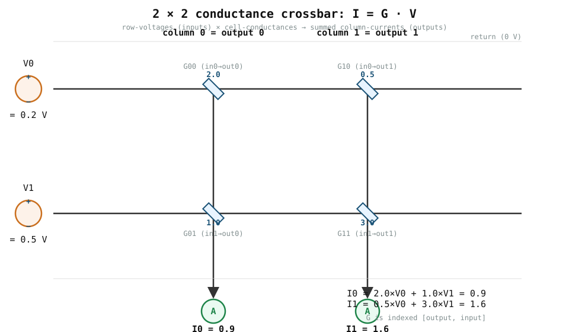

# 0001 — Ohm + Kirchhoff = matrix-vector multiplication

> **Reading time:** ~15 min · **Run:** `python book/0001-crossbar-mvm/train.py`
> **Bản tiếng Việt:** [`README.vi.md`](README.vi.md)

A crossbar turns two classical circuit laws into one matrix-vector
multiplication. A **programmable conductance cell** stores a non-negative value
`G`. Apply a voltage `V` across it and Ohm's law gives the cell current

```text
I = V × G
```

Where the cell currents of one column meet, Kirchhoff's current law (KCL) says
they **add**. A column therefore produces a dot product of its conductances
with the applied voltages. A grid of such columns computes `I = G @ V`.

## 1. The picture



- **Rows** = inputs: each row is driven by one voltage `V_i`, representing an
  activation value `x_i`.
- **Columns** = outputs: each column collects the cell currents and sums them,
  producing one output `I_j`.
- **Cells** = weights: each intersection stores a conductance `G[j, i]`.

What the schematic hides is that each cell is a *separately programmable*
conductance. In one machine that is a precision resistor on a fixed board; in a
programmable machine it is a digital pot or, later, a ReRAM cell. The math is
the same regardless.

## 2. The convention (read this twice)

The repository stores every weight matrix as `[output, input]`, i.e.

```text
G[j, i]  connects input i (row)  →  output j (column)
```

and computes

```text
I_j = Σ_i  G[j,i] · V_i        (per column, the KCL sum)
```

In terms of the arrays you saw above:

```text
V = [0.2, 0.5]                  (V0 on row 0, V1 on row 1)
G = [[2.0, 1.0],                G[0] = column "output 0"
     [0.5, 3.0]]                 G[1] = column "output 1"
```

Because of this orientation, `columns = outputs`, so **apply voltage on rows,
read current off columns**. If you ever reverse it, you must transpose at exactly
one named boundary (see `docs/MODULE_STANDARD.md`).

## 3. Compute it by hand

Inputs `V = [0.2, 0.5]`, conductances as above.

**Output 0** (column of `G[0] = [2.0, 1.0]`):

```text
I0 = G[0,0]·V0 + G[0,1]·V1 = 2.0×0.2 + 1.0×0.5 = 0.4 + 0.5 = 0.9
```

**Output 1** (column of `G[1] = [0.5, 3.0]`):

```text
I1 = G[1,0]·V0 + G[1,1]·V1 = 0.5×0.2 + 3.0×0.5 = 0.1 + 1.5 = 1.6
```

```text
I = G @ V = [0.9, 1.6]
```

Now run the check:

```bash
python book/0001-crossbar-mvm/train.py
```

The assertion `assert_allclose(actual, [0.9, 1.6])` is the **contract** between
this hand-written arithmetic and `analog_ai.crossbar.ideal_mvm`. Re-read §2 and
confirm on the diagram: input 0 (row) carries 0.2 V, and output 0 (column) sums
`2.0×0.2 + 1.0×0.5`.

## 4. A second example to trust your intuition

Take a different, diagonal-like matrix and check it quickly:

```text
V = [1.0, 0.0]          G = [[0.5, 0.0],
                              [0.0, 0.7]]
I = G @ V = [0.5, 0.0]
```

Because `V1 = 0` the bottom row contributes nothing; column 0 reads only its
top cell, `0.5×1.0 = 0.5`. This is just the definition of a dot product —
nothing magical. Change a value and recompute by hand before trusting the code.

## 5. What is genuinely analog here

- **Multiplication** happens in each cell through Ohm's law: `I = V × G`.
- **Accumulation** happens "for free" as KCL: currents physically add on the
  wire. No explicit adder and no loop over the inputs is required for one
  resident MVM.

That is the whole idea. Everything else in an LLM layer — converters,
activation, partial sums across tiles, scheduling — is *additional* work that
later chapters and the `analog_llm` simulator make explicit.

## 6. Non-idealities you have not seen yet

`ideal_mvm` is deliberately ideal. A real array also has:

- **finite conductance resolution** — you cannot program `G` to arbitrary
  precision (this is `g_bits` in `analog_llm`/`converter` work);
- **DAC/ADC resolution and clipping** — voltages can't be exact, and outputs
  saturate;
- **noise and gain/offset** on the read path;
- **parasitic/IR drop and stuck cells**, ignored here.

None of these are hidden in the first example; they are named here so that
chapter 0003 (`converters-and-noise`) and the simulator can add them as explicit
features rather than a vague "error".

## 7. Break it deliberately

Change one conductance to a negative value, e.g. `G = [[2.0, -1.0], ...]`. The
code rejects it:

```text
ValueError: physical conductance cannot be negative
```

A real passive conductance is always `G ≥ 0`, so a negative weight cannot live
in one cell. That is exactly why chapter 0002 uses **differential pairs** to
represent signed weights with two non-negative arrays.

## 8. Boundary of this chapter

The NumPy multiplication is a **functional** check of the equation. It does not
simulate transistor dynamics, wire resistance, converter energy, or timing
(see the three claim-levels in `AGENTS.md`). One ideal, fully-resident crossbar
operation is not an end-to-end `O(1)` LLM — chapter 0004 shows why tiling and
accumulation break that over-simplification.

## 9. Exercises

1. Recompute `I0` by hand for `V = [0.5, 0.5]` and the same `G`. Verify against
   `ideal_mvm` before running.
2. Write a 1×3 crossbar (`G` one row, `V` three entries) and compute the single
   output by hand.
3. Swap orientation: use `G.T @ V` and confirm the numbers *don't* match
   `G @ V`. Explain why (see §2).
4. Predict what changes if a cell's conductance doubles; verify with the code.

## 10. Next

Continue to `book/0002-differential-pairs/`, where two non-negative arrays
`(G+, G−)` recover signed neural-network weights. The `analog_llm` simulator
(`scripts/run_llm_sim.py`) shows the same crossbar scaled up and used to run a
tiny transformer.
