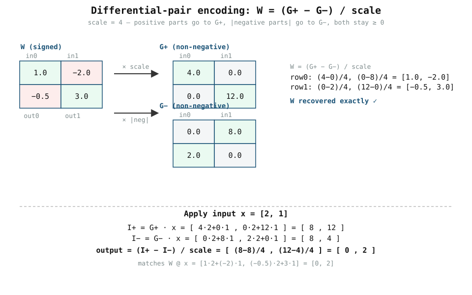

# 0002 — Trọng số có dấu với cặp vi phân

> **Thời gian đọc:** ~12 phút · **Chạy:** `python book/0002-differential-pairs/train.py`

Chương 0001 kết thúc bằng một quy tắc cứng rắn: **một cell crossbar chỉ lưu
được độ dẫn không âm `G ≥ 0`.** Nhưng trọng số mạng neural thường âm. Chương
này trình bày mẹo chuẩn: biểu diễn mỗi trọng số có dấu bằng **hai** độ dẫn
không âm và trừ chúng đi.

## 1. Ý tưởng

Lưu mỗi trọng số dưới dạng hiệu của hai độ dẫn:

```text
W = (G+ − G−) / scale        với   G+ ≥ 0  và  G− ≥ 0
```

- **G+** chỉ giữ các phần dương của `W` (độ mạnh của "đầu vào này đẩy đầu ra
  lên").
- **G−** chỉ giữ độ lớn của các phần âm (độ mạnh của "đầu vào này đẩy đầu ra
  xuống").
- `scale` là hằng số độ lợi/đơn vị đã chọn; chia cho nó để khôi phục `W`.

Cả hai mảng đều hợp lệ về mặt vật lý vì không bao giờ âm.

## 2. Mã hóa, qua hình ảnh



Với `W = [[1.0, −2.0], [−0.5, 3.0]]` và `scale = 4`:

```text
G+ = clip(W, 0) × 4  = [[4.0, 0.0],
                        [0.0,12.0]]

G− = clip(−W,0) × 4  = [[0.0, 8.0],
                        [2.0, 0.0]]
```

Tự kiểm chứng phép khôi phục bằng tay cho trọng số âm `−2.0`
(`G+ = 0`, `G− = 8`):

```text
(0 − 8) / 4 = −2.0   ✓
```

## 3. Mạch thực hiện phép trừ thế nào

Mỗi trọng số giờ trải trên **hai cột**: một cột `G+` và một cột `G−`. Khi một
đầu vào `x` tới:

```text
I+ = G+ · x      (dòng từ các cột dương)
I− = G− · x      (dòng từ các cột âm)
W@x = (I+ − I−) / scale
```

```text
        x ──► [ mảng G+ ] ──► I+ ─┐
                                   ├─ phép trừ ─► output = (I+ − I−)/scale
        x ──► [ mảng G− ] ──► I− ─┘
```

Với `x = [2, 1]`:

```text
I+ = G+ · x = [8, 12]
I− = G− · x = [8,  4]
output = (I+ − I−) / 4 = [0, 2]
```

khớp với `W @ x = [1×2 + (−2)×1, (−0.5)×2 + 3×1] = [0, 2]`.

Phép trừ được thực hiện trong miền dòng analog hoặc sau một lần đọc
mixed-signal — bài học chỉ yêu cầu *các con số* khôi phục lại kết quả có dấu.

## 4. Chạy nó

```bash
python book/0002-differential-pairs/train.py
```

`map_differential` dựng `(G+, G−)`; `differential_mvm` áp `x` lên cả hai và
trừ. Assertion trên `[0, 2]` và các kiểm tra `G+ ≥ 0, G− ≥ 0` là hợp đồng.

## 5. Chi phí được phơi bày (hãy trung thực về nó)

Ánh xạ vi phân **làm tăng gấp đôi số cell độ dẫn được lập trình** với cách
biểu diễn đơn giản này: một trọng số có dấu = hai cell. Nhân lên theo kích
thước ma trận, chi phí diện tích/năng lượng/hiệu chuẩn của tile tăng lên. Đây
là một cái giá vật lý thực tế — các chương sau và simulator `analog_llm` theo
dõi nó (model vi phân của simulator cũng giới thiệu common-mode cân bằng `gmin`
và `g_bits` hữu hạn, xem dưới) thay vì coi trọng số có dấu là miễn phí.

> **Cầu nối với simulator:** `analog_llm.crossbar.map_differential` dùng cùng
> ý tưởng `G+ − G−` nhưng với một cặp *cân bằng* `[gmin, gmax]`: trọng số không
> được lưu là cặp `(gmin, gmin)` (cả hai cell bật, triệt tiêu nhau) thay vì
> `(0, 0)`. Điều đó thực tế hơn về vật lý — các cell lập trình thật có một độ
> dẫn tối thiểu dương. Ở đây dùng cell `G = 0` là một cách đơn giản hóa bạn có
> thể xem lại trong simulator.

## 6. Vì sao không dùng một cell có dấu?

Vì độ dẫn vật lý là một đại lượng thụ động, không âm — bạn không thể lưu
"−2 siemens". Không có bữa trưa miễn phí: "bit dấu" tốn hẳn một cell phụ cho
mỗi trọng số, và việc hiệu chuẩn nó (làm khớp hai nhánh) chính là lý do mảng
vi phân khó hơn mảng không dấu.

## 7. Ranh giới của chương này

Khôi phục `W` bằng số, và tính `(G+·x − G−·x)/scale`, là một mô hình *chức
năng*. Nó không mô hình hóa việc làm khớp nhánh (lệch gain/offset giữa hai cột
`G+` và `G−`), lỗi common-mode, hay bộ chuyển đổi đọc `I+ − I−`. Đó là các lỗi
thật mà simulator `analog_llm` bổ sung tường minh dưới dạng `adc_gain`,
`adc_offset`, và `g_bits` hữu hạn.

## 8. Bài tập

1. Tự mã hóa `W = [[−1.0, 0.5]]` với `scale = 2` thành `(G+, G−)`; kiểm chứng
   `(G+ − G−)/2` khôi phục `W`.
2. Chỉ ra rằng trọng số **không** ánh xạ thành `(0, 0)` trong model này — hiệu
   nhỏ nhất có thể.
3. Với `W = [[1.0, −2.0], [−0.5, 3.0]]` và `x = [0.5, 1.5]`, tính `W@x` theo cả
   hai cách (trực tiếp và qua `(G+·x − G−·x)/4`) và xác nhận chúng khớp.
4. `scale` biểu diễn gì về mặt vật lý? Đổi nó và giải thích vì sao `W` không
   đổi trong khi `G+`, `G−` tăng.

## 9. Tiếp theo

Chương 0003 (`converters-and-noise`) bổ sung thực tế rằng đầu vào và đầu ra
thật đi qua các DAC/ADC nhiễu, phân giải hữu hạn. Simulator `analog_llm` sau
đó kết hợp trọng số vi phân, bộ chuyển đổi và tiling để chạy một transformer
nhỏ hoàn chỉnh (`scripts/run_llm_sim.py`).
