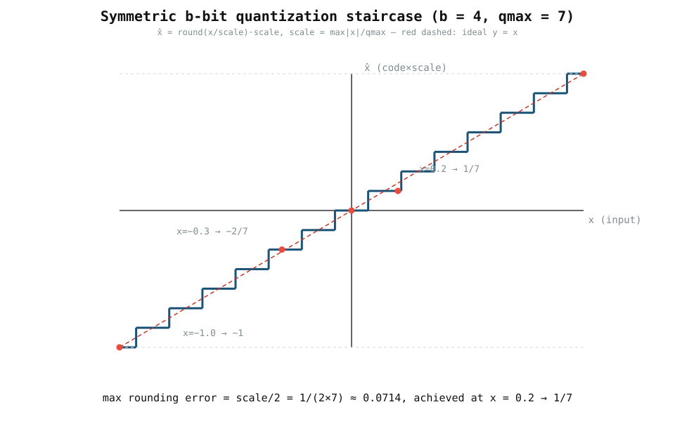

# 0003 — DAC, ADC, lượng tử hóa và nhiễu

> **Thời gian đọc:** ~12 phút · **Chạy:** `python book/0003-converters-and-noise/train.py`

Crossbar là analog, nhưng các giá trị mà một mô hình xử lý — activation đi vào,
tổng có trọng số đi ra — đi vào và rời khỏi miền analog qua các **bộ chuyển
đổi**. Một bộ chuyển đổi không thể biểu diễn một giá trị liên tục một cách
chính xác; nó có độ phân giải hữu hạn. Chương này làm cho chi phí số học đó
trở nên tường minh và thêm một mô hình nhiễu đọc trung thực đầu tiên.

## 1. Bộ chuyển đổi nằm ở đâu

```text
  x (digital) ──► [DAC] ──► V ──► [crossbar] ──► I ──► [ADC] ──► ŷ (digital)
                   finite bits              finite bits + noise
```

- **DAC** biến một activation digital thành điện áp. Nó chỉ chạm được một tập
  rời rạc các mức.
- **ADC** đo dòng tổng (sau khi chuyển thành điện áp) và lượng tử hóa thành
  các mã rời rạc.

Cả hai đều *làm thay đổi giá trị*. Một crossbar lý tưởng với bộ chuyển đổi
thật không còn là `G @ x` chính xác nữa.

## 2. Mô hình lượng tử hóa đối xứng

Với một bộ chuyển đổi có dấu `b` bit, chương này dùng `qmax = 2^(b-1) − 1` và
một scale đặt bởi độ lớn lớn nhất của tín hiệu:

```text
scale = max(|x|) / qmax
code  = round(x / scale)
x_hat = code × scale
```

`scale` là một bước lượng tử; `code` được kẹp về `[−qmax, +qmax]`. Vì ánh xạ
đối xứng quanh số không, nên `Q(−x) = −Q(x)`.



Đường đứt màu đỏ là lý tưởng `x̂ = x`. Bậc thang màu xanh là thứ bộ chuyển đổi
thực sự báo cáo.

## 3. Cận sai số

Sai số làm tròn lớn nhất của một bộ chuyển đổi lý tưởng, chưa bão hòa, bằng
**một nửa một bước lượng tử**:

```text
max |x_hat − x| ≤ scale / 2
```

Với `b = 4`, `scale = max|x| / 7`; với `max|x| = 1.0` thì `scale = 1/7` và
`scale/2 ≈ 0.0714`. Điểm ví dụ `x = 0.2` ánh xạ thành code `round(0.2 × 7) = 1`,
tức `x̂ = 1/7 ≈ 0.1429` — một sai số khoảng `0.057`.

## 4. Chạy nó

```bash
python book/0003-converters-and-noise/train.py
```

Nó kiểm chứng cận `scale/2` cho `values = [−1, −0.3, 0, 0.2, 1]`, sau đó cộng
một mẫu nhiễu Gaussian **xác định** (seed cố định `7`) vào đầu ra crossbar lý
tưởng `[0.9, 1.6]`. Kết quả tái lập được trên mọi máy.

```text
quantized: [-1.   -0.2857  0.   0.1429  1.   ]
max quantization error: 0.0571        (≤ 0.0714)
deterministic noisy sample: [0.9000, 1.6030]
```

## 5. Nhiễu: tại sao tường minh, không làm mờ

Đầu ra thật của ADC còn mang nhiễu (nhiệt, tham chiếu, độ bất định khẩu độ).
Ở đây nó được mô hình hóa bằng một `noise_std`, nhưng nó được cộng vào véc-tơ
**một cách tường minh** với seed cố định — nó là một đầu vào nhìn thấy được,
không phải một "error" ẩn. Đó chính là điểm khác biệt mà dự án nhấn mạnh: đặt
tên mọi non-ideality như một tham số riêng thay vì gộp nó vào một con số mơ
hồ. (So sánh cách `analog_llm.converters` thêm `gain`, `offset`, `noise_std`
tách riêng.)

## 6. Mô hình này không bao gồm điều gì

Chương này **chưa** mô hình hóa:

- tính phi tuyến tích phân/vi phân (INL/DNL);
- phục hồi sau bão hòa của ADC (chuyện gì xảy ra khi đầu vào vượt dải);
- trôi độ dẫn, sụt IR, cell kẹt, hay nhiệt độ;
- năng lượng hay thời gian của bộ chuyển đổi.

Những thứ đó phải được bổ sung như các đặc trưng tường minh sau này — không
giấu sau một `noise_std` Gaussian duy nhất. Simulator `analog_llm` đã thêm
`adc_gain`, `adc_offset`, clipping và bit trọng số hữu hạn lên trên nền tảng
này.

## 7. Bài tập

1. Với `bits = 8`, `qmax` là bao nhiêu? Nếu `max|x| = 2.0`, `scale` là bao
   nhiêu? Đặt `x = 0.5` lên bậc thang và tính `x̂`.
2. Thử `bits = 2` (nên `qmax = 1`). Các đầu ra khả dĩ duy nhất là gì, và vì sao
   cận sai số giờ rất lớn?
3. Xác nhận tính đối xứng: chạy quantizer trên `[0.3, −0.3]` và kiểm tra
   `Q(−x) = −Q(x)`.
4. Sửa script train: thêm một `noise_std` thứ hai lớn hơn nhiều và quan sát
   `max quantization error` không đổi trong khi "phép đo" nhiễu hơn.

## 8. Tiếp theo

Chương 0004 (`tiling`) cho thấy cách một ma trận LLM logic lớn hơn hẳn một
crossbar vật lý được chia thành các tile và cộng dồn. Rồi simulator `analog_llm`
kết hợp *chính* mô hình chuyển đổi này với trọng số vi phân và tiling để chạy
một transformer nhỏ hoàn chỉnh (`scripts/run_llm_sim.py`).
