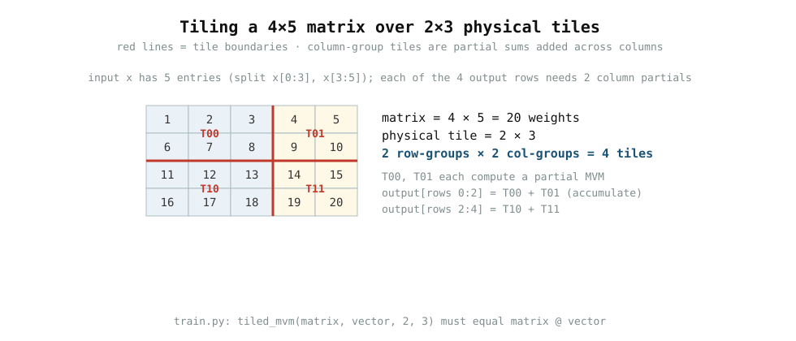

# 0004 — Tiling a matrix across physical arrays

> **Reading time:** ~10 min · **Run:** `python book/0004-tiling/train.py`
> **Bản tiếng Việt:** [`README.vi.md`](README.vi.md)

A real LLM layer has matrices far larger than any physical crossbar. This
chapter shows the standard answer: **split both the output rows and the input
columns into tiles**, compute a local matrix-vector product per tile, and
**accumulate partial sums** across the input-column tiles to recover the
logical output.

## 1. The mapping

Take a `4 × 5` weight matrix and physical `2 × 3` tiles:



There are `2 row-groups × 2 col-groups = 4` tiles:

```text
rows 0:2, cols 0:3    rows 0:2, cols 3:5     (T00, T01)
rows 2:4, cols 0:3    rows 2:4, cols 3:5     (T10, T11)
```

The input vector is split the same way: `x = [1, −1, 0.5, 2, −0.25]` becomes
`x[0:3] = [1, −1, 0.5]` for the left column-tiles and
`x[3:5] = [2, −0.25]` for the right ones.

## 2. Partial sums by hand (row 0)

Full `matrix = [[1..5],[6..10],[11..15],[16..20]]`. For output row 0:

```text
T00 (cols 0:3): 1×1 + 2×(−1) + 3×0.5 = 1 − 2 + 1.5 = 0.5
T01 (cols 3:5): 4×2 + 5×(−0.25)      = 8 − 1.25   = 6.75
output[0] = T00 + T01                = 7.25
```

The other rows give `[7.25, 18.5, 29.75, 41]`. Repeating the split for every
row range and **adding the two column-partials** recovers exactly `matrix @ x`.

## 3. Run it

```bash
python book/0004-tiling/train.py
```

`tiled_mvm(matrix, vector, 2, 3)` iterates the tiles explicitly and asserts the
result equals the dense `matrix @ vector`. The tiling is a *software* scheduling
decision, not physics — the point is that a large logical MVM can be covered by
finite physical arrays.

## 4. Why "O(1)" needs qualification

One physical array can evaluate its *resident* MVM in one analog operation. But
that is not an end-to-end claim. A large layer needs:

- **many tiles** — the matrix is too big for one array;
- **converter cycles** — each tile's result is read through an ADC;
- **partial-sum accumulation** — column-group results must be added;
- **communication and scheduling** — moving inputs/outputs around the machine.

So end-to-end layer time/energy grows with model size; it is not constant.
This is exactly why the `analog_llm` simulator keeps a **physical ledger**
(MACs, tile MVM cycles, rewrites) instead of claiming a free `O(1)`, and why
its `Accelerator` splits arbitrary matrices over a tile grid while accumulating
partial sums.

> **Bridge to the simulator:** `analog_llm.accelerator.Accelerator.mvm` does
> precisely this: it splits a matrix over tiles, pads edge blocks, accumulates
> column partials digitally, and charges the ledger for MACs/cycles/rewrites.
> Run `scripts/run_llm_sim.py` to see a full tiny transformer tiled and run.

## 5. Edge blocks

When a matrix dimension is not a multiple of the tile size (here 5 columns with
3-column tiles), the last column-tile is smaller (`2 × 2`). On the simulator the
block is **padded with zeros** up to the physical tile size so every tile fires
uniformly; the zero cells add no useful work, and the ledger counts only the
real cells.

## 6. Exercises

1. Hand-tile a `3 × 6` matrix with `2 × 2` tiles: how many row-groups,
   col-groups, and tiles? Draw the layout.
2. Recompute `output[3] = 41` by hand using the two column partials (T10 row 2
   and T11 row 2 of `x`), as §2 did for row 0.
3. What happens to the number of tiles if the tile is `4 × 5` instead of
   `2 × 3`, for the same `4 × 5` matrix?
4. Explain why the partial sums must be **added**, not overwritten, when
   multiple tiles cover the same output rows.

## 7. Next

This completes the theory track (0001–0004). Chapter 0005 (`one-analog-neuron`)
turns a single weighted sum into real hardware. Or jump to the product
simulator `analog_llm` (`scripts/run_llm_sim.py`), which combines *all four*
ideas — crossbar, differential weights, converters, and tiling — to run a tiny
transformer and report its ledger and accuracy.
