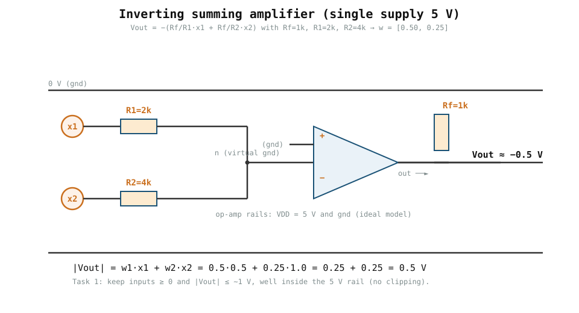
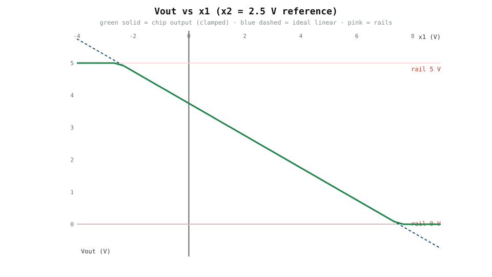
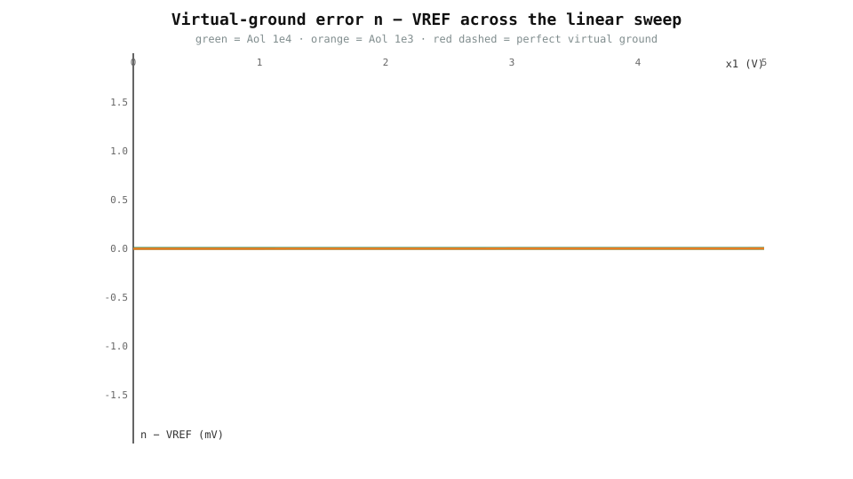
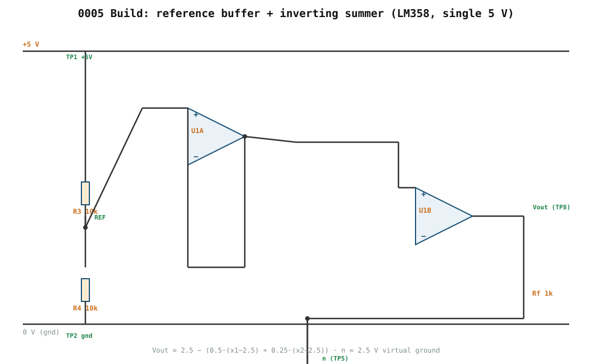

# 0005 — Build One Analog Neuron

> **Reading time:** ~20 min · **Simulate:** `book/0005-one-analog-neuron/sim_neuron*.py`
> **Bản tiếng Việt:** [`README.vi.md`](README.vi.md)

> Status: **circuit designed, simulated, and BOM'd**; a real build/measurement
> is still outstanding. See the build files below and `calibration.md`.

## Goal

Build and measure a low-voltage circuit that computes a weighted sum:

```text
y = w1*x1 + w2*x2 + b
```

The first revision may omit the bias input and add it after the two-input weighted sum is validated.

## Simulate before you build

This chapter now verifies the circuit in SPICE (via PySpice + ngspice) *before*
you touch a breadboard. The proposed first circuit is a two-input **inverting
summing amplifier** on a 5 V supply:



```text
         Rf = 1 k
x1 ── R1=2k ──(+)── out      with  w1 = Rf/R1 = 0.50
x2 ── R2=4k ──(+)              w2 = Rf/R2 = 0.25
               (op-amp)        Vout = −(w1·x1 + w2·x2)
```

For the hand contract `x = [0.5, 1.0]`:

```text
|Vout| = 0.5·0.5 + 0.25·1.0 = 0.25 + 0.25 = 0.5 V
```

Install the engine and run the check:

```bash
brew install ngspice                # the SPICE engine (macOS/Homebrew)
python -m pip install -e '.[sim]'   # PySpice + package
python book/0005-one-analog-neuron/sim_neuron.py
```

Result (6 input cases all match the hand arithmetic):

```text
  x1     x2    |Vout|(sim)  y(hand)   match
 0.50  1.00     0.5000     0.50    OK
 0.20  0.80     0.3000     0.30    OK
 1.00  0.00     0.5000     0.50    OK
 0.00  2.00     0.5000     0.50    OK
 0.60  1.20     0.6000     0.60    OK
 0.80  0.40     0.5000     0.50    OK
```

> The simulation uses an **ideal op-amp model** — it verifies the *summing
> relation*, not saturation/common-mode/offset of a real device. Those limits
> are exactly what the bring-up sequence (§ below) must confirm on real
> hardware. If ngspice is not installed the script reports it and skips
> cleanly rather than failing.

### Non-ideal op-amp: what a real chip actually does

An ideal model never saturates and has no offset — a real chip does. The chapter
now also checks a **non-ideal** model (finite open-loop gain, a `Vos` input
offset, and a `0..5 V` output rail) in `sim_neuron_nonideal.py`:

```bash
python book/0005-one-analog-neuron/sim_neuron_nonideal.py
```

Measured (all explicit, nothing hidden):

| Scenario | Result |
|---|---|
| 1 — linear @ 2.5 V reference | `out = 2.3496` vs ideal `2.3500` (err 0.4 mV) |
| 2 — output past 5 V rail | ideal `5.875` → **clips at `5.000`** |
| 3 — gnd-referenced, single 5 V supply | positive input → **clips at `0`** (the chapter's warning) |
| 4 — `Vos = 10 mV` | shifts the output by `+0.0175 V` |

The key result of Scenario 3 is the chapter's warning made measurable: a
textbook **inverting** summer referenced to ground cannot output a negative
value on a single 5 V supply, so it clips at `0 V`. That is why the tested build
must use a **virtual reference** (e.g. VDD/2) as in scenarios 1–2 — and why the
real bring-up sequence must record where saturation actually happens.

### DC sweep: seeing the linear region and the rails

Sweeping one input across the whole supply range turns the "linear region" into
something you can read off a plot:

```bash
python book/0005-one-analog-neuron/sweep_neuron.py
```



Holding the 2.5 V reference on the other input (so `x2` contributes nothing),
the output follows `Vout = 2.5 − 0.5·(x1 − 2.5)`:

- **linear-region slope = −0.500**, matching `−w1 = −0.5`;
- it **clips at the 5 V rail** for `x1 ≤ −2.5 V`;
- it **clips at the 0 V rail** for `x1 ≥ 7.5 V`.

The **headroom** around the 2.5 V reference is `2.5 V` up to the 5 V rail and
`2.5 V` down to ground — so inputs must swing the output within ±2.5 V of the
reference to stay linear. This is exactly the quantity to record on real
hardware (task A3), where the swing will be smaller than ideal.

### Virtual ground and rail headroom

Two properties a builder checks at bring-up — now verified in simulation:

```bash
python book/0005-one-analog-neuron/headroom_neuron.py
```



**Virtual ground.** In the linear region the summing node `n` must sit at the
2.5 V reference. With the finite-gain model the error is small and grows as
`1/Aol`:

- `Aol = 1e4`: `max |n − VREF| = 0.37 mV`
- `Aol = 1e3`: `max |n − VREF| = 3.74 mV`

This is why the reference/op-amp quality (open-loop gain, offset) shows up as a
tiny offset at the summing node — measurable, but usually small compared to
resistor tolerance.

**Rail headroom.** On a 5 V supply with a 2.5 V reference:

```text
headroom up   = VDD − VREF = 2.5 V
headroom down = VREF − 0   = 2.5 V
```

Keep `|Vout − VREF| ≤ 2.5 V` to stay linear. For the gnd-referenced
configuration `headroom down = 0`, which is exactly why it clips on any positive
input.

## Build files (simulated design, ready to breadboard)

The full single-supply circuit (2.5 V reference buffer + inverting summer,
LM358) has a schematic, BOM, wiring, test points, and calibration procedure:



| File | Contains |
|---|---|
| [`diagrams/full_schematic.svg`](diagrams/full_schematic.svg) | full schematic with test points |
| [`bom.csv`](bom.csv) | parts + substitutes |
| [`breadboard.md`](breadboard.md) | pin-by-pin LM358 wiring |
| [`testpoints.md`](testpoints.md) | TP1–TP9 expected/actual table |
| [`calibration.md`](calibration.md) | bring-up, calibration record, power-down |

| Part | Value | Role |
|---|---|---|
| U1 | LM358 (dual) | A = reference buffer, B = summer |
| R1 / R2 / Rf | 2 k / 4 k / 1 k | w = [0.50, 0.25] |
| R3 / R4 | 10 k / 10 k | 2.5 V reference divider |

The build must use the **virtual reference** (not a gnd-referenced inverting
summer), exactly as scenarios 1–3 of the non-ideal sim demonstrated.

## Learning result

By the end of this chapter, the builder should be able to explain and measure:

- how a voltage represents an input value;
- how a resistance/conductance represents a weight;
- how currents add at a summing node;
- how an op-amp converts summed current into output voltage;
- why sign, gain, headroom, offset, and saturation matter;
- why measured output differs from ideal arithmetic.

## Proposed build blocks

```text
Input x1 -- conductance G1 --+
                            +-- summing node -- op-amp -- Vout
Input x2 -- conductance G2 --+
```

The tested schematic must use a topology compatible with the selected single-supply op-amp and virtual reference. Do not copy a dual-supply textbook inverting summer directly onto a 5 V breadboard without accounting for input common-mode range and output headroom.

## Hand calculation contract

The chapter will freeze one small example before the circuit is finalized. A candidate is:

```text
x = [0.5, 1.0]
w = [0.5, 0.25]
ideal weighted sum = 0.5
```

The physical mapping must document:

- value-to-voltage scale;
- weight-to-conductance scale;
- feedback resistance;
- polarity;
- expected output voltage;
- acceptable error interval.

## Required deliverables

- `schematic/` source and exported PDF/PNG;
- `breadboard.md` with pin-by-pin wiring;
- `bom.csv` with exact manufacturer part and substitutes;
- `measurements.csv` from the tested build;
- `verify.py` reproducing the expected arithmetic;
- test-point table for supply, reference, inputs, summing node, and output;
- calibration and power-down procedure;
- photos or diagrams matching the tested revision.

## Bring-up sequence

1. Read the safety guide.
2. Build and measure the power/reference stage only.
3. Confirm the selected op-amp pinout from its datasheet.
4. Power the op-amp with no signal and verify quiescent conditions.
5. Add one input branch and compare one measured point.
6. Add the second input branch.
7. Sweep several inputs inside the safe range.
8. Record expected and measured output.
9. Deliberately approach saturation and document the failure.
10. Power down before changing component values.

## Measurements to record

| Measurement | Expected | Actual | Unit | Instrument |
|---|---:|---:|---|---|
| Supply | TBD |  | V | multimeter |
| Analog reference | TBD |  | V | multimeter |
| Input 1 | TBD |  | V | multimeter |
| Input 2 | TBD |  | V | multimeter |
| Output | TBD |  | V | multimeter/scope |
| Output noise | TBD |  | mV RMS | scope |

## Experiments

- replace 1% resistors with 5% resistors;
- warm one resistor gently with normal handling and observe drift;
- repeat the same input 100 times;
- increase input until the output clips;
- compare multimeter and oscilloscope measurements;
- calculate ideal, component-tolerance, and measured error separately.

## What this build does not prove

A successful weighted-sum circuit does not demonstrate ReRAM storage, large-array scalability, competitive energy efficiency, neural-network accuracy, or faster inference than digital hardware. It proves that a real analog circuit can encode and measure a small weighted sum, which is the physical primitive the later machine will scale and automate.
