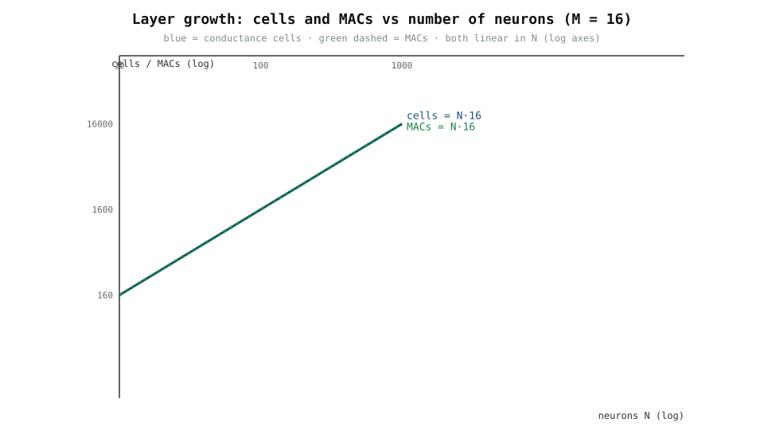

# 0006 — Nhiều neuron: một lớp (10, 100, 1000)

> **Thời gian đọc:** ~15 phút · **Chạy:** `python book/0006-many-neurons/layer_neuron.py`

Chương 0005 đã xây một neuron analog. Một mạng neural cần hàng trăm, hàng
nghìn neuron. Tin tốt: **một lớp gồm N neuron, mỗi neuron cộng M đầu vào, chính
là tích ma trận-véc-tơ `y = W @ x` ở chương 0001.** Nhân rộng không có gì mới —
nó vẫn là phép toán đó nhưng với nhiều cell độ dẫn hơn.

## 1. Một neuron → một lớp

Một neuron đơn là `y = w1·x1 + w2·x2`. Một lớp gồm `N` neuron, mỗi neuron đọc
cùng M đầu vào:

```text
y[i] = sum_j W[i,j]·x[j]      với i = 0..N-1, j = 0..M-1
Y    = W @ x                  (W là N × M)
```

Lại là crossbar: các hàng là véc-tơ trọng số của N neuron, các cột là M đầu
vào, mỗi đầu ra là một cột được tổng (của 0001 `I = G @ V`, với trọng số có dấu
qua cặp vi phân của 0002).

## 2. Chạy: 10, 100, 1000 neuron

```bash
python book/0006-many-neurons/layer_neuron.py
```

Với `M = 16` đầu vào mỗi neuron (có dấu, vi phân):

```text
  N     cells  cells(signed)   MACs  tiles  cycles     max|err|
   10      160         320      160      1       1  5.37e-04
  100     1600        3200     1600      2       1  5.74e-04
 1000    16000       32000    16000     16       1  6.28e-04
```



Lớp tiled `analog_llm` khớp tham chiếu float tới ~6e-4 — thêm neuron chỉ đổi
*kích thước*, không đổi *phép toán*.

## 3. Thứ thật sự tăng

Mọi thứ tăng **tuyến tính** theo `N` (với `M` cố định):

- `cells = N·M` độ dẫn (không dấu), `2·N·M` với trọng số vi phân có dấu (0002);
- `MACs = N·M` phép nhân-cộng dồn mỗi lượt forward;
- `physical tiles = ceil(N/T)·ceil(M/T)` với tile kích thước `T` (ở đây 64).

Từ 10 → 100 → 1000 neuron nhân cells và MACs lên 10 lần mỗi bước. Đây là giá
thành trung thực của "nhiều neuron hơn": thêm diện tích silicon (cell độ dẫn),
thêm năng lượng (MACs), và với lớp rất lớn thêm nhiều tile và cộng dồn — không
bao giờ là `O(1)` miễn phí. (Xem chương 0004 và `maths/complexity.md`.)

## 4. Góc nhìn mạch: 2 neuron trên một LM358

Một mẫu vật lý nhỏ khá đơn giản: cả hai neuron đều là bộ cộng đảo dùng chung
mức chuẩn ảo 2.5 V, và LM358 kép có đúng hai op-amp. Kiểm chứng trong SPICE:

```bash
python book/0006-many-neurons/layer_neuron_spice.py
```

```text
x = [3.0, 2.1]  VREF = 2.5
  neuron0: sim=2.3496  ideal=2.3500  err=0.0004
  neuron1: sim=2.3496  ideal=2.3500  err=0.0004
```

Hai tầng cộng chạy từ một chip — bước đầu tiên hướng tới tile crossbar mà
simulator `analog_llm` (và mảng `G` của chương 0001) đã mô hình.

## 5. Vì sao nhiều neuron biện minh cho crossbar

Với hàng nghìn neuron, nối dây tay nút tổng của từng neuron là bất khả thi.
Crossbar giải quyết về mặt cấu trúc: một mảng cell dùng chung, hàng = đầu vào,
cột = đầu ra (0001). 0006 là cầu nối: "nhiều neuron" *chính là* "một ma trận",
và "một ma trận" *chính là* "một crossbar". Simulator `analog_llm` sau đó chạy
các lớp LLM thật trên các tile như vậy.

## 6. Ranh giới / giới hạn trung thực

- Đây là một lớp **chức năng + mô phỏng**; mảng 1000 neuron thật cần độ dẫn
  lập trình được (digital pot hoặc sau này ReRAM), hiệu chuẩn, và xử lý
  IR-drop/converter — ngoài phạm vi ở đây nhưng được nêu tường minh trong
  `docs/PRODUCT_SPEC.md` và `analog_llm`.
- Tăng tuyến tính của cells/MACs được nêu như số học, không phải là lợi thế
  năng lượng/độ trễ so với GPU.

## 7. Bài tập

1. Tự tính `cells` và `MACs` cho `N = 500`, `M = 32`.
2. Cần bao nhiêu tile 64×64 cho `N = 1000, M = 64`?
3. Vì sao `cycles` vẫn là 1 dù `tiles` tăng? (Các tile cùng chạy song song khi
   đủ số tile.)
4. Đổi `M` trong `layer_neuron.py` và chạy lại: sai số có giữ nhỏ không?
