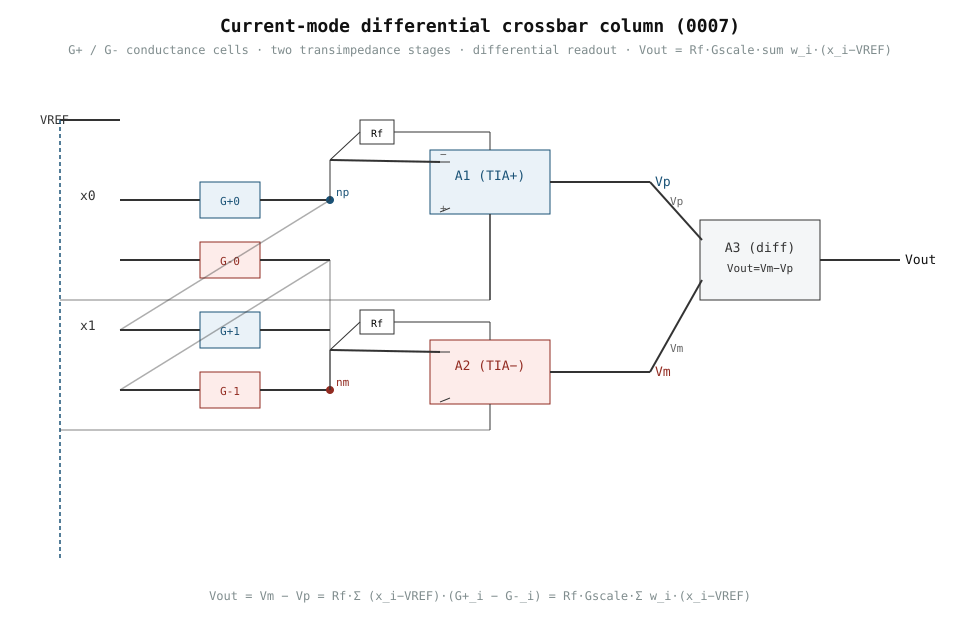

# 0007 — Current-mode differential crossbar column

> **Bản tiếng Việt:** [`README.vi.md`](README.vi.md)

Upgrade from the 0005/0006 **voltage-mode resistor summer** to the architecture
the simulator (`analog_llm/crossbar.py`, `tile.py`) actually models: a
**current-mode crossbar column with differential conductance cells** and a
transimpedance readout. This is the physical embodiment of one row of the
`y = W @ x` that the simulator computes.

## Why (the upgrade)

- **0005/0006** learned a weighted inverting summer: `Vout = VREF − Σ w_i·x_i`
  with resistor weights (`Rf/R = w`). It models the *math* of one neuron/layer,
  but not the *in-memory-computing* cell: a programmable conductance `G`
  produces a current `I = V·G`, and columns sum currents, not resistor ratios.
- **0007** builds that column: signed weights as differential conductances
  `G+`/`G-`, currents summed at a virtual ground, and a transimpedance +
  differential readout proportional to `Σ w_i·(x_i − VREF)`.

## Units and assumptions

| Quantity | Value | Units |
|---|---|---|
| `VREF` | 2.5 | V (virtual reference) |
| `G0` | 0.1 | mS (balanced-zero conductance) |
| `GSCALE` | 0.1 | mS per weight unit |
| `RF` | 10 | kΩ (transimpedance feedback) |
| weights `w` | ±0.5, ±0.25 | dimensionless (in [-1,1]) |
| inputs `x` | around 2.5 | V |

Signal envelope: `Vout = RF·GSCALE·Σ w_i·(x_i−VREF)`. All values are simulation
targets; nothing here is a real measured silicon result.

## Circuit

- Each `w_i` realized by two conductances: `G+_i − G-_i = w_i·GSCALE`
  (balanced zero at `G0`, exactly as `map_differential` does).
- Inputs drive both cells; currents sum at virtual-ground nodes `np` (plus) and
  `nm` (minus).
- Two transimpedance op-amp stages: `Vp = VREF − RF·Iplus`,
  `Vm = VREF − RF·Iminus`.
- Differential stage: `Vout = Vm − Vp = RF·(Iplus − Iminus)`.

`Run: book/0007-crossbar-column/crossbar_column.py`

## Verification

- **SPICE** (`run_column`): `Vout = 0.1501 V` vs hand calc `0.1500 V`
  (err `1e-4` V); negative weights flip sign correctly.
- **Differential mapping**: `G+_i − G-_i = w_i·GSCALE` holds to `7e-21 S`.
- Always-on data tests + optional engine tests in `tests/test_crossbar_column.py`.

## Ledger

A 1-column crossbar with `M` inputs uses `2M` conductance cells (differential)
and `3` op-amps (two TIA + one subtractor). This is the physical unit whose
counts the simulator reports as `macs`/`tiles`/`programs` at scale.

ngspice note: the two TIA stages are independent linear networks, so `Vout = Vm − Vp`
holds by superposition. ngspice's DC operating point is numerically fragile when two
ideal/OTA gain loops share one netlist, so each stage is solved in its own netlist and
combined — exact, since the stages are uncoupled.

## What this chapter does NOT prove

- It does **not** characterize converter non-idealities (DAC/ADC INL/DNR, quantization noise) — deferred to Ch. 0009–0011.
- It does **not** model interconnect parasitics, IR drop, or transient settling — deferred to Ch. 0017–0018.
- It does **not** prove array-level scaling behavior — deferred to Ch. 0012–0014.

## Exercises

1. **Hand calculation**: Given $W = [0.5, -0.25]$ and $x = [2.6, 2.4]$ V, compute the expected $V_\text{out}$ using the formula $V_\text{out} = R_F \cdot G_\text{scale} \cdot \sum w_i (x_i - V_\text{REF})$.
2. **Sign change**: If all weights are negated ($W \to -W$), what happens to $V_\text{out}$? Verify with the script.
3. **Scaling**: What is $V_\text{out}$ if $G_\text{scale}$ is doubled to $0.2\text{ mS}$? What current does each cell source?
