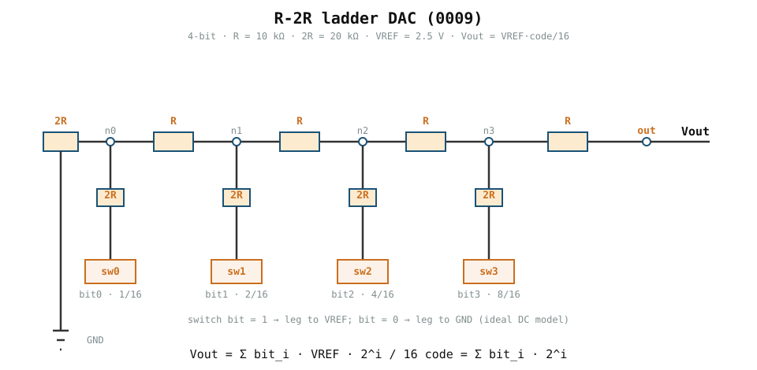
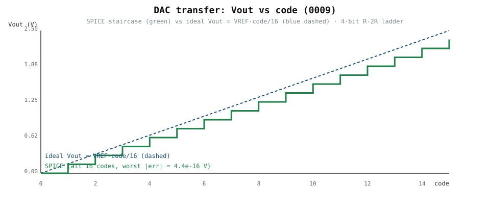

# 0009 — R-2R ladder DAC

> **Bản tiếng Việt:** [`README.vi.md`](README.vi.md)

First design candidate for the converter signal path (R2): a **binary-weighted
R-2R ladder** DAC. The activation path needs `x (digital) → V (analog)`, and the
ladder realizes it with only two resistor values, `R` and `2R`.

## Why an R-2R ladder

- Uses exactly two resistor values regardless of resolution (`R`, `2R`) — a
  real, manufactureable building block.
- Output depends only on resistor **ratios** and `VREF`, so gain and range are
  set by design, not by an exotic component.
- Its hand model is simple and exact under ideal switches:

  ```text
  Vout(code) = VREF * code / 2^N ,   code = Σ bit_i · 2^i
  ```

## Units and assumptions

| Quantity | Value | Units |
|---|---|---|
| `BITS` | 4 | ladder width (prototype) |
| `VREF` | 2.5 | V (reference; matches 0007/0005 reference) |
| `R` | 10 | kΩ (unit resistor) |
| `2R` | 20 | kΩ (bit-leg / termination resistor) |
| full scale | `VREF·15/16 = 2.34375` | V (code 15) |
| LSB | `VREF/16 = 0.15625` | V per code |

All values are simulation targets; nothing here is a measured silicon result.

## Circuit



- Each node `n_i` has a `2R` leg switched between `VREF` (bit = 1) and ground
  (bit = 0). Bit 0 is at the terminated end (the `2R` termination to GND); the
  output is taken at `out`.
- The ladder divides current exponentially, so each bit contributes
  `VREF · 2^i / 2^N` at the output.

`Run: book/0009-dac-r2r/r2r_dac.py`

### Sample transfer



The 4-bit transfer staircase rises one LSB (`0.15625 V`) per code, exactly
overlayed by the ideal line `Vout = VREF·code/16`. The plot is regenerated from
the committed extract (`verification/circuit/results/dac-r2r-v1-extract.json`)
by `book/0009-dac-r2r/diagrams/make_transfer.py`, so it always shows the
numbers the tests verify.

## Verification

- **SPICE vs hand**: all 16 codes, `worst |SPICE − ideal| = 4.44e-16 V` (DC
  operating-point solves with ideal switch sources).
- `Vout(0) = 0`, monotonic by construction, `Vout(15) = 2.34375 V`.
- **Output resistance**: two-point DC load line gives `Rth = 2R = 20 kΩ`,
  code-independent (the ladder orientation — termination at the LSB end, output
  at the MSB end — puts `Rth = R + Z` with `Z = 2R ‖ (R + Z)`).
- **Transient settling**: with an *assumed* load `CL = 1 pF` and a 0.5 LSB band,
  a  full-scale step settles in 68.7 ns (SPICE) vs 68.0 ns from the single-pole
  hand model `t = 2R·CL·ln(ΔV/band)`. The `CL` value has no device evidence yet,
  so settling is a sensitivity study only: it lives in the extract JSON and is
  deliberately NOT a profile field (it would fail `physical_claim` validation).
- **VREF supply sensitivity**: the ladder is ratio-based, so a VREF shift is a
  *pure gain error* — measured (SPICE) `gain_error` equals `dVREF/VREF` at
  ±10% to within `1e-9`, offset stays exactly `0`, and the deviated transfer
  reproduces the hand model `Vout = VREF'·code/2^N` code-for-code. Temperature
  and process corner have **no** modelable effect on ideal resistors by
  construction; that is documented as out of scope, not swept as fake
  evidence. A supply deviation on an ideal model is a design condition, not
  new device evidence, so the study lives in the extract JSON only and is not
  a profile field.
- Always-on data tests + optional engine tests in `tests/test_dac_r2r_profile.py`.

## What this chapter does NOT do yet

- Resistor mismatch / Monte Carlo — delivered as chapter 0011 (converter
  variation): the numeric sensitivity of the ratio ladder under mismatch, as an
  assumed-`sigma` sensitivity study (fails closed under `physical_claim`).
- Non-zero switch resistance — real switches add offset and INL; ideal sources
  are the DC model here.
- Device-backed load capacitance for settling — `CL` is assumed; a measured
  ADC-input / parasitic `CL` would promote settling to a physical claim.

These are tracked as open items in the R2 gate.
