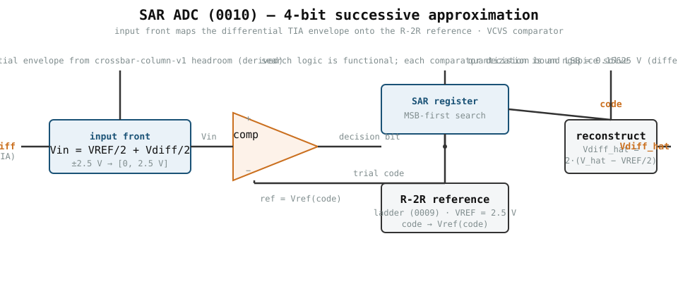
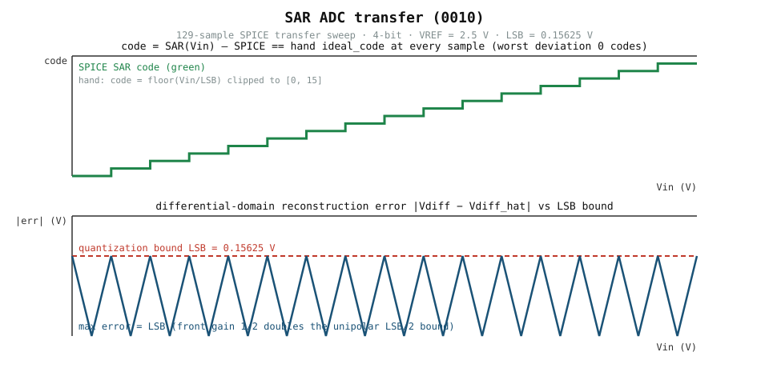

# 0010 — ADC SAR cho đường ngõ ra TIA

Ứng viên thiết kế đầu tiên cho phía ADC của đường tín hiệu converter (R2):
một converter **xấp xỉ liên tiếp (SAR)** với tham chiếu nội là thang R-2R của
chương 0009. Nó số hóa ngõ ra **vi sai** của cột crossbar 0007.

## Chuỗi tín hiệu

```
 Ngõ ra TIA            front ngõ vào          SAR
 Vdiff = Vm - Vp  ->   Vin = VREF/2 + Vdiff/2  ->  code  ->  Vdiff_hat
 +/-2.5 V (có dấu)     đơn cực [0, VREF]      floor(Vin/LSB)
```



- Ngõ ra vi sai `Vout = Vm − Vp` của cột 0007 có dấu và có thể trải `±2.5 V`
  quanh tham chiếu ảo (headroom của profile crossbar-column).
- Thang tham chiếu R-2R (0009) *đơn cực* `0 .. VREF`, nên front ngõ vào
  dịch mức và chia đôi tín hiệu: `Vin = VREF/2 + Vdiff/2`. Điều này ánh xạ
  `±2.5 V` lên `[0, 2.5 V]` chính xác, đủ một bọc LSB cho `2^N` code.

## Đơn vị và giả định

| Đại lượng | Giá trị | Đơn vị |
|---|---|---|
| `BITS` | 4 | bit (nguyên mẫu; khớp thang 0009) |
| `VREF` | 2.5 | V (tham chiếu; khớp 0005/0007/0009) |
| `LSB` | `VREF/16 = 0.15625` | V trên mỗi code |
| bọc vi sai | `±2.5` | V (từ headroom crossbar-column-v1, derived) |
| độ lợi front ngõ vào | `1/2` (×2 để tái tạo) | V/V |
| offset front ngõ vào | `+VREF/2` | V |
| comparator | VCVS độ lợi `1e4` (opamp lý tưởng, mô hình 0007) | — |

Mọi giá trị là mục tiêu mô phỏng; không phải kết quả silicon đo thật. Độ lợi
`1/2` và offset `VREF/2` của front ngõ vào là *lựa chọn thiết kế*, chưa phải
mạch đo — chúng sẽ được kiểm chứng trong công việc output-stage (giao diện
TIA→ADC).

## Mô hình đặc tuyến

Tham chiếu tay (mid-rise):

```text
code   = floor(Vin / LSB),              clipped về [0, 2^N - 1]
V_hat  = (code + 0.5) * LSB             tái tạo đơn cực
Vdiff_hat = 2 * (V_hat - VREF/2)        tái tạo trong miền vi sai
```



Panel trên là bậc thang code SAR SPICE trên bọc `[0, VREF]` — mạch tái hiện
`floor(Vin/LSB)` từng code một tại mọi một trong 129 mẫu. Panel dưới cho sai số
tái tạo miền vi sai nằm tại hoặc dưới ràng buộc lượng tử `LSB` (xem dưới). Cả
hai đồ thị được tạo lại từ extract đã commit (`verification/circuit/results/
adc-sar-v1-extract.json`) bởi `book/0010-adc-sar/diagrams/make_transfer.py`.

Sai số lượng tử bị chặn bởi `LSB = 0.15625 V` trong miền vi sai: front ngõ vào
tỉ lệ `1/2`, nên một code vi sai trải `2·LSB` và sai số tái tạo mid-rise tối đa
là `2·(LSB/2) = LSB` tại hai biên của bọc `±VREF`. (Đơn cực, chặn quen thuộc
là `LSB/2`.)

## Ranh giới mạch vs chức năng

Chương này cố ý tách hai mức (theo AGENTS.md quy tắc 4):

- **circuit/device** — mỗi lần thử bit SAR là một giải operating-point ngspice
  thật: điện áp node thang tham chiếu R-2R so với ngõ vào đã dịch mức, quyết
  định bởi comparator VCVS. `comparator_decision(Vin, code)` là SPICE.
- **functional** — thuật toán tìm kiếm *theo thứ tự MSB* đi qua các bit là
  logic xác định trong Python (`sar_search`). Nó tiêu thụ các quyết định SPICE
  nhưng bản thân việc tìm kiếm không phải mạch.

Đặc tuyến DC của thang 0009 đã được SPICE kiểm chứng; chương này tái dùng
topology đó và thêm quyết định comparator làm bằng chứng mức circuit mới.

## Kiểm chứng

- **Comparator**: quyết định SPICE bằng so sánh tay `Vin >= Vref(code)` trên
  các lần thử đại diện.
- **Quét đặc tuyến**: 129 mẫu trên `[0, VREF]`, code SAR bằng `ideal_code` tay
  tại mọi điểm — sai lệch tệ nhất 0 code.
- **Ví dụ**: `Vdiff = +2.0 V` → `Vin = 2.25 V` → code 14 →
  `Vdiff_hat = +2.0312 V`, sai số 0.0312 V ≤ LSB.
- **Settling tham chiếu**: tham chiếu R-2R tại node comparator settling như
  thang 0009 (`τ = 2R·CL`); SPICE khớp mô hình tay một cực trong 10 ns cho mỗi
  lần thử bit tại `CL = 1 pF` *giả định*.
- **Thời gian chuyển đổi**: 4 lần thử bit tuần tự, bước tham chiếu xấu nhất mỗi
  bit, cộng lại thành `140.9 ns` (SPICE) so với `138.6 ns` (tay). Giá trị `CL`
  chưa có bằng chứng device, nên settling/thời gian chuyển đổi chỉ là nghiên
  cứu độ nhạy.
- **Độ phân giải hiệu dụng**: một sine full-scale kết hợp (chu kỳ nguyên tố lẻ
  trên số mẫu là lũy thừa của hai, nên mọi mức lượng tử được quét đều) cho
  `ENOB = 3.91 bits` cho bộ lượng tử 4-bit (chặn trên tay 4.00); nhiễu Gaussian
  cộng tính quy về ngõ vào tại `0.05 V` làm suy giảm còn `3.46` (tay `3.42`).
  Mô hình nhiễu cộng tính phản chiếu `analog_llm.converters.adc`.
- **Độ nhạy nguồn VREF**: vì thang dựa trên tỉ số và comparator lý tưởng, lệch
  VREF là *sai số độ lợi thuần* — đo (SPICE) `gain_error` bằng `dVREF/VREF`
  tại ±10% trong sai số `1e-9`. Nhiệt độ và process corner **không** có hiệu
  ứng mô hình được trên điện trở/VCVS lý tưởng theo cấu trúc; điều đó được ghi
  là ngoài phạm vi, không quét như bằng chứng giả.
- **Profile**: `device_profiles/adc-sar-v1.json` (extract
  `verification/circuit/results/adc-sar-v1-extract.json`). Đặc tuyến SPICE cho
  `max_code_error_codes = 0` và `max_abs_error_v = LSB` (chặn lượng tử miền vi
  sai); `bits`, `r_ohm`, `vref_v`, `lsb_v`, `input_range_v`,
  `quantization_error_v` là lựa chọn thiết kế derived. Settling CL giả định,
  ENOB chức năng và nghiên cứu lệch nguồn chỉ nằm trong extract JSON — chúng
  không mang bằng chứng vật lý và fail closed dưới `physical_claim`. Chạy:
  `python verification/circuit/extract_adc_sar.py`.
- Test dữ liệu chạy luôn + test engine tùy chọn trong `tests/test_adc_sar.py`.

Chạy: `book/0010-adc-sar/sar_adc.py`

## Chương này CHƯA làm gì

- Mạch output-stage TIA→ADC (front `1/2` + `VREF/2` được giả định, chưa SPICE)
  — mục tiếp theo của chương này.
- Nhiễu như cơ chế *device*: nghiên cứu ENOB thêm nhiễu Gaussian quy về ngõ
  vào theo chức năng (khớp `converters.adc`); nhiễu nhiệt/kT-C comparator,
  nhiễu tham chiếu và phổ của chúng chưa phải mô hình SPICE.
- Quét nhiệt độ/process corner: điện trở lý tưởng + VCVS không có phụ thuộc
  nhiệt độ/corner theo cấu trúc, nên chỉ độ nhạy nguồn VREF (sai số độ lợi
  thuần) được quét.

Những mục này được theo dõi là mục mở trong gate R2; không gì ở đây được nâng
thành khẳng định vật lý đã kiểm chứng.
