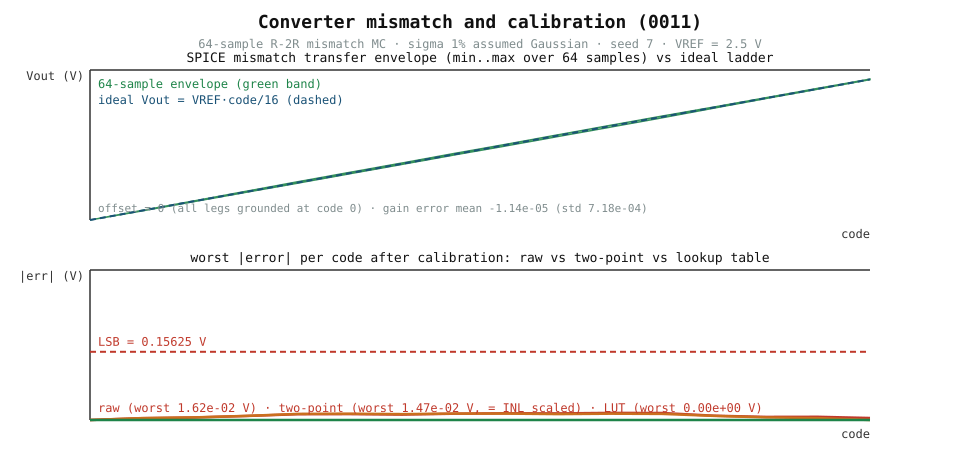

# 0011 — Biến thiên converter: mismatch điện trở R-2R

Điện trở silicon thật không chính xác: mỗi điện trở mang một mismatch tương
đối `delta ~ N(0, sigma)`. Các chương 0009/0010 kiểm chứng thang R-2R *danh
định*; chương này đo mismatch lan truyền vào đặc tuyến converter như thế nào
dưới dạng sai số độ lợi, INL và DNL — với một tham chiếu tay độc lập chứng
minh Monte Carlo.

## Hai solver, một bộ rút thăm xác định

Một seed cố định (`7`) rút một bộ véc-tơ mismatch tương đối (một phần tử cho
mỗi điện trở thang: chuỗi `R` của `bits`, `2R` kết thúc `1`, các nhánh chuyển
bit `2R` của `bits`). Mỗi véc-tơ lái **cả hai** solver:

- **SPICE** (`mismatched_output`): bản sao netlist thang 0009 với giá trị điện
  trở `nominal * (1 + delta)`, giải bởi ngspice.
- **tay** (`hand_output`): cùng mạng điện trở giải như ma trận conductance
  `G·V = b` trong NumPy, với switch bit là nguồn `VREF`/`0` lý tưởng — lý
  tưởng hóa giống hệt netlist SPICE.

Mạng tuyến tính, nên cả hai solver phải trả điện áp giống hệt cho mọi cặp
(code, mẫu). Đẳng thức đó là khẳng định cốt lõi: thang mismatch SPICE và mô
hình tay khớp đến **`2.2e-15 V`** trên toàn bộ 1024 cặp (mẫu × code) của nghiên
cứu 64 mẫu.

## Neo tính tay siêu nhỏ

Cho thang 1-bit (chuỗi `b`, kết thúc `a`, nhánh `c`) với code 1, ngõ ra chính
xác là

```
Vout = VREF * a / (a + c)
```

(KCL tại `n0` với `Vout = Vn0`; `b` không mang dòng tải và bị loại — kiểm tra
bằng cách nhiễu `b` 99% và xác nhận không ảnh hưởng). Dạng đóng được khẳng
định trong `tests/test_converter_variation.py` làm neo cho toàn bộ mô hình
mismatch.

## Thống kê Monte Carlo

Mỗi mẫu, trên toàn bộ `2^N` code, đo từ đường khớp điểm đầu-cuối:

| Đại lượng | mean | std |
|---|---|---|
| offset | `0` | `0` (mọi nhánh nối đất tại code 0) |
| sai số độ lợi (độ dốc điểm đầu-cuối / LSB − 1) | `−1.1e-5` | `7.2e-4` |
| max \|INL\| | `6.3e-3 V` | `3.1e-3 V` |
| max \|DNL\| | `1.1e-2 V` | `6.5e-3 V` |

Với `sigma = 0` nghiên cứu tái hiện thang lý tưởng (kiểm tra fail-closed), và
thống kê tính từ đặc tuyến SPICE khớp thống kê hand-solver đến `1e-12`.



Panel trên là bọc đặc tuyến mismatch SPICE 64 mẫu (min..max mỗi code trên các
rút thăm xác định) so với thang lý tưởng — độ trải tăng dần về full scale (sai
số độ lợi thuần; offset chính xác 0). Panel dưới cho sai số mỗi code tệ nhất
sau mỗi ứng viên hiệu chuẩn: trải thô so với hiệu chỉnh hai điểm (trái bằng
max|INL| đã tỉ lệ) so với LUT đầy đủ (zero). Đồ thị được tạo lại từ extract đã
commit (`verification/circuit/results/converter-variation-0011-extract.json`)
bởi `book/0011-converter-variation/diagrams/make_plots.py`, vốn tái dùng module
`calibration` của chương, nên hình luôn hiển thị đúng các số đã test.

## Đơn vị và giả định

- `R = 10 kΩ`, `2R = 20 kΩ`, `VREF = 2.5 V`, `BITS = 4` (khớp 0009/0010).
- `sigma = 1%` mismatch tương đối, Gaussian, **giả định** — không có đo đạc
  hậu thuẫn. Đây là nghiên cứu độ nhạy: nó chứng minh mô hình lan truyền
  mismatch xác định và khớp một solver độc lập, nhưng **không** xuất bản
  profile device và sẽ fail closed dưới `physical_claim`.
- Mismatch chỉ áp lên điện trở; điện trở switch, offset comparator và nhiệt độ
  nằm ngoài phạm vi.

## Tách các cơ chế sai số

Một đặc tuyến đo trộn các nguồn sai số độc lập; `decomposition.py` tách chúng
và chứng minh phép tách chính xác.

**DAC** (`decompose_dac_transfer`): đường khớp điểm đầu-cuối
`L(code) = offset + slope·code` nắm offset + độ lợi; phần còn lại là phi tuyến
(`INL = V − L`). Trên nghiên cứu mismatch SPICE 64 mẫu, phép tách cho offset
`0`, sai số độ lợi mean `−1.1e-5` (std `7.2e-4`), và `max|INL| = 1.5e-2 V`,
với `V == line + INL` đến `1e-12` — phép tách chính xác theo cấu trúc.

**ADC** (`separate_adc_error`): một sine full-scale qua bộ lượng tử 4-bit cộng
nhiễu Gaussian quy về ngõ vào tích lũy công suất sai số từ hai cơ chế không
tương quan, `P_total = P_quant + P_noise` với `P_quant = LSB²/12`. Công suất đo
bám tổng tay (ví dụ `noise_std = 0.05 V`: đo `4.25e-3` so với tay `4.54e-3 V²`,
dung sai lấy mẫu).

## Ứng viên hiệu chuẩn

Mismatch tĩnh theo từng chip, nên hiệu chỉnh được. `calibration.py` định nghĩa
và chạy ba ứng viên trên các rút thăm mismatch SPICE:

| Ứng viên | Hiệu chỉnh | Phần dư trên nghiên cứu SPICE 64 mẫu |
|---|---|---|
| thô (chưa hiệu chỉnh) | — | `1.6e-2 V` |
| hai điểm (độ lợi + offset) | khớp điểm đầu-cuối, `V_corr = (V−offset)·LSB/slope` | `1.5e-2 V` = max\|INL\| (đã tỉ lệ) |
| LUT đặc tuyến đầy đủ | trừ độ lệch mỗi code khỏi lý tưởng | `0.0 V` (mismatch tĩnh) |
| trim tham chiếu (VREF) | hệ số độ lợi số (từ 0010: `gain_error = dVREF/VREF`) | ghi chú thiết kế, không đo lại |

Sơ đồ hai điểm loại phần độ lợi/offset và để lại đúng phi tuyến; LUT đầy đủ
triệt tiêu toàn bộ mismatch tĩnh. Cả hai được chứng minh chính xác trong
`tests/test_converter_calibration.py`.

## Tạo phẩm (artifacts)

- `book/0011-converter-variation/variation.py` — nguồn sự thật duy nhất cho
  các giải SPICE (chạy `python book/0011-converter-variation/variation.py`).
- `book/0011-converter-variation/decomposition.py` — tách các cơ chế sai số
  (chạy `python book/0011-converter-variation/decomposition.py`).
- `book/0011-converter-variation/calibration.py` — định nghĩa các ứng viên
  hiệu chuẩn (chạy `python book/0011-converter-variation/calibration.py`).
- `verification/circuit/extract_converter_variation.py` — trích xuất xác định;
  phát ra `verification/circuit/results/converter-variation-0011-extract.json`
  (đặc tuyến thô cho cả hai solver + thống kê).
- `tests/test_converter_variation.py` — test mô hình tay chạy luôn + test khớp
  SPICE và tái tạo extract gated theo engine.
