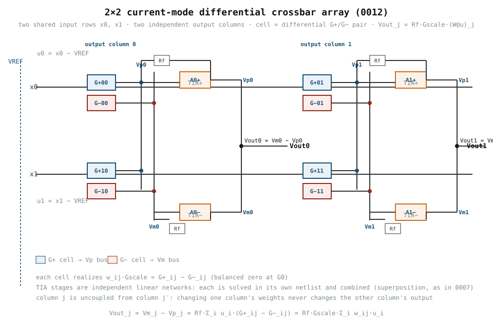
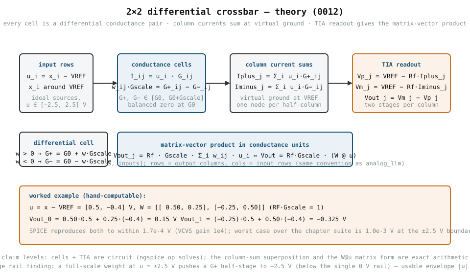
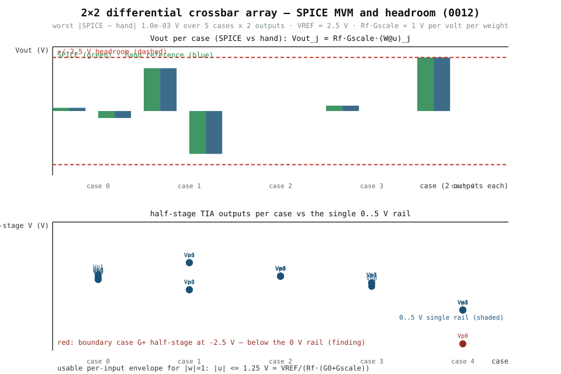

# 0012 — 2×2 current-mode differential crossbar array

> **Bản tiếng Việt:** [`README.vi.md`](README.vi.md)

Scale the 0007 single-column design to a small **array**: two input rows shared
by two independent output columns. This is the first chapter whose SPICE
evidence is a real matrix-vector product — `y = W @ u` with `W` a `[outputs,
inputs]` matrix — the exact operation `analog_llm` maps onto tiles.

## Theory



Every cell is a differential conductance pair realizing the signed weight

```text
w_ij · GSCALE = G+_ij − G−_ij,      balanced zero at G0
```

Inputs `x_i` drive both cells of every column; each output column `j` sums its
cell currents at two virtual-ground nodes (one for `G+`, one for `G−`) and
converts them with a transimpedance stage:

```text
Iplus_j  = Σ_i u_i · G+_ij        u_i = x_i − VREF
Iminus_j = Σ_i u_i · G−_ij
Vout_j   = Vm_j − Vp_j
         = RF · GSCALE · Σ_i u_i · w_ij
         = RF · GSCALE · (W @ u)_j
```

The two input rows are **shared**; the two output columns are **independent**
— each column's cells connect only to that column's summing nodes, so changing
one column's weights never changes the other column's output (asserted in
SPICE: `|ΔVout_0| = 0` when only column 1 changes).



## Units and assumptions

| Quantity | Value | Units |
|---|---|---|
| `VREF` | 2.5 | V (matches 0005/0007/0009/0010) |
| `G0` | 0.10e-3 | S (balanced zero conductance) |
| `GSCALE` | 0.10e-3 | S per weight unit |
| `RF` | 10 | kΩ (transimpedance feedback) |
| `RF·GSCALE` | 1.0 | V per volt per weight |
| differential headroom | ±2.5 | V (crossbar-column-v1, derived) |
| op-amp | VCVS gain 1e4 | ideal model, 0005/0007 |

All values are simulation targets; nothing here is a measured silicon result.

## Circuit → solves

`crossbar_2x2.py` is the single source of truth for SPICE solves. Each of the
four TIA stages (`Vp_0, Vm_0, Vp_1, Vm_1`) is an independent linear network
sharing only the ideal input sources and the reference, so `Vout_j = Vm_j −
Vp_j` holds by superposition — each stage is solved in its own netlist and
combined (exactly the 0007 procedure, now for four stages).

## Verification

- **MVM vs hand reference**: 5 deterministic cases × 2 outputs —
  mixed-sign weights, full-scale differential, balanced zero, one zero per
  row, and the boundary envelope — `worst |SPICE − hand| = 1.0e-3 V` (VCVS
  gain 1e4; consistent with 0007's 8e-4 V for smaller swings). Balanced zero
  gives exactly `0 V`.
- **Column independence**: changing only column 1's weights leaves `Vout_0`
  unchanged to `0.0e+00 V`.
- **Output-stage headroom**: every differential output stays inside the
  `±2.5 V` envelope (`max |Vout| = 2.499 V` at the boundary case).
- **Virtual ground / loading**: every summing node sits within `3.5e-4 V` of
  `VREF` (the `|Vhalf|/Aol` finite-gain bound of the 1e4 VCVS), well inside
  the 0.05 V loading check.
- **Half-stage rail finding**: each half-stage is a *single-rail* (0..5 V)
  inverting summer. With a full-scale weight at the input envelope edge the
  `G+` half-stage of the boundary column reaches **−2.5 V — below the 0 V
  rail**. The ideal VCVS model has no clipping, so the differential output
  stays exact, but a real single-rail TIA would clip there. This bounds the
  usable per-input envelope for `|w| = 1`:

  ```text
  |u| ≤ VREF / (RF·(G0 + GSCALE)) = 1.25 V
  ```

  i.e. the half-stage rail, not the ±2.5 V differential headroom, sets the
  per-input envelope. Reported as a finding (not hidden) and carried into the
  extract; it is exactly the kind of constraint the R4/R8 headroom and
  feasibility work must respect.

 — regenerated from the
committed extract by `book/0012-crossbar-2x2/diagrams/make_plots.py`.

## Artifacts

- `book/0012-crossbar-2x2/crossbar_2x2.py` — single source of truth for the
  SPICE solves (run `python book/0012-crossbar-2x2/crossbar_2x2.py`).
- `verification/circuit/extract_crossbar_2x2.py` — deterministic extraction;
  emits `verification/circuit/results/crossbar-2x2-0012-extract.json`
  (per-case transfers, headroom, virtual-ground, independence, rail finding).
  Run: `python verification/circuit/extract_crossbar_2x2.py`.
- `tests/test_crossbar_2x2.py` — always-on hand-model and committed-extract
  tests + engine-gated SPICE tests.
- `diagrams/array_schematic.svg`, `diagrams/theory.svg` — theory diagrams;
  `diagrams/make_plots.py` regenerates `diagrams/mvm_cases.svg` from the
  committed extract.

No new device profile is published here: `crossbar-v1` (device realism) is the
R4 milestone. This chapter is the **behavioral-mapping evidence** that the
2×2 array computes `W @ u` correctly in SPICE.

## What this chapter does NOT do yet

- Behavioral-equivalence comparison against `analog_llm`'s tile model and a
  quantitative error report — that is 0013 (4×4) / the R3 gate exit.
- Loading of the shared input rows by a finite driver impedance (inputs are
  ideal sources here); IR drop and parasitic RC are R4 items.
- A real output-stage circuit: the TIA is the 0005/0007 ideal VCVS model, and
  the single-rail half-stage clipping at `|u| > 1.25 V` (full-scale weights)
  is documented, not modeled as clipping.

These are tracked as open items in the R3 gate.
