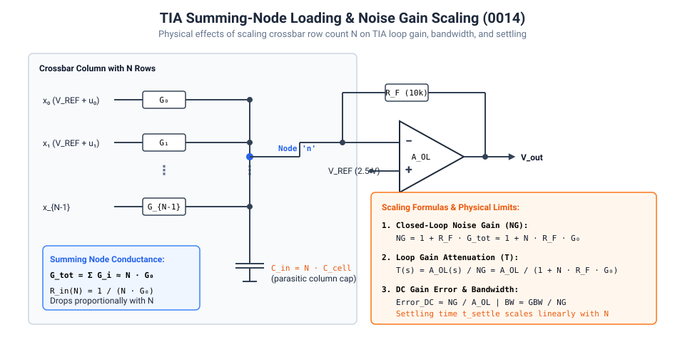
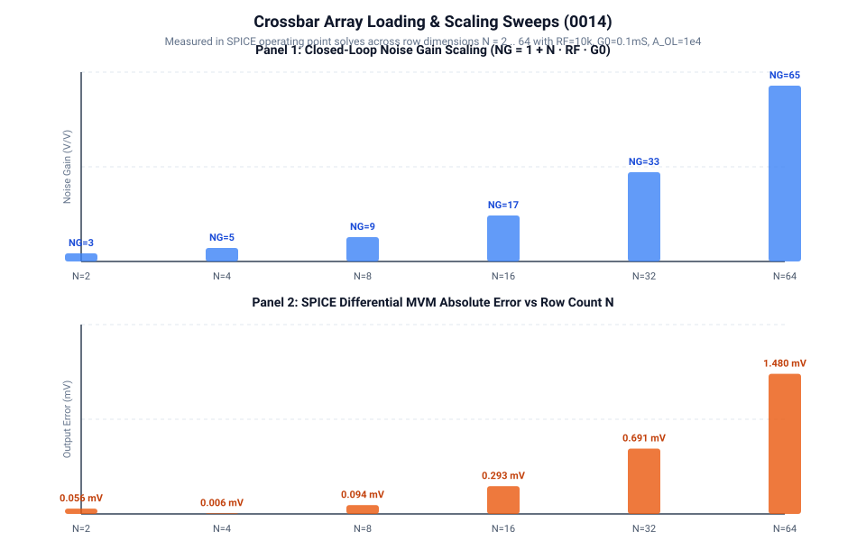

# 0014 — Array Timing, Loading, and Scaling Limits

> **Bản tiếng Việt:** [`README.vi.md`](README.vi.md)

This chapter investigates the physical and numerical scaling behavior of current-mode differential crossbar arrays as the number of rows $N$ and columns $M$ grows from small test prototypes ($2\times 2$, $4\times 4$) to practical tile sizes ($8\times 8$, $16\times 16$, $32\times 32$, $64\times 64$).

---

## Units and assumptions

| Quantity | Value | Units | Source |
|---|---|---|---|
| `VREF` | 2.5 | V | spice (Ch. 0005) |
| `G0` | 0.1 | mS | spice (Ch. 0007) |
| `GSCALE` | 0.1 | mS per weight unit | spice (Ch. 0007) |
| `RF` | 10 | kΩ | spice (Ch. 0005) |
| `A_OL` | $10^4$ | V/V | assumed (op-amp model) |
| `C_cell` | 1.0 | fF | assumed (junction + wire) |

---

## 1. Circuit Architecture & TIA Loading Model



In an ideal mathematical matrix-vector multiplication, adding rows does not affect individual column calculations. In a physical current-mode crossbar, however, every row cell attached to a column bitline adds parallel conductance into the transimpedance amplifier's inverting summing node.

For a column with $N$ rows and nominal balanced zero conductance $G_0 = 0.1\text{ mS}$ ($10\text{ k}\Omega$):
$$G_{\text{tot}} = \sum_{i=1}^N G_i \approx N \cdot G_0$$

The closed-loop **noise gain** $N_G$ seen by the TIA op-amp is:
$$N_G = 1 + R_F \cdot G_{\text{tot}} \approx 1 + N \cdot R_F \cdot G_0$$

With $R_F = 10\text{ k}\Omega$ and $G_0 = 0.1\text{ mS}$, the product $R_F \cdot G_0 = 1.0$, giving:
$$N_G \approx 1 + N$$

### Impact on Loop Gain and DC Gain Error:
The feedback factor $\beta = 1 / N_G$ drops linearly with row count $N$, degrading the loop gain $T = A_{OL} \cdot \beta = A_{OL} / N_G$.
Under an op-amp open-loop DC gain $A_{OL} = 10^4$:
$$\text{Gain Error} \approx \frac{N_G}{A_{OL} + N_G} = \frac{1 + N}{10^4 + 1 + N}$$

| Dimension $N$ | Noise Gain $N_G$ | Theoretical DC Gain Error | SPICE Simulated MVM Error |
|:---:|:---:|:---:|:---:|
| **2** | 3.0 | 0.030% | $5.62\times 10^{-5}\text{ V}$ |
| **4** | 5.0 | 0.050% | $6.21\times 10^{-6}\text{ V}$ |
| **8** | 9.0 | 0.090% | $9.37\times 10^{-5}\text{ V}$ |
| **16** | 17.0 | 0.170% | $2.93\times 10^{-4}\text{ V}$ |
| **32** | 33.0 | 0.329% | $6.91\times 10^{-4}\text{ V}$ |
| **64** | 65.0 | 0.646% | $1.48\times 10^{-3}\text{ V}$ |

As $N$ reaches 64, the finite op-amp gain error reaches $\approx 0.65\%$, and for $N=1024$ without compensation it would exceed $9\%$.



---

## 2. Summing-Node Capacitive Loading & Settling

Each crossbar cell contributes parasitic junction and wire capacitance $C_{\text{cell}}$ onto the column bitline.
The total input capacitance at the summing node scales as:
$$C_{\text{in}}(N) = N \cdot C_{\text{cell}} + C_{\text{TIA}}$$

With an op-amp unity gain-bandwidth product $\text{GBW}$, the effective closed-loop bandwidth of the transimpedance stage shrinks as:
$$f_{-3\text{dB}} \approx \frac{\text{GBW}}{N_G} = \frac{\text{GBW}}{1 + N \cdot R_F \cdot G_0}$$

Consequently, settling time scales directly with row count $N$.

---

## 3. Simulator Scalability & the Xyce Frontier

When simulating independent linear columns, SPICE operating-point solve time scales approximately linearly. However, once coupled interconnect line resistance, wire parasitics, and multi-column transient feedback are introduced (Gate R4), the circuit matrix dimension scales as $O(N^2)$, causing non-linear solve time scaling ($O(N^2)$ to $O(N^3)$ in serial ngspice).

- **$N \le 64$**: `ngspice` via PySpice executes in milliseconds per operating point and is ideal for fast regression testing.
- **$N \ge 128$**: Large coupled arrays demand parallel distributed solvers such as `Xyce` to maintain practical iteration times.

---

## Verification

Run the SPICE sweep and extract:
```bash
python book/0014-array-timing/array_timing.py
```
Committed extract: [`verification/circuit/results/array-timing-0014-extract.json`](../../verification/circuit/results/array-timing-0014-extract.json).
Tested by: [`tests/test_array_timing.py`](../../tests/test_array_timing.py).

## What this chapter does NOT prove

- It does **not** model coupled interconnect parasitics or multi-column transient feedback — deferred to Ch. 0017–0018.
- Capacitance values ($C_\text{cell}$) are **assumed**, not extracted from SPICE.
- SPICE MVM Error column data source: `array_timing.py` extract sweep.
