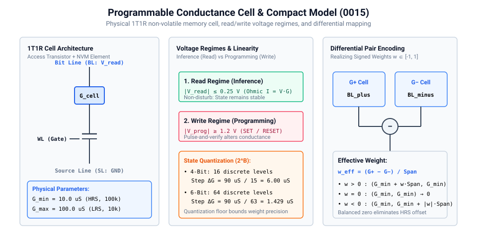
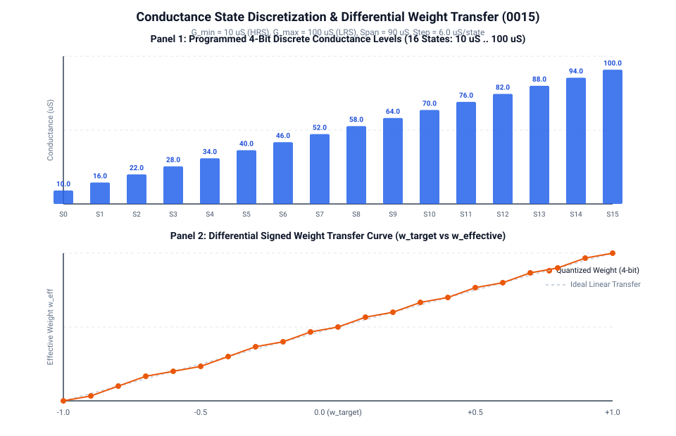

# 0015 — Programmable Conductance Compact Model

> **Bản tiếng Việt:** [`README.vi.md`](README.vi.md)

This chapter opens **Gate R4 (Device Realism)** by transitioning from idealized continuous resistors to a physical **programmable non-volatile memory (NVM / ReRAM / 1T1R)** compact model with discrete conductance states and bounded read voltages.

---

## 1. Physical Cell Structure & Operating Regimes



In real hardware, analog in-memory computing cells are non-volatile elements (such as metal-oxide memristors, phase change memory, or floating gate transistors) gated by an access transistor (1T1R configuration).

### Key Physical Parameters:
| Parameter | Symbol | Value | Notes / Provenance |
|---|---|---|---|
| High-Resistance State (HRS) | $G_{\min}$ | $10.0\,\mu\text{S}$ ($100\text{ k}\Omega$) | Device leakage / baseline floor |
| Low-Resistance State (LRS) | $G_{\max}$ | $100.0\,\mu\text{S}$ ($10\text{ k}\Omega$) | Maximum programmed conductance |
| Conductance Span | $\Delta G_{\text{span}}$ | $90.0\,\mu\text{S}$ | $G_{\max} - G_{\min}$ |
| Dynamic Range Ratio | $G_{\max}/G_{\min}$ | $10.0\times$ | Measurable on-off window |
| Max Read Voltage | $V_{\text{read,max}}$ | $0.25\text{ V}$ | Non-disturb linear ohmic envelope |
| Programming Threshold | $V_{\text{prog}}$ | $\ge 1.2\text{ V}$ | SET / RESET pulse amplitude |

---

## 2. Discrete Conductance States & Signed Weight Mapping



### State Discretization ($2^B$ levels):
Devices are tuned via pulse-and-verify programming into $K = 2^B$ discrete states:
$$G_k = G_{\min} + \frac{k}{2^B - 1} (G_{\max} - G_{\min}), \quad k \in \{0, 1, \dots, 2^B - 1\}$$

- **4-Bit Programming ($K=16$)**: Step size $\Delta G = 6.00\,\mu\text{S}$ per state ($6.67\%$ of full span).
- **6-Bit Programming ($K=64$)**: Step size $\Delta G = 1.429\,\mu\text{S}$ per state ($1.58\%$ of full span).

### Differential Signed Weight Resolution:
A signed matrix weight $w \in [-1, 1]$ maps across a physical cell pair $(G^+, G^-)$:
$$w_{\text{eff}} = \frac{G^+ - G^-}{G_{\max} - G_{\min}}$$

- Positive weight ($w > 0$): $G^+ = \text{quantize}(G_{\min} + w \cdot \text{Span})$, $G^- = G_{\min}$.
- Balanced Zero ($w = 0$): $G^+ = G_{\min}$, $G^- = G_{\min} \implies w_{\text{eff}} = 0.0$ exactly.
- Negative weight ($w < 0$): $G^+ = G_{\min}$, $G^- = \text{quantize}(G_{\min} + |w| \cdot \text{Span})$.

---

## 3. Read Currents and Linearity Envelope

Within $|V_{\text{read}}| \le 0.25\text{ V}$, the cell operates as a linear resistor with max current per cell:
$$I_{\text{cell,max}} = V_{\text{read,max}} \cdot G_{\max} = 0.25\text{ V} \times 100\,\mu\text{S} = 25.0\,\mu\text{A}$$
$$I_{\text{cell,min}} = V_{\text{read,max}} \cdot G_{\min} = 0.25\text{ V} \times 10\,\mu\text{S} = 2.5\,\mu\text{A}$$

---

## Verification

Run compact model characterization and extraction:
```bash
python book/0015-conductance-model/conductance_model.py
python book/0015-conductance-model/diagrams/make_plots.py
```
Committed extract: [`verification/circuit/results/conductance-model-0015-extract.json`](../../verification/circuit/results/conductance-model-0015-extract.json).
Tested by: [`tests/test_conductance_model.py`](../../tests/test_conductance_model.py).
