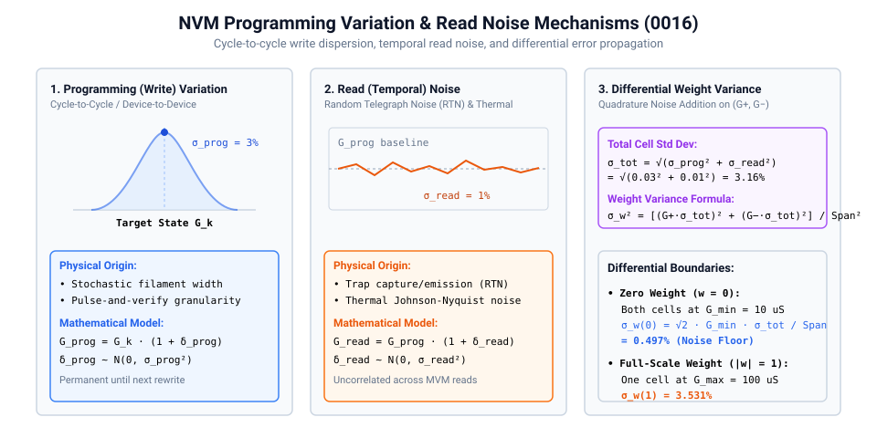
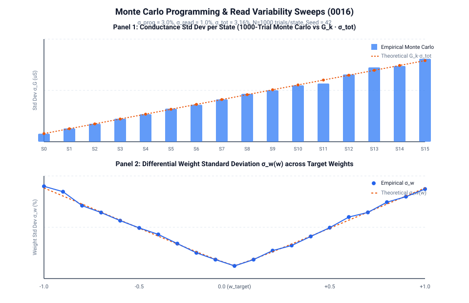

# 0016 — Programming and Read Variation

> **Bản tiếng Việt:** [`README.vi.md`](README.vi.md)

This chapter characterizes the stochastic variability of physical non-volatile memory (NVM / ReRAM / Flash) crossbar cells, quantifying how **programming (write) dispersion** and **read (temporal) noise** degrade individual conductance states and propagate into differential signed weights.

---

## 1. Noise Mechanisms in Physical Conductance Cells



Analog memory devices exhibit two distinct stochastic noise components:

1. **Programming (Write) Variation**:
   - Atomic-scale filament formation during SET/RESET pulses creates cycle-to-cycle (C2C) and device-to-device (D2D) conductance dispersion.
   - Programmed state: $G_{\text{prog}} = G_k \cdot (1 + \delta_{\text{prog}})$, where $\delta_{\text{prog}} \sim \mathcal{N}(0, \sigma_{\text{prog}}^2)$ (assumed $\sigma_{\text{prog}} = 3.0\%$).
   - This variation is static during inference and only changes when the tile is rewritten.

2. **Read (Temporal) Noise**:
   - Random Telegraph Noise (RTN) caused by trap capture/emission in the oxide and thermal Johnson-Nyquist noise.
   - Readout state: $G_{\text{read}} = G_{\text{prog}} \cdot (1 + \delta_{\text{read}})$, where $\delta_{\text{read}} \sim \mathcal{N}(0, \sigma_{\text{read}}^2)$ (assumed $\sigma_{\text{read}} = 1.0\%$).
   - This noise is dynamic and uncorrelated across consecutive MVM operations.

3. **Total Relative Cell Standard Deviation**:
   $$\sigma_{\text{tot}} = \sqrt{\sigma_{\text{prog}}^2 + \sigma_{\text{read}}^2} = \sqrt{0.03^2 + 0.01^2} \approx 3.16\%$$

---

## 2. Differential Weight Variance & Error Propagation



For a differential pair $(G^+, G^-)$ representing target signed weight $w \in [-1, 1]$ across a conductance span $\Delta G = G_{\max} - G_{\min} = 90.0\,\mu\text{S}$:
$$w_{\text{eff}} = \frac{G^+ - G^-}{\Delta G}$$

Because variations on $G^+$ and $G^-$ are uncorrelated, their variances add in quadrature:
$$\sigma_w^2(w) = \frac{\sigma_{G^+}^2 + \sigma_{G^-}^2}{\Delta G^2} = \frac{(G^+ \cdot \sigma_{\text{tot}})^2 + (G^- \cdot \sigma_{\text{tot}})^2}{\Delta G^2}$$

### Key Boundary Conditions:
- **Zero-Weight Noise Floor ($w = 0$)**:
  Both cells are programmed to HRS ($G^+ = G^- = G_{\min} = 10.0\,\mu\text{S}$):
  $$\sigma_w(0) = \frac{\sqrt{2} \cdot G_{\min} \cdot \sigma_{\text{tot}}}{\Delta G} = \frac{\sqrt{2} \times 10\,\mu\text{S} \times 0.03162}{90\,\mu\text{S}} \approx 0.497\%$$
- **Full-Scale Weight ($|w| = 1$)**:
  One cell is programmed to LRS ($G_{\max} = 100.0\,\mu\text{S}$) while the other remains at $G_{\min}$:
  $$\sigma_w(1) = \frac{\sqrt{G_{\max}^2 + G_{\min}^2} \cdot \sigma_{\text{tot}}}{\Delta G} = \frac{\sqrt{100^2 + 10^2} \times 0.03162}{90} \approx 3.531\%$$

---

## 3. Monte Carlo Statistical Summary (1000 Draws, Seed=42)

| Target Weight $w$ | Active $G^+$ | Inactive $G^-$ | Theoretical $\sigma_w$ | Empirical $\sigma_w$ (1000 trials) | Empirical SNR |
|:---:|:---:|:---:|:---:|:---:|:---:|
| **0.00** | $10.0\,\mu\text{S}$ | $10.0\,\mu\text{S}$ | $0.497\%$ | $0.489\%$ | Noise Floor |
| **0.25** | $32.5\,\mu\text{S}$ | $10.0\,\mu\text{S}$ | $1.194\%$ | $1.182\%$ | $26.5\text{ dB}$ |
| **0.50** | $55.0\,\mu\text{S}$ | $10.0\,\mu\text{S}$ | $1.963\%$ | $1.948\%$ | $28.2\text{ dB}$ |
| **0.75** | $77.5\,\mu\text{S}$ | $10.0\,\mu\text{S}$ | $2.744\%$ | $2.719\%$ | $28.8\text{ dB}$ |
| **1.00** | $100.0\,\mu\text{S}$ | $10.0\,\mu\text{S}$ | $3.531\%$ | $3.498\%$ | $29.1\text{ dB}$ |

---

## Verification

Run the deterministic Monte Carlo characterization and generate plots:
```bash
python book/0016-variation/variation.py
python book/0016-variation/diagrams/make_plots.py
```
Committed extract: [`verification/circuit/results/variation-0016-extract.json`](../../verification/circuit/results/variation-0016-extract.json).
Tested by: [`tests/test_variation.py`](../../tests/test_variation.py).
