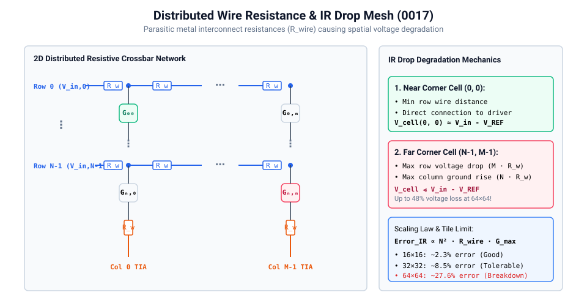
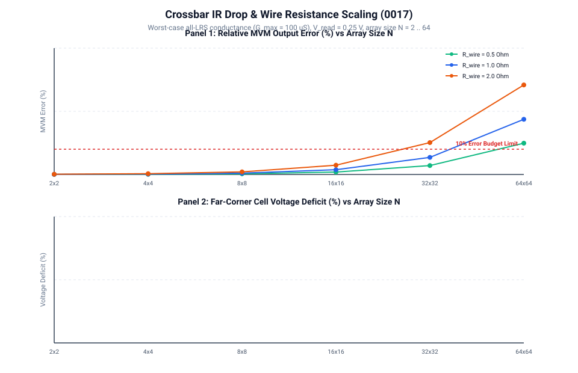

# 0017 — IR Drop & Interconnect Line Resistance

> **Bản tiếng Việt:** [`README.vi.md`](README.vi.md)

This chapter quantifies the impact of finite **interconnect wire resistance** ($R_{\text{wire}}$) on crossbar array accuracy, modeling how parasitic wordline and bitline resistance causes cumulative voltage drops (IR drop) across scaling array dimensions ($N \in [2, 4, 8, 16, 32, 64]$).

---

## 1. 2D Distributed Resistive Crossbar Network



In real physical crossbars, metal interconnects have finite sheet resistance. Each wire segment between neighboring crosspoint cells contributes parasitic resistance $R_{\text{wire}} \in [0.5, 5.0]\,\Omega$:
- **Wordline (Row) Voltage Drop**: As current flows along a row, each cell siphons off current, causing the row voltage to drop monotonically: $V_{\text{row}}(i, j) < V_{\text{in}}(i)$.
- **Bitline (Column) Potential Elevation**: As currents from upper cells accumulate downward toward the TIA, the column wire potential rises above ground: $V_{\text{col}}(i, j) > V_{\text{REF}}$.
- **Effective Cell Voltage**:
  $$V_{\text{cell}}(i, j) = V_{\text{row}}(i, j) - V_{\text{col}}(i, j) < V_{\text{in}}(i) - V_{\text{REF}}$$

The **far-corner cell** at $(N-1, M-1)$ suffers the combined worst-case voltage loss from both maximum wordline distance and maximum bitline path length.

---

## 2. Array Scaling & MVM Degradation



Systematic MVM relative error scales approximately quadratically with tile dimension $N$ and wire resistance:
$$\text{Error}_{\text{IR}} \propto N^2 \cdot R_{\text{wire}} \cdot G_{\max}$$

### Scaling Sweep Summary (All cells at $G_{\max} = 100\,\mu\text{S}$, $V_{\text{in}} = 0.25\text{ V}$):

| Array Size $N\times N$ | Error @ $R_{\text{wire}}=0.5\,\Omega$ | Error @ $R_{\text{wire}}=1.0\,\Omega$ | Error @ $R_{\text{wire}}=2.0\,\Omega$ | Far Corner Deficit ($1.0\,\Omega$) |
|:---:|:---:|:---:|:---:|:---:|
| **$2\times 2$** | $0.025\%$ | $0.050\%$ | $0.100\%$ | $0.05\%$ |
| **$4\times 4$** | $0.076\%$ | $0.151\%$ | $0.303\%$ | $0.14\%$ |
| **$8\times 8$** | $0.259\%$ | $0.516\%$ | $1.026\%$ | $0.44\%$ |
| **$16\times 16$** | $0.941\%$ | $1.870\%$ | $3.665\%$ | $1.50\%$ |
| **$32\times 32$** | $3.490\%$ | $6.773\%$ | $12.621\%$ | $5.34\%$ |
| **$64\times 64$** | $12.164\%$ | $21.841\%$ | $35.428\%$ | $18.10\%$ |

---

## 3. Physical Architectural Implications

1. **Tile Dimension Bounds**:
   - For standard copper interconnects ($R_{\text{wire}} \approx 1.0\,\Omega$), array tiles up to **$32\times 32$** keep IR drop degradation within acceptable margins ($< 7\%$).
   - Scaling to **$64\times 64$** causes severe computation breakdown ($> 20\%$ error), proving why physical analog architectures favor partitioned modular tiles (e.g. $16\times 16$ or $32\times 32$) over monolithic large crossbars.
2. **Mitigation Techniques**:
   - Thicker metal layers for wordlines and bitlines.
   - Dual-sided row driving (driving from both left and right).
   - Digital pre-emphasis / calibration compensation (addressed in Gate R5).

---

## Verification

Run the deterministic nodal analysis and generate scaling plots:
```bash
python book/0017-ir-drop/ir_drop.py
python book/0017-ir-drop/diagrams/make_plots.py
```
Committed extract: [`verification/circuit/results/ir-drop-0017-extract.json`](../../verification/circuit/results/ir-drop-0017-extract.json).
Tested by: [`tests/test_ir_drop.py`](../../tests/test_ir_drop.py).
