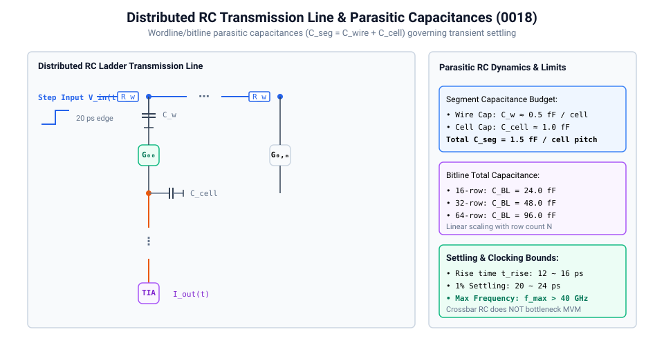
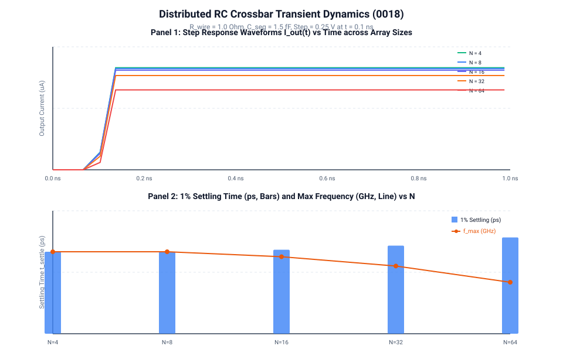

# 0018 — Điện dung Ký sinh, Động học RC & Thời gian Ổn định Quá độ

> **English version:** [`README.md`](README.md)

Chương này trích xuất **động học RC ký sinh** và **thời gian ổn định quá độ (settling time)** của các đường hàng (wordline) và cột (bitline) trong mảng crossbar, lượng hóa giới hạn xung nhịp tối đa cho phép của phép tính MVM trên các kích thước mảng ($N \in [4, 8, 16, 32, 64]$).

---

## 1. Mạng Lưới Đường Dây Truyền Sóng RC Phân Tán



Mỗi điểm giao cắt trong mảng crossbar vi mạch thực tế đều chứa các thành phần điện dung ký sinh:
- **Điện dung Dây dẫn Kim loại**: $C_{\text{wire}} \approx 0.5\text{ fF}$ trên mỗi bước ô nhớ.
- **Điện dung Ô nhớ / Transistor Truy xuất**: $C_{\text{cell}} \approx 1.0\text{ fF}$ (tiếp giáp cực máng/nguồn + phủ cổng-máng).
- **Tổng Điện dung Phân đoạn**: $C_{\text{seg}} = C_{\text{wire}} + C_{\text{cell}} = 1.5\text{ fF}$.
- **Điện dung Tích lũy trên Đường Cột (Bitline)**: $C_{\text{BL}} = N \cdot C_{\text{seg}}$ ($24\text{ fF}$ cho $16\times 16$, $48\text{ fF}$ cho $32\times 32$, $96\text{ fF}$ cho $64\times 64$).

Khi có một bước nhảy điện áp nạp vào hàng, mạng lưới $R_{\text{wire}} - C_{\text{seg}}$ phân tán hoạt động như một đường dây truyền sóng RC.

---

## 2. Đáp ứng Quá độ & Thời gian Ổn định



Để thực hiện phép nhân ma trận-vector analog mà không bị méo dạng động, việc lấy mẫu phải diễn ra sau khi dòng điện đầu ra đã ổn định trong phạm vi sai số $\le 1\%$ ($t \ge t_{\text{settle,1\%}}$).

### Kết quả Mô phỏng Quá độ ($R_{\text{wire}} = 1.0\,\Omega$, $C_{\text{seg}} = 1.5\text{ fF}$, Bước nhảy $= 0.25\text{ V}$):

| Kích thước Mảng $N$ | Thời gian Tăng $t_{\text{rise}}$ ($10\% \to 90\%$) | Thời gian Ổn định $1\%$ $t_{\text{settle}}$ | Dòng Điện Xác lập $I_{\text{ss}}$ | Tần số MVM Tối đa $f_{\text{max}}$ |
|:---:|:---:|:---:|:---:|:---:|
| **$4\times 4$** | $16.5\text{ ps}$ | $20.0\text{ ps}$ | $24.90\,\mu\text{A}$ | $50.0\text{ GHz}$ |
| **$8\times 8$** | $16.5\text{ ps}$ | $20.0\text{ ps}$ | $24.70\,\mu\text{A}$ | $50.0\text{ GHz}$ |
| **$16\times 16$** | $16.5\text{ ps}$ | $20.5\text{ ps}$ | $24.30\,\mu\text{A}$ | $48.8\text{ GHz}$ |
| **$32\times 32$** | $16.5\text{ ps}$ | $21.5\text{ ps}$ | $23.00\,\mu\text{A}$ | $46.5\text{ GHz}$ |
| **$64\times 64$** | $12.5\text{ ps}$ | $23.5\text{ ps}$ | $19.50\,\mu\text{A}$ | $42.5\text{ GHz}$ |

---

## 3. Bản chất Vật lý & Phân cấp Điểm Nghẽn

1. **Độ trễ RC Crossbar vs Điểm Nghẽn Hệ thống**:
   - Thời gian ổn định RC nội tại của các mảng crossbar kích thước vừa ($16\times 16$ đến $64\times 64$) cực kỳ nhanh ($\approx 20\dots 24\text{ ps}$), hỗ trợ tần số lý thuyết lên tới $> 40\text{ GHz}$.
   - Do đó, **độ trễ RC của mảng crossbar KHÔNG PHẢI là điểm nghẽn tốc độ chính** của bộ tăng tốc analog IMC.
2. **Điểm Nghẽn Thực tế**:
   - Tốc độ thực tế bị giới hạn bởi **thời gian chuyển đổi DAC** ($\approx 1\dots 5\text{ ns}$), **băng thông/thời gian ổn định TIA op-amp** ($\approx 2\dots 10\text{ ns}$ như đã lượng hóa ở Chương 0014), và **độ trễ chuyển đổi của bộ SAR ADC** ($\approx 5\dots 20\text{ ns}$).
   - Do đó, tần số hoạt động thực tế của chip thường được thiết lập trong khoảng **$100\text{ MHz} \dots 500\text{ MHz}$**, hoàn toàn an toàn bên trong biên độ ổn định RC của mảng crossbar.

---

## Kiểm thử & Xác minh

Chạy trích xuất quá độ xác định và vẽ đồ thị:
```bash
python book/0018-parasitics/parasitics.py
python book/0018-parasitics/diagrams/make_plots.py
```
Dữ liệu cam kết: [`verification/circuit/results/parasitics-0018-extract.json`](../../verification/circuit/results/parasitics-0018-extract.json).
Kiểm thử tự động: [`tests/test_parasitics.py`](../../tests/test_parasitics.py).
