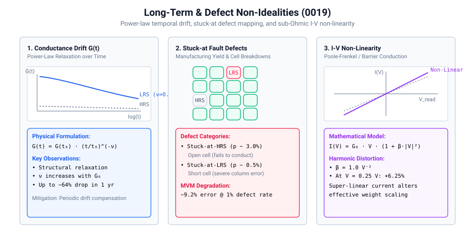
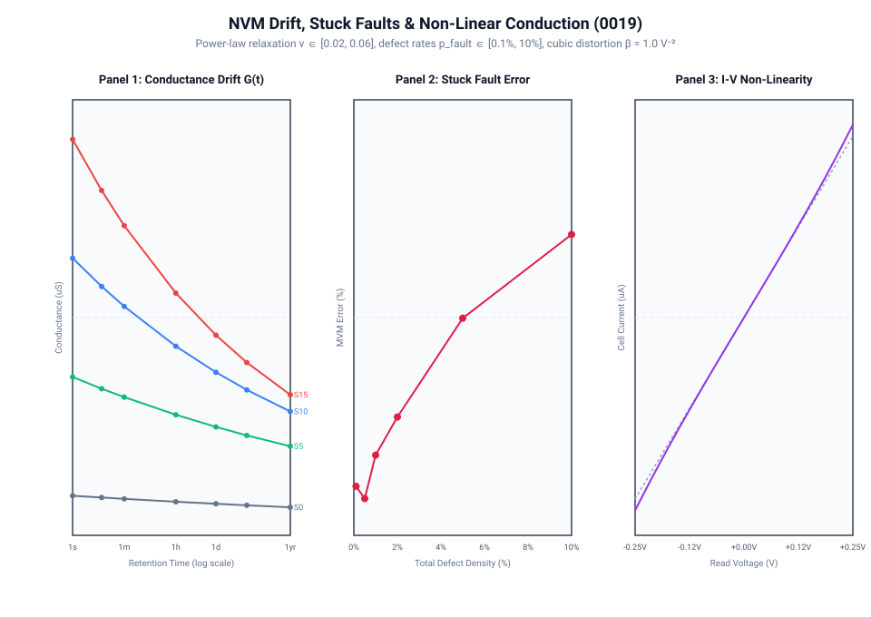

# 0019 — Conductance Drift, Stuck-at Faults & I-V Non-Linearity

> **Bản tiếng Việt:** [`README.vi.md`](README.vi.md)

This chapter isolates and models three distinct long-term physical non-idealities and manufacturing defects in non-volatile memory (NVM / ReRAM / PCM) crossbar arrays: **power-law temporal conductance drift**, **stuck-at fault defect distributions**, and **sub-Ohmic $I-V$ non-linearity**.

---

## 1. Physical Mechanisms & Mathematical Formulations



### A. Temporal Conductance Drift (Retention Decay)
In phase-change memory and filamentary metal-oxide memristors, continuous atomic-scale structural relaxation and defect annihilation cause conductance to decay monotonically over time following a power law:
$$G(t) = G(t_0) \cdot \left(\frac{t}{t_0}\right)^{-\nu(G_0)}, \quad t \ge t_0 = 1\text{ s}$$

- **Drift Exponent $\nu$**: Programmed state-dependent, scaling from $\nu_{\min} = 0.02$ at $G_{\min} = 10.0\,\mu\text{S}$ (HRS) up to $\nu_{\max} = 0.06$ at $G_{\max} = 100.0\,\mu\text{S}$ (LRS).
- **Long-Term Impact**: Over 1 year ($3.15 \times 10^7\text{ s}$), high-conductance states lose up to **$64.5\%$** of their initial conductance, causing systematic weight magnitude decay and neural activation shrinkage.

### B. Stuck-at Faults (Defect Distributions & Yield)
Fabrication imperfections and dielectric breakdown lock a fraction of crossbar cells into permanent non-responsive states:
- **Stuck-at-HRS (Open / $p_{\text{HRS}} \approx 1\%\dots 5\%$)**: Cell permanently fixed at $G_{\min} = 10.0\,\mu\text{S}$.
- **Stuck-at-LRS (Short / $p_{\text{LRS}} \approx 0.1\%\dots 1\%$)**: Cell permanently fixed at $G_{\max} = 100.0\,\mu\text{S}$.
- **MVM Impact**: Stuck-at-LRS defects inject massive static current offsets into affected columns, causing substantial computation errors (e.g. **$9.21\%$ MVM error at a $1.0\%$ total fault rate**).

### C. Sub-Ohmic I-V Non-Linearity
At non-zero read voltages within $|V_{\text{read}}| \le 0.25\text{ V}$, field-assisted emission (Poole-Frenkel conduction) creates a cubic deviation from ideal linear Ohm's law:
$$I(V) = G_0 \cdot V \cdot \left(1 + \beta \cdot |V|^2\right)$$

- **Non-Linearity Parameter**: $\beta = 1.0\text{ V}^{-2}$.
- **Harmonic Distortion**: At peak read voltage $V_{\text{read,max}} = 0.25\text{ V}$, the non-linear current distortion reaches $\Delta I / I_{\text{linear}} = +6.25\%$.

---

## 2. Quantitative Characterization & Scaling Curves



### Summary of Characterization Ledger:

| Non-Ideality Mechanism | Primary Metric / Scale | Baseline Impact | Architectural Mitigation Strategy |
|---|---|---|---|
| **Conductance Drift** | Retention loss @ 1 year | $-64.5\%$ conductance drop on LRS | Periodic drift compensation / global weight rescaling |
| **Stuck-at-HRS Defects** | $p_{\text{HRS}} = 2.55\%$ ($85\%$ of faults) | Inability to represent positive weight | Fault-aware training / redundant column mapping |
| **Stuck-at-LRS Defects** | $p_{\text{LRS}} = 0.45\%$ ($15\%$ of faults) | Constant $\approx 25\,\mu\text{A}$ column offset | Digital background subtraction / column isolation |
| **I-V Non-Linearity** | Peak cubic distortion $\beta = 1.0\text{ V}^{-2}$ | $+6.25\%$ current distortion @ $0.25\text{ V}$ | Low-voltage read envelope ($V_{\text{read}} \le 0.25\text{ V}$) |

---

## 3. Engineering & Provenance Class

In accordance with `AGENTS.md` verification guidelines:
- All temporal drift exponents ($\nu$), defect probabilities ($p_{\text{HRS}}, p_{\text{LRS}}$), and non-linearity coefficients ($\beta$) are tracked as **sensitivity parameters** (`evidence_class: "assumed"`).
- They enable isolated sensitivity studies and fail-closed validation under physical hardware claims.

---

## Verification

Run the deterministic characterization and generate plots:
```bash
python book/0019-drift-faults/drift_faults.py
python book/0019-drift-faults/diagrams/make_plots.py
```
Committed extract: [`verification/circuit/results/drift-faults-0019-extract.json`](../../verification/circuit/results/drift-faults-0019-extract.json).
Tested by: [`tests/test_drift_faults.py`](../../tests/test_drift_faults.py).
