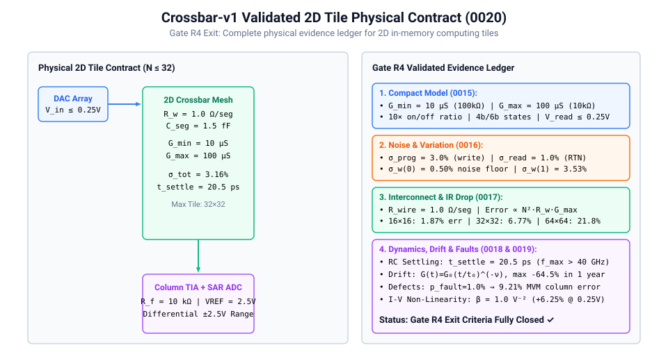
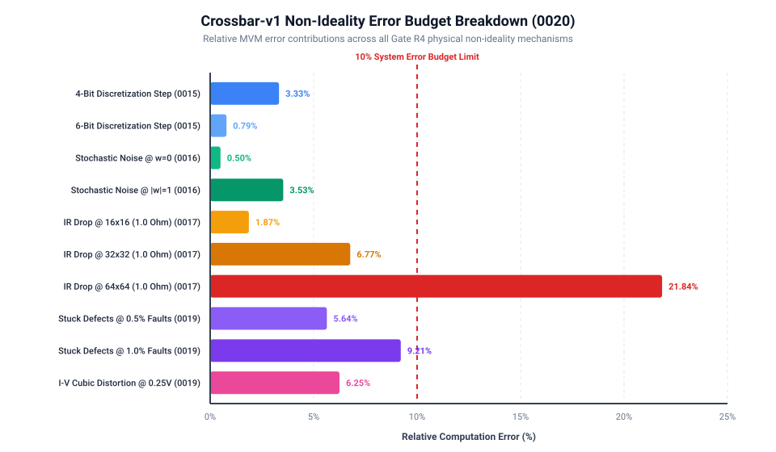

# 0020 — `crossbar-v1` Profile Publication & Gate R4 Close

> **Bản tiếng Việt:** [`README.vi.md`](README.vi.md)

This chapter publishes the unified 2D crossbar profile [`device_profiles/crossbar-v1.json`](../../device_profiles/crossbar-v1.json) and closes **Gate R4 (Device Realism & `crossbar-v1`)**, transitioning from single-column proof-of-concept models to an end-to-end validated physical 2D crossbar contract.

---

## 1. 2D Physical Tile Architecture & Verification Ledger



`crossbar-v1` aggregates physical and circuit evidence across Chapters 0015 through 0019 into a single versioned profile:

### Key Physical Parameters:
| Domain / Parameter | Profile Field | Value | Provenance | Source Work Package |
|---|---|---|---|---|
| **Conductance Range** | `gmin_s` / `gmax_s` | $10.0\,\mu\text{S} \dots 100.0\,\mu\text{S}$ ($10\times$ on/off) | `assumed` | Chapter 0015 (Compact Model) |
| **Input Linear Envelope** | `v_read_max_v` | $0.25\text{ V}$ (non-disturb) | `derived` | Chapter 0015 (Read Regimes) |
| **Write/Read Noise** | `sigma_prog_rel` / `sigma_read_rel` | $3.0\%$ write / $1.0\%$ read ($\sigma_{\text{tot}} = 3.16\%$) | `assumed` | Chapter 0016 (Monte Carlo) |
| **Weight Noise Floor** | `zero_weight_noise_floor_std` | $0.497\%$ @ $w=0$ ($3.53\%$ @ $|w|=1$) | `derived` | Chapter 0016 (Differential SNR) |
| **Interconnect Resistance** | `r_wire_ohm` | $1.0\,\Omega$ per segment | `assumed` | Chapter 0017 (Nodal Mesh) |
| **IR Drop Error** | `mvm_error_32x32_1ohm_pct` | $6.77\%$ @ $32\times 32$ ($21.84\%$ @ $64\times 64$) | `derived` | Chapter 0017 (Array Scaling) |
| **Tile Dimension Limit** | `recommended_max_tile_dim` | $32\times 32$ cells | `derived` | Chapter 0017 (Tile Budget) |
| **Parasitic Capacitance** | `c_seg_ff` | $1.5\text{ fF}$ per cell pitch | `derived` | Chapter 0018 (Parasitics) |
| **Transient Settling** | `t_settle_1pct_ps` / `f_max_ghz` | $20.5\text{ ps}$ ($1\%$ settling, $f_{\max} = 48.8\text{ GHz}$) | `spice` | Chapter 0018 (Transient RC) |
| **Temporal Drift** | `max_drift_loss_1year_pct` | $-64.5\%$ retention decay on LRS in 1 year | `derived` | Chapter 0019 (Power-law Drift) |
| **Stuck Defect Error** | `mvm_error_1pct_faults_pct` | $9.21\%$ @ $1.0\%$ defect rate | `derived` | Chapter 0019 (Stuck Faults) |
| **I-V Non-Linearity** | `max_iv_distortion_pct` | $+6.25\%$ cubic distortion @ $0.25\text{ V}$ | `derived` | Chapter 0019 (Poole-Frenkel) |

---

## 2. Non-Ideality Error Budget Breakdown



### Key Takeaways for System Integration (Part VI):
1. **Tile Partitioning**: Monolithic crossbars larger than $32\times 32$ break down under severe IR drop ($>20\%$). Physical architectures must tile dense matrices into modular $16\times 16$ or $32\times 32$ sub-arrays.
2. **Speed Bottleneck Hierarchy**: The intrinsic RC settling time of crossbars ($\sim 20\text{ ps}$) does not limit inference throughput. Clock frequency ($100\dots 500\text{ MHz}$) is governed by peripheral DAC, TIA GBW, and ADC conversion latency.
3. **Defect & Drift Mitigation**: Long-term temporal drift and manufacturing defects must be handled through periodic weight rescaling, fault-aware quantization, or background offset subtraction.

---

## 3. Gate R4 Exit Criteria

All Gate R4 checklist items are complete and verified:
- [x] Select explicit programmable-conductance abstraction / compact model (`0015`)
- [x] Establish `gmin`, `gmax`, state count/resolution and programming assumptions (`0015`)
- [x] Programming/read variation Monte Carlo (`0016`)
- [x] IR-drop / line resistance versus array dimensions (`0017`)
- [x] Parasitic RC and settling (`0018`)
- [x] Drift, stuck states and non-linearity where supported (`0019`)
- [x] Publish `crossbar-v1` profile with limitations (`0020`)

**Gate R4 is CLOSED. We proceed to Part VI: Profile-driven accelerator architecture.**

---

## Verification

Run profile crosscheck and generate summary reports:
```bash
python book/0020-crossbar-v1/crossbar_v1.py
python verification/reports/generate_crossbar_v1_summary.py
python book/0020-crossbar-v1/diagrams/make_plots.py
```
Committed profile: [`device_profiles/crossbar-v1.json`](../../device_profiles/crossbar-v1.json).
Verification report: [`verification/reports/crossbar-v1-summary.md`](../../verification/reports/crossbar-v1-summary.md).
Tested by: [`tests/test_crossbar_v1_profile.py`](../../tests/test_crossbar_v1_profile.py).
