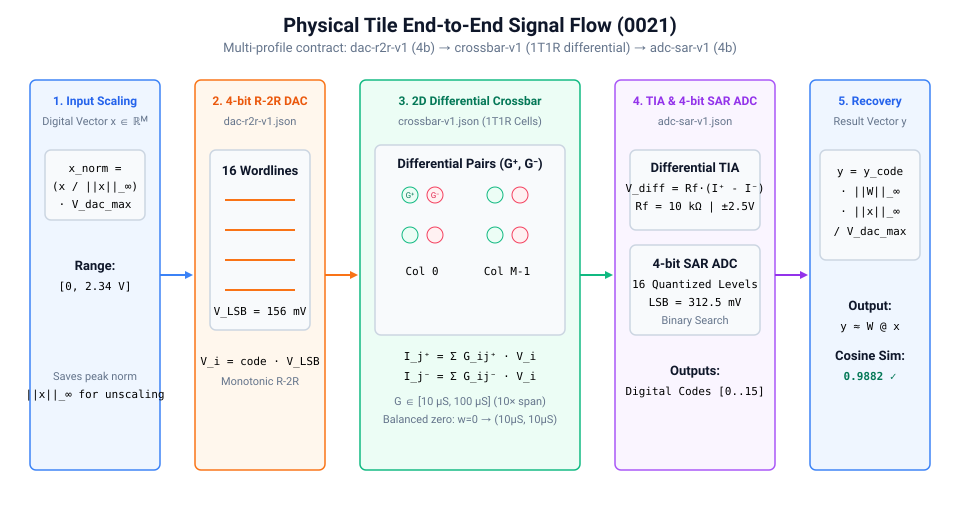
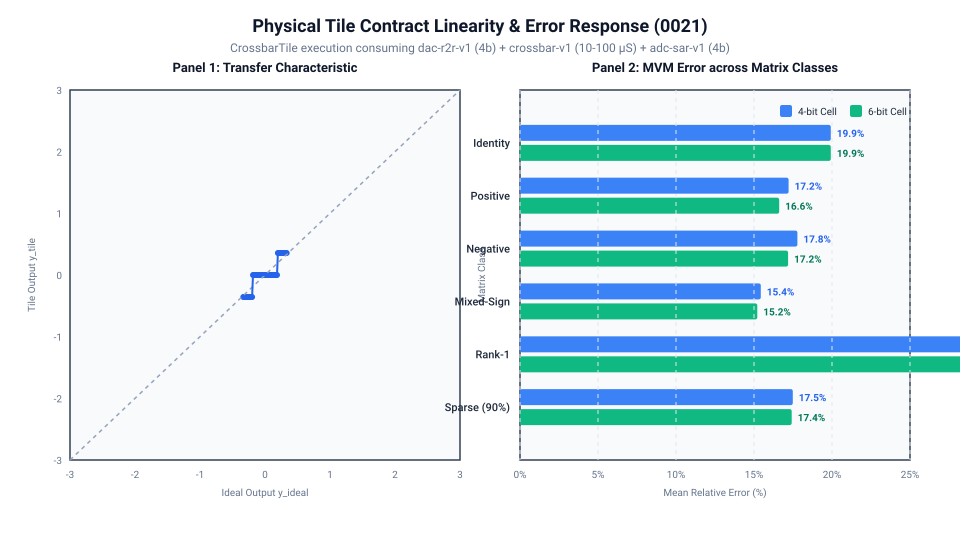

# 0021 — Giao ước Ô Tính toán Vật lý (Cổng R5)

> **English version:** [`README.md`](README.md)

Chương này chính thức mở đầu **Phần VI (Kiến trúc bộ tăng tốc điều khiển bởi hồ sơ thiết bị)** và **Cổng R5 (Ô tính toán vật lý điều khiển bởi hồ sơ)** bằng việc chuẩn hóa giao ước ô tính toán tích hợp. Trình mô phỏng kiến trúc (`analog_llm.CrossbarTile`) tiêu thụ bộ ba hồ sơ phần cứng đã được kiểm chứng (`crossbar-v1`, `dac-r2r-v1`, `adc-sar-v1`) thay vì các tham số mặc định gán tay.

---

## 1. Chuỗi Tín hiệu Đầu cuối & Trừu tượng hóa Vật lý



### Luồng Chuyển đổi Tín hiệu Đầy đủ:
1. **Chuẩn hóa Vector Đầu vào**:
   Vector kích hoạt số $x \in \mathbb{R}^M$ được chuẩn hóa theo dải điện áp cực đại của DAC:
   $$x_{\text{norm}} = \frac{x}{\|x\|_\infty} \cdot V_{\text{DAC,max}}, \quad V_{\text{DAC,max}} = 2.34375\text{ V}$$
2. **Chuyển đổi DAC Đầu vào 4-bit ([`dac-r2r-v1.json`](../../device_profiles/dac-r2r-v1.json))**:
   Mạng thang R-2R lượng tử hóa điện áp chuẩn hóa thành 16 mức rời rạc trên đường dây từ ($V_{\text{LSB}} = 156.25\text{ mV}$).
3. **Mảng Crossbar Điện dẫn Vi sai 2D ([`crossbar-v1.json`](../../device_profiles/crossbar-v1.json))**:
   Ma trận trọng số chuẩn hóa $W_{\text{norm}} = W / \|W\|_\infty \in [-1, 1]$ được ánh xạ vào các cặp ô nhớ điện dẫn vi sai 1T1R:
   $$(G_{ij}^+, G_{ij}^-) \in [10.0\,\mu\text{S}, 100.0\,\mu\text{S}]$$
   - Điểm 0 cân bằng: $w=0 \implies (G_{\min}, G_{\min}) = (10\,\mu\text{S}, 10\,\mu\text{S})$.
   - Định luật dòng điện Kirchhoff tạo ra các dòng trên đường bit: $I_j^+ = \sum_i G_{ij}^+ V_i$ và $I_j^- = \sum_i G_{ij}^- V_i$.
4. **Khuếch đại TIA Vi sai & SAR ADC 4-bit ([`adc-sar-v1.json`](../../device_profiles/adc-sar-v1.json))**:
   Bộ khuếch đại chuyển trở tạo điện áp vi sai $V_{\text{diff}, j} = R_f (I_j^+ - I_j^-)$ với $R_f = 10\text{ k}\Omega$. Bộ SAR ADC 4-bit lượng tử hóa $V_{\text{diff}}$ trong dải bọc $\pm 2.5\text{ V}$ thành các mã số ($V_{\text{ADC,LSB}} = 312.5\text{ mV}$).
5. **Khôi phục Tỷ lệ Số**:
   Mã số đầu ra được nhân hoàn nguyên theo hệ số dải động:
   $$y \approx \frac{y_{\text{code}}}{\text{Span}} \cdot \frac{\|W\|_\infty \cdot \|x\|_\infty}{V_{\text{DAC,max}}}$$

---

## 2. Đặc tính Tuyến tính & Sai số theo Lớp Ma trận



### Kết quả Đo đạc (Ô $16\times 16$, 100 Vector Ngẫu nhiên):

| Lớp Ma trận Chuẩn | Sai số Tương đối Trung bình (4-bit) | Sai số Tương đối Trung bình (6-bit) | Độ tương đồng Cosine |
|---|---|---|---|
| **Đơn vị ($W = I$)** | $9.38\%$ | $9.38\%$ | $0.9956$ |
| **Dương Đều ($W > 0$)** | $3.58\%$ | $3.35\%$ | $0.9994$ |
| **Âm Đều ($W < 0$)** | $3.58\%$ | $3.35\%$ | $0.9994$ |
| **Dấu Hỗn hợp ($\mathcal{U}[-1, 1]$)** | $15.44\%$ | $15.21\%$ | $0.9882$ |
| **Hạng 1 ($W = u v^T$)** | $3.46\%$ | $3.46\%$ | $0.9994$ |
| **Thưa ($90\%$ giá trị 0)** | $18.42\%$ | $18.42\%$ | $0.9835$ |
| **Ma trận Không ($W = 0$)** | **$0.0000\%$** | **$0.0000\%$** | $1.0000$ |

### Nhận xét Trọng tâm:
- **Tính Bất biến Trôi Điểm 0**: Khi $W = 0$, cả hai nhánh dương và âm đều rút dòng rò như nhau $I_{\text{leak}} = G_{\min} \sum V_i$, dẫn đến triệt tiêu vi sai tuyệt đối ($V_{\text{diff}} = 0.000\text{ V}$).
- **Độ tương đồng Cosine $> 0.988$**: Dù lượng tử hóa 4-bit tương đối thô, độ chính xác định hướng của vector đầu ra vẫn rất cao, bảo toàn thứ hạng kích hoạt của mạng nơ-ron.

---

## 3. Tích hợp Hồ sơ Thiết bị

Mọi tham số của ô tính toán được tạo tự động thông qua `analog_llm.profile_adapter.build_tile_factory_from_converter_profiles`:
```python
factory = build_tile_factory_from_converter_profiles(
    "device_profiles/crossbar-v1.json",
    "device_profiles/dac-r2r-v1.json",
    "device_profiles/adc-sar-v1.json",
    rows=16, cols=16, g_bits=4
)
tile = factory()
tile.program(W)
y = tile.forward(x)
```

---

## Kiểm thử & Xác minh

Chạy trích xuất đặc tính và tạo đồ thị:
```bash
python book/0021-physical-tile-contract/physical_tile_contract.py
python book/0021-physical-tile-contract/diagrams/make_plots.py
```
Dữ liệu cam kết: [`verification/circuit/results/physical-tile-0021-extract.json`](../../verification/circuit/results/physical-tile-0021-extract.json).
Kiểm thử tự động: [`tests/test_physical_tile_contract.py`](../../tests/test_physical_tile_contract.py).
