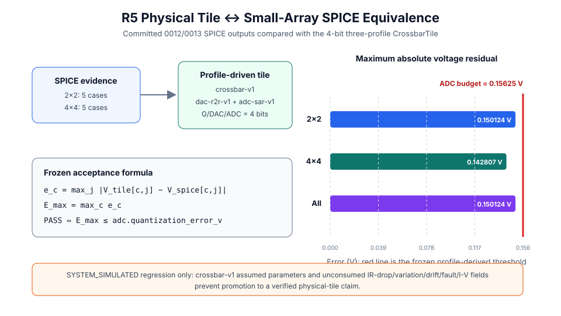
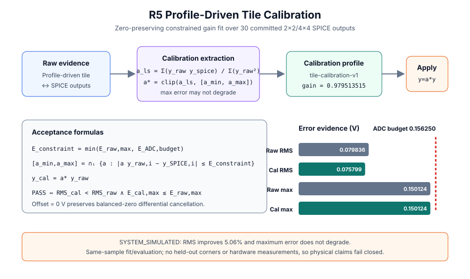

# 0021 — Giao ước Ô Tính toán Vật lý (Cổng R5)

> **English version:** [`README.md`](README.md)

Chương này chính thức mở đầu **Phần VI (Kiến trúc bộ tăng tốc điều khiển bởi hồ sơ thiết bị)** và **Cổng R5 (Ô tính toán vật lý điều khiển bởi hồ sơ)** bằng việc chuẩn hóa giao ước ô tính toán tích hợp. Trình mô phỏng kiến trúc (`analog_llm.CrossbarTile`) tiêu thụ bộ ba hồ sơ phần cứng đã được kiểm chứng (`crossbar-v1`, `dac-r2r-v1`, `adc-sar-v1`) thay vì các tham số mặc định gán tay.

---

## 1. Chuỗi Tín hiệu Đầu cuối & Trừu tượng hóa Vật lý


### Luồng Chuyển đổi Tín hiệu Đầy đủ:
1. **Chuẩn hóa Vector Đầu vào**:
   Vector kích hoạt số $x \in \mathbb{R}^M$ được chuẩn hóa theo dải điện áp cực đại của DAC:
   $$x_{\text{norm}} = \frac{x}{\|x\|_\infty} \cdot V_{\text{DAC,max}}, \quad V_{\text{DAC,max}} = 2.34375\text{ V}$$
2. **Chuyển đổi DAC Đầu vào 4-bit ([`dac-r2r-v1.json`](../../device_profiles/dac-r2r-v1.json))**:
   Mạng thang R-2R lượng tử hóa điện áp chuẩn hóa thành 16 mức rời rạc trên đường dây từ ($V_{\text{LSB}} = 156.25\text{ mV}$).
3. **Mảng Crossbar Điện dẫn Vi sai 2D ([`crossbar-v1.json`](../../device_profiles/crossbar-v1.json))**:
   Ma trận trọng số chuẩn hóa $W_{\text{norm}} = W / \|W\|_\infty \in [-1, 1]$ được ánh xạ vào các cặp ô nhớ điện dẫn vi sai 1T1R:
   $$(G_{ij}^+, G_{ij}^-) \in [10.0\,\mu\text{S}, 100.0\,\mu\text{S}]$$
   - Điểm 0 cân bằng: $w=0 \implies (G_{\min}, G_{\min}) = (10\,\mu\text{S}, 10\,\mu\text{S})$.
   - Định luật dòng điện Kirchhoff tạo ra các dòng trên đường bit: $I_j^+ = \sum_i G_{ij}^+ V_i$ và $I_j^- = \sum_i G_{ij}^- V_i$.
4. **Khuếch đại TIA Vi sai & SAR ADC 4-bit ([`adc-sar-v1.json`](../../device_profiles/adc-sar-v1.json))**:
   Bộ khuếch đại chuyển trở tạo điện áp vi sai $V_{\text{diff}, j} = R_f (I_j^+ - I_j^-)$ với $R_f = 10\text{ k}\Omega$. Bộ SAR ADC 4-bit lượng tử hóa $V_{\text{diff}}$ trong dải bọc $\pm 2.5\text{ V}$ thành các mã số ($V_{\text{ADC,LSB}} = 312.5\text{ mV}$).
5. **Khôi phục Tỷ lệ Số**:
   Mã số đầu ra được nhân hoàn nguyên theo hệ số dải động:
   $$y \approx \frac{y_{\text{code}}}{\text{Span}} \cdot \frac{\|W\|_\infty \cdot \|x\|_\infty}{V_{\text{DAC,max}}}$$

---

## 2. Đặc tính Tuyến tính & Sai số theo Lớp Ma trận


### Kết quả Đo đạc (Ô $16\times 16$, 100 Vector Ngẫu nhiên):

| Lớp Ma trận Chuẩn | Sai số Tương đối Trung bình (4-bit) | Sai số Tương đối Trung bình (6-bit) | Độ tương đồng Cosine |
|---|---|---|---|
| **Đơn vị ($W = I$)** | $19.92\%$ | $19.92\%$ | $0.9825$ |
| **Dương Đều ($W > 0$)** | $17.22\%$ | $16.61\%$ | $0.9868$ |
| **Âm Đều ($W < 0$)** | $17.78\%$ | $17.19\%$ | $0.9867$ |
| **Dấu Hỗn hợp ($\mathcal{U}[-1, 1]$)** | $15.44\%$ | $15.21\%$ | $0.9882$ |
| **Hạng 1 ($W = u v^T$)** | $48.33\%$ | $45.41\%$ | $0.8601$ |
| **Thưa ($90\%$ giá trị 0)** | $17.49\%$ | $17.41\%$ | $0.9860$ |
| **Ma trận Không ($W = 0$)** | **$0.0000\%$** | **$0.0000\%$** | $1.0000$ |

### Nhận xét Trọng tâm:
- **Tính Bất biến Trôi Điểm 0**: Khi $W = 0$, cả hai nhánh dương và âm đều rút dòng rò như nhau $I_{\text{leak}} = G_{\min} \sum V_i$, dẫn đến triệt tiêu vi sai tuyệt đối ($V_{\text{diff}} = 0.000\text{ V}$).
- Lượng tử hóa bộ chuyển đổi 4-bit thể hiện rõ: trường hợp dấu hỗn hợp đạt cosine trung bình $0.9882$, trong khi trường hợp hạng thấp giảm xuống $0.8601$. Đây là kết quả mô phỏng hành vi, không phải phép đo thiết bị.

---

## 3. Tương đương với SPICE Mảng Nhỏ



Ô 4-bit tạo từ `crossbar-v1`, `dac-r2r-v1`, và `adc-sar-v1` được chạy lại trên năm trường hợp 2×2 đã cam kết của 0012 và năm trường hợp 4×4 của 0013. Với trường hợp $c$ và đầu ra $j$:

$$e_c = \max_j |V_{\text{tile},c,j} - V_{\text{SPICE},c,j}|$$

$$E_{\max} = \max_c e_c, \qquad \text{ĐẠT} \iff E_{\max} \le E_{\text{budget}}$$

Ngưỡng được đóng băng trực tiếp từ `adc-sar-v1.json#/fields/quantization_error_v`:

$$E_{\text{budget}} = 0.15625\text{ V}$$

| Tập bằng chứng | Số trường hợp | Sai số cực đại | Sai số RMS |
|---|---:|---:|---:|
| SPICE 0012 2×2 | 5 | 0.150124 V | 0.087369 V |
| SPICE 0013 4×4 | 5 | 0.142807 V | 0.075789 V |
| Kết hợp | 10 | **0.150124 V — ĐẠT** | 0.079836 V |

Đây là tiêu chí hồi quy `SYSTEM_SIMULATED` cho các trường hợp đã nêu. Kết quả không được nâng thành khẳng định ô vật lý đã xác minh: `crossbar-v1` chứa tham số thiết bị được đánh dấu giả định, và `CrossbarTile` hiện chưa tiêu thụ các trường sụt áp IR, biến thiên, trôi, lỗi kẹt hoặc phi tuyến I-V.

---

## 4. Tích hợp Hồ sơ Thiết bị

Mọi tham số của ô tính toán được tạo tự động thông qua `analog_llm.profile_adapter.build_tile_factory_from_converter_profiles`:
```python
factory = build_tile_factory_from_converter_profiles(
    "device_profiles/crossbar-v1.json",
    "device_profiles/dac-r2r-v1.json",
    "device_profiles/adc-sar-v1.json",
    rows=16, cols=16, g_bits=4
)
tile = factory()
tile.program(W)
y = tile.forward(x)
```

---

## 5. Hiệu chuẩn Điều khiển bởi Hồ sơ



Trình trích xuất hiệu chuẩn tiêu thụ các đầu ra tương đương ô/SPICE đã cam kết và ngưỡng từ hồ sơ ADC. Offset bằng không bảo toàn triệt tiêu vi sai chính xác. Hệ số bình phương tối thiểu và hiệu chỉnh có ràng buộc là:

$$a_{\mathrm{LS}} = \frac{\sum_i y_{\mathrm{raw},i}y_{\mathrm{SPICE},i}}{\sum_i y_{\mathrm{raw},i}^2}$$

$$E_{\mathrm{constraint}} = \min(E_{\mathrm{raw,max}}, E_{\mathrm{ADC,budget}})$$

$$[a_{\min},a_{\max}] = \bigcap_i \{a: |a y_{\mathrm{raw},i}-y_{\mathrm{SPICE},i}| \le E_{\mathrm{constraint}}\}$$

$$a^*=\operatorname{clip}(a_{\mathrm{LS}},[a_{\min},a_{\max}]), \qquad y_{\mathrm{cal}}=a^*y_{\mathrm{raw}}$$

Hồ sơ `tile-calibration-v1` sinh ra cung cấp $a^*=0.9795135153$ và offset bằng không. Trên cùng 30 đầu ra đã cam kết, sai số RMS giảm từ $0.079836\text{ V}$ xuống $0.075799\text{ V}$ (**cải thiện 5.06%**), trong khi sai số cực đại không tăng ($0.150124\text{ V}$) và vẫn dưới ngưỡng ADC $0.15625\text{ V}$.

Đây là bằng chứng hiệu chuẩn cùng tập dữ liệu ở mức `SYSTEM_SIMULATED`, không phải khả năng khái quát trên tập giữ lại hoặc hiệu chuẩn phần cứng. Vì vậy `output_calibration_from_profile(..., physical_claim=True)` sẽ dừng an toàn.

---

## Kiểm thử & Xác minh

Chạy trích xuất đặc tính và tạo đồ thị:
```bash
python book/0021-physical-tile-contract/physical_tile_contract.py
python book/0021-physical-tile-contract/diagrams/make_plots.py
python book/0021-physical-tile-contract/diagrams/make_equivalence_diagram.py
python verification/calibration/extract_tile_calibration.py
python verification/calibration/diagrams/make_tile_calibration_diagram.py
```
Dữ liệu cam kết: [`verification/circuit/results/physical-tile-0021-extract.json`](../../verification/circuit/results/physical-tile-0021-extract.json).
Hồ sơ hiệu chuẩn: [`device_profiles/tile-calibration-v1.json`](../../device_profiles/tile-calibration-v1.json).
Kiểm thử tự động: [`tests/test_physical_tile_contract.py`](../../tests/test_physical_tile_contract.py) và [`tests/test_tile_calibration.py`](../../tests/test_tile_calibration.py).
