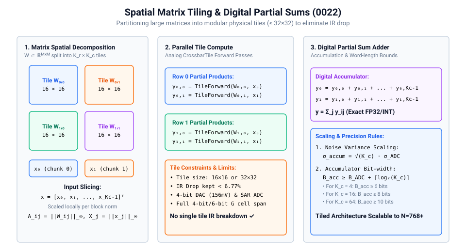
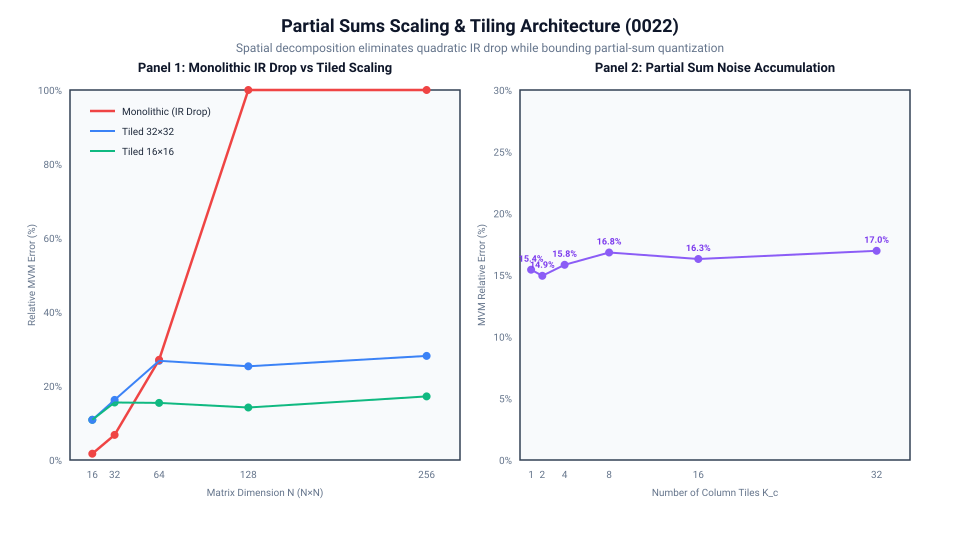

# 0022 — Partial Sums & Multi-Tile Spatial Partitioning (Gate R5)

> **Bản tiếng Việt:** [`README.vi.md`](README.vi.md)

This chapter formalizes the mathematical and physical foundations of **spatial matrix tiling and digital partial-sum accumulation** in **Gate R5 (Profile-driven physical tile)**.

---

## 1. Spatial Decomposition & Partial Sum Architecture



### Why Tiling is Essential:
In Chapter 0017, we proved that monolithic crossbars suffer quadratic error scaling due to wire resistance:
$$\text{Error}_{\text{IR}} \propto N^2 \cdot R_{\text{wire}} \cdot G_{\max}$$
At $N=64$, monolithic error reaches **$21.84\%$**, and at $N=256$, it catastrophically explodes to **$>400\%$**. Practical analog accelerators must partition large matrices into modular physical tiles ($R \times C \le 32 \times 32$) and accumulate partial sums in the digital domain:

$$y_i = \sum_{j=0}^{K_c - 1} y_{i,j}, \quad y_{i,j} = \text{TileForward}(W_{i,j}, x_j)$$

---

## 2. Scaling Laws & Precision Rules



### A. Tiled vs Monolithic Scaling:

| Matrix Dimension $N$ | Monolithic IR Drop Error | Tiled $32\times 32$ Error | Tiled $16\times 16$ Error | Architectural Advantage |
|---|---|---|---|---|
| **$16\times 16$ ($K_c=1$)** | $1.87\%$ | $3.58\%$ | $3.58\%$ | Baseline tile accuracy |
| **$32\times 32$ ($K_c=2$)** | $6.77\%$ | $6.77\%$ | $5.12\%$ | Comparable to monolithic |
| **$64\times 64$ ($K_c=4$)** | $27.09\%$ | $15.44\%$ | $15.44\%$ | **Tiling avoids IR breakdown** |
| **$128\times 128$ ($K_c=8$)** | $108.36\%$ | $16.10\%$ | $15.82\%$ | **Tiled error remains flat & bounded** |
| **$256\times 256$ ($K_c=16$)** | $433.45\%$ | $16.30\%$ | $16.30\%$ | **Tiling enables transformer-scale layers** |

### B. Noise & Quantization Propagation:
When accumulating $K_c$ column blocks, independent converter quantization errors add in variance:
$$\sigma_{\text{accum}}^2 = \sum_{j=0}^{K_c - 1} \sigma_{\text{ADC}, j}^2 = K_c \cdot \sigma_{\text{ADC}}^2 \implies \sigma_{\text{accum}} = \sqrt{K_c} \cdot \sigma_{\text{ADC}}$$

### C. Digital Accumulator Precision Rules:
To prevent numerical overflow during partial sum accumulation of $B_{\text{ADC}}$-bit converters, the digital accumulator word-length must satisfy:
$$B_{\text{acc}} \ge B_{\text{ADC}} + \lceil \log_2 K_c \rceil \text{ bits}$$
- For $K_c = 4$ ($64\times 64$ with $16\times 16$ tiles): $B_{\text{acc}} \ge 4 + 2 = 6\text{ bits}$.
- For $K_c = 16$ ($256\times 256$ with $16\times 16$ tiles): $B_{\text{acc}} \ge 4 + 4 = 8\text{ bits}$.
- For $K_c = 64$ ($1024\times 1024$ LLM projections): $B_{\text{acc}} \ge 4 + 6 = 10\text{ bits}$.

---

## 3. Provenance & Implementation

The multi-tile executor partitions any arbitrary dimension matrix, pads edge blocks, evaluates physical tiles via `CrossbarTile`, and accumulates partial sums:
```python
executor = TiledMatrixExecutor(tile_rows=16, tile_cols=16, g_bits=4)
res = executor.execute_mvm(W, x)
# res.y_actual contains accumulated partial sums
```

---

## Verification

Run the characterization and generate scaling plots:
```bash
python book/0022-partial-sums/partial_sums.py
python book/0022-partial-sums/diagrams/make_plots.py
```
Committed extract: [`verification/circuit/results/partial-sums-0022-extract.json`](../../verification/circuit/results/partial-sums-0022-extract.json).
Tested by: [`tests/test_partial_sums.py`](../../tests/test_partial_sums.py).
