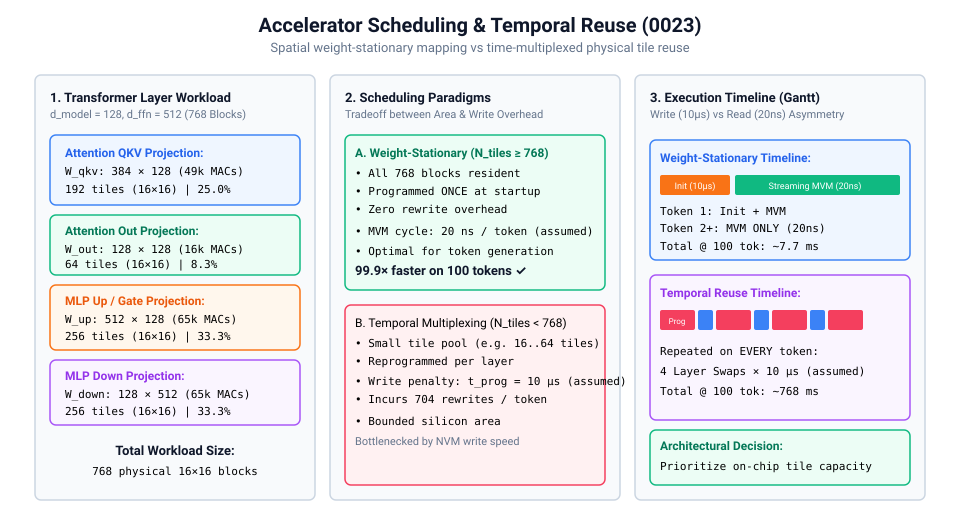
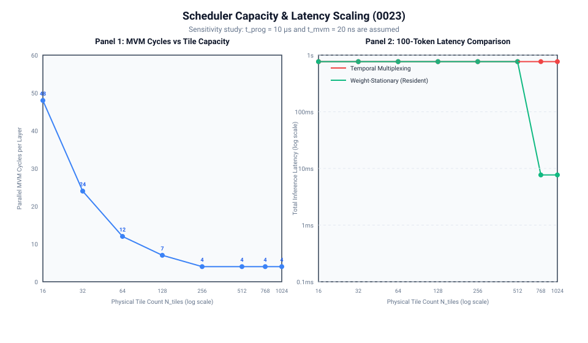

# 0023 — Scheduler & Temporal Reuse (Gate R5/R6)

> **Bản tiếng Việt:** [`README.vi.md`](README.vi.md)

This chapter formalizes the **deterministic hardware tile scheduling and temporal reuse model** for multi-tile analog accelerators in **Gate R5 & Gate R6 (Accelerator architecture and data movement)**.

---

## 1. Spatial Parallelism vs Temporal Reuse Trade-Off



### Assumed Write-Read Sensitivity Point:
- **Analog Read / MVM Latency**: $t_{\text{mvm}} = 20\text{ ns}$ (`assumed`; profile-derived converter/tile timing is pending).
- **NVM Cell Write / Programming Latency**: $t_{\text{prog}} = 10\,\mu\text{s}$ (`assumed`; programming evidence is pending).
- **Derived Asymmetry**: $t_{\text{prog}}/t_{\text{mvm}} = 500$. This is an architecture sensitivity study, not verified physical performance.

### Scheduling Strategies:
1. **Weight-Stationary (Spatial Dedication)**:
   - All layer weights are mapped permanently across $N_{\text{tiles}} \ge K_{\text{total}}$ on-chip physical tiles.
   - Programmed **once** during model initialization.
   - Zero rewrite overhead during active token generation.
2. **Layer-by-Layer Temporal Multiplexing**:
   - Physical tiles are time-multiplexed across layers ($N_{\text{tiles}} < K_{\text{total}}$).
   - Minimizes on-chip silicon area, but incurs $N_{\text{rewrites}} = \max(0, K_{\text{layer}} - N_{\text{tiles}})$ write cycles on every single token.
3. **Hybrid Stationary Allocation**:
   - Small, latency-critical projections (Attention QKV & Out) remain resident; large feed-forward layers (MLP Up & Down) are time-multiplexed.

---

## 2. Capacity Scaling & Execution Metrics



### Benchmark Workload (Transformer Layer: $d_{\text{model}} = 128, d_{\text{ffn}} = 512$, $16\times 16$ Tiles):
- **Attention QKV ($384\times 128$)**: $192$ physical blocks ($25.0\%$).
- **Attention Out ($128\times 128$)**: $64$ physical blocks ($8.3\%$).
- **MLP Up ($512\times 128$)**: $256$ physical blocks ($33.3\%$).
- **MLP Down ($128\times 512$)**: $256$ physical blocks ($33.3\%$).
- **Total Layer Workload**: **$768$ physical $16\times 16$ blocks** ($196,608$ MACs).

### Execution Ledger across Physical Tile Capacities:

| On-Chip Tile Capacity $N_{\text{tiles}}$ | MVM Cycles / Layer | Temporal Rewrites / Layer | 100-Token Latency (Temporal) | 100-Token Latency (Stationary) | Speedup (Stationary) |
|---|---|---|---|---|---|
| **$16$ tiles** | $48$ | $704$ | $768.1\text{ ms}$ | $768.1\text{ ms}$ (Fallback) | $1.0\times$ |
| **$32$ tiles** | $24$ | $640$ | $768.0\text{ ms}$ | $768.0\text{ ms}$ (Fallback) | $1.0\times$ |
| **$64$ tiles** | $12$ | $512$ | $768.0\text{ ms}$ | $768.0\text{ ms}$ (Fallback) | $1.0\times$ |
| **$128$ tiles** | $7$ | $320$ | $768.0\text{ ms}$ | $768.0\text{ ms}$ (Fallback) | $1.0\times$ |
| **$256$ tiles** | $4$ | $0$ | $768.0\text{ ms}$ | $768.0\text{ ms}$ (Fallback) | $1.0\times$ |
| **$768$ tiles (Resident)** | $4$ | **$0$** | $768.0\text{ ms}$ | **$7.7\text{ ms}$** | **$99.9\times$ Faster** |
| **$1024$ tiles (Resident)** | $4$ | **$0$** | $768.0\text{ ms}$ | **$7.7\text{ ms}$** | **$99.9\times$ Faster** |

---

## 3. Mathematical Ledger Formulas

For sequential layers $l$, each with $K_l$ tiled blocks scheduled onto $N_{\text{tiles}}$ physical hardware tiles:
- **Parallel MVM Cycles**: $T_{\text{cycles}} = \sum_l \lceil K_l / N_{\text{tiles}} \rceil$
- **Temporal Rewrites**: $N_{\text{rewrites}} = \sum_l \max(0, K_l-N_{\text{tiles}})$
- **Tile Utilization Efficiency**:
  $$\eta_{\text{util}} = \frac{\sum_l K_l}{N_{\text{tiles}} \cdot T_{\text{cycles}}} \in (0, 1]$$
- **Total Latency ($N_{\text{tokens}}$ Generation)**:
  $$T_{\text{stationary}} = \left(\sum_l K_l\right)t_{\text{prog}} + N_{\text{tokens}}T_{\text{cycles}}t_{\text{mvm}}$$
  $$T_{\text{temporal}} = N_{\text{tokens}}\left[T_{\text{cycles}}t_{\text{mvm}} + \left(\sum_l K_l\right)t_{\text{prog}}\right]$$

Tiny hand-check: one $2\times10$ layer on $2\times2$ tiles has $K=5$. With two physical tiles, $T_{\text{cycles}}=\lceil5/2\rceil=3$, $N_{\text{rewrites}}=5-2=3$, and $\eta=5/(2\cdot3)=5/6$.

---

## Verification

Run the deterministic scheduler and generate scaling plots:
```bash
python book/0023-scheduler/scheduler.py
python book/0023-scheduler/diagrams/make_plots.py
```
Committed extract: [`verification/circuit/results/scheduler-0023-extract.json`](../../verification/circuit/results/scheduler-0023-extract.json).
Tested by: [`tests/test_scheduler.py`](../../tests/test_scheduler.py).
