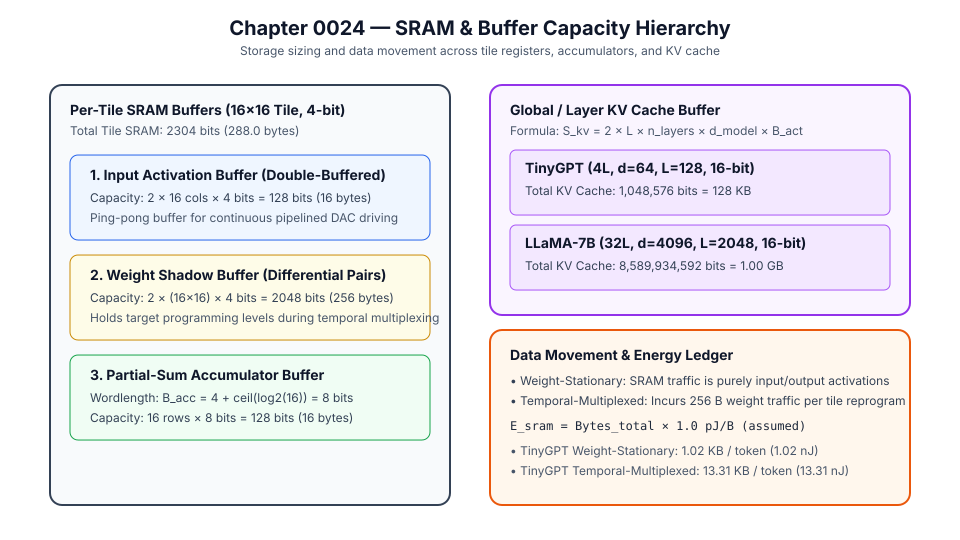

# 0024 — SRAM & Buffer Capacity Model (Gate R6)

> **Bản tiếng Việt:** [`README.vi.md`](README.vi.md)

This chapter formalizes the **on-chip SRAM storage, staging buffer hierarchy, and data movement traffic ledgers** for multi-tile analog compute-in-memory accelerators in **Gate R6 (Accelerator architecture and data movement)**.

---

## 1. Storage Hierarchy & Buffer Sizing



### Per-Tile SRAM Buffer Allocation ($R \times C$ Tile):
1. **Activation Input Buffer (Double-Buffered)**:
   $$S_{\text{act}} = 2 \times C \times B_{\text{DAC}}\text{ bits}$$
   Enables ping-pong overlap between host/NoC vector arrival and continuous analog DAC driving.
2. **Partial-Sum Accumulator Buffer**:
   $$S_{\text{acc}} = R \times B_{\text{acc}}\text{ bits}, \quad \text{where } B_{\text{acc}} = B_{\text{ADC}} + \lceil \log_2 K_c \rceil$$
   Sized to prevent overflow across $K_c$ tiled column reductions (Chapter 0022).
3. **Weight Shadow / Staging Buffer**:
   $$S_{\text{weight}} = 2 \times R \times C \times B_{\text{weight}}\text{ bits}$$
   Stores quantized digital conductance levels for differential cell pairs $(G^+, G^-)$ during temporal reprogramming.

---

## 2. Storage Requirements across Tile Dimensions

| Tile Configuration | Input Activation SRAM | Weight Shadow SRAM | Accumulator SRAM ($K_c \le 16$) | Total SRAM / Tile | Area Estimate ($0.12\,\mu\text{m}^2/\text{bit}$) |
|---|---|---|---|---|---|
| **$16\times 16$ Tile (4-bit)** | $128\text{ bits}$ ($16\text{ B}$) | $2,048\text{ bits}$ ($256\text{ B}$) | $128\text{ bits}$ ($16\text{ B}$) | **$2,304\text{ bits}$ ($288\text{ B}$)** | **$276.5\,\mu\text{m}^2$** |
| **$32\times 32$ Tile (4-bit)** | $256\text{ bits}$ ($32\text{ B}$) | $8,192\text{ bits}$ ($1,024\text{ B}$) | $288\text{ bits}$ ($36\text{ B}$) | **$8,736\text{ bits}$ ($1,092\text{ B}$)** | **$1,048.3\,\mu\text{m}^2$** |
| **$64\times 64$ Tile (4-bit)** | $512\text{ bits}$ ($64\text{ B}$) | $32,768\text{ bits}$ ($4,096\text{ B}$) | $640\text{ bits}$ ($80\text{ B}$) | **$33,920\text{ bits}$ ($4,240\text{ B}$)** | **$4,070.4\,\mu\text{m}^2$** |

---

## 3. Global KV Cache Capacity Sizing

For multi-head attention autoregressive decoding across sequence length $L$:
$$S_{\text{KV}}(L) = 2 \times L \times n_{\text{layers}} \times d_{\text{model}} \times B_{\text{act}}\text{ bits}$$

| Model Architecture | Layers | $d_{\text{model}}$ | Context Length $L$ | Precision | Total KV Cache Size |
|---|---|---|---|---|---|
| **TinyGPT** | $4$ | $64$ | $128$ tokens | $16\text{-bit}$ | **$128\text{ KB}$** |
| **LLaMA-7B** | $32$ | $4,096$ | $2,048$ tokens | $16\text{-bit}$ | **$1.00\text{ GB}$** |
| **LLaMA-13B** | $40$ | $5,120$ | $4,096$ tokens | $16\text{-bit}$ | **$3.20\text{ GB}$** |

---

## 4. Traffic & Energy Ledger

- **Input Activation Traffic**: $T_{\text{in}} = (C \cdot B_{\text{DAC}} / 8) \times N_{\text{mvm}}\text{ bytes}$
- **Output Activation Traffic**: $T_{\text{out}} = (R \cdot B_{\text{ADC}} / 8) \times N_{\text{mvm}}\text{ bytes}$
- **Weight Reprogramming Traffic**: $T_{\text{prog}} = N_{\text{rewrites}} \times S_{\text{weight}} / 8\text{ bytes}$
- **SRAM Access Energy**: $E_{\text{sram}} = T_{\text{total}} \times e_{\text{sram\_byte}}$ ($e_{\text{sram\_byte}} \approx 1.0\text{ pJ/byte}$, explicitly `assumed`).

---

## 5. Execution & Verification

Run the deterministic sizing generator:
```bash
python book/0024-sram-buffers/sram_buffers.py
```
Output artifact committed at: `verification/circuit/results/sram-buffers-0024-extract.json`.
Tested by: [`tests/test_sram_buffers.py`](../../tests/test_sram_buffers.py).
