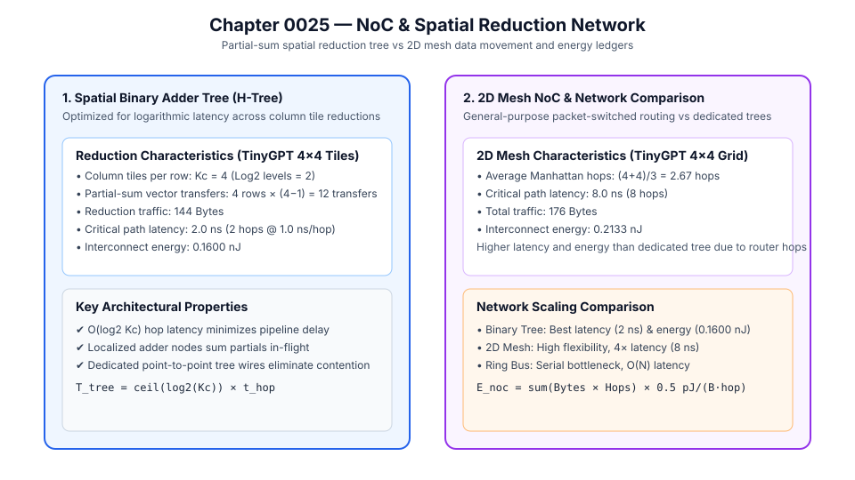

# 0025 — NoC / Interconnect Traffic Model (Gate R6)

> **Bản tiếng Việt:** [`README.vi.md`](README.vi.md)

This chapter formalizes the **Network-on-Chip (NoC) interconnect architecture, spatial partial-sum reduction trees, and data movement latency/energy ledgers** for multi-tile analog compute-in-memory arrays in **Gate R6 (Accelerator architecture and data movement)**.

---

## 1. Spatial Reduction Network & Topologies



When a weight matrix of dimension $M_{\text{out}} \times M_{\text{in}}$ is partitioned into $K_r \times K_c$ physical tiles ($R \times C$ each):
- **Tile Rows**: $K_r = \lceil M_{\text{out}} / R \rceil$
- **Tile Columns**: $K_c = \lceil M_{\text{in}} / C \rceil$
- **Accumulator Wordlength**: $B_{\text{acc}} = B_{\text{ADC}} + \lceil \log_2 K_c \rceil$ (Chapter 0022)

Along each of the $K_r$ row channels, the $K_c$ partial-sum vectors produced by the column tiles must be reduced (summed):
$$y_i = \sum_{j=0}^{K_c - 1} y_{i,j}$$

### Evaluated Network Topologies:
1. **Binary Adder Tree (H-Tree)**:
   - Partial sums are merged along an adder tree in $\lceil \log_2 K_c \rceil$ stages.
   - Dedicated point-to-point interconnects prevent packet collisions and minimize latency.
   - Critical path latency: $T_{\text{tree}} = \lceil \log_2 K_c \rceil \times t_{\text{hop}}$.
2. **2D Mesh NoC (X-Y Dimension-Order Routing)**:
   - Tiles are connected via a 2D grid with 5-port packet routers.
   - Average Manhattan hop distance: $\bar{H}_{\text{mesh}} = \frac{1}{3}(K_r + K_c)$.
   - Critical path latency: $T_{\text{mesh}} = (K_r + K_c) \times t_{\text{hop}}$.
3. **Shared Ring Bus**:
   - Sequential token ring; $H_{\text{avg}} = N_{\text{tiles}} / 4$.
   - Suffers from serial arbitration bottlenecks when $N_{\text{tiles}} > 16$.

---

## 2. Quantitative Network Comparison

### TinyGPT Workload ($M = 64\times 64$, $16\times 16$ Tiles $\to 4\times 4$ Grid, $K_r=4, K_c=4$):

| Interconnect Topology | Total Traffic | Average Hops / Transfer | Critical Path Latency ($t_{\text{hop}}=1.0\text{ ns}$) | Interconnect Energy ($0.5\text{ pJ/(B}\cdot\text{hop)}$) |
|---|---|---|---|---|
| **Binary Adder Tree** | **$176.0\text{ B}$** | **$2.00\text{ hops}$** | **$2.0\text{ ns}$** | **$0.160\text{ nJ}$** |
| **2D Mesh NoC** | $176.0\text{ B}$ | $2.67\text{ hops}$ | $8.0\text{ ns}$ | $0.213\text{ nJ}$ |
| **Shared Ring Bus** | $176.0\text{ B}$ | $4.00\text{ hops}$ | $8.0\text{ ns}$ | $0.320\text{ nJ}$ |

### LLaMA-7B Projection ($M = 4096\times 4096$, $32\times 32$ Tiles $\to 128\times 128$ Grid, $K_r=128, K_c=128$):

| Interconnect Topology | Total Traffic | Average Hops / Transfer | Critical Path Latency | Interconnect Energy |
|---|---|---|---|---|
| **Binary Adder Tree** | **$1.11\text{ MB}$** | **$7.00\text{ hops}$** | **$7.0\text{ ns}$** | **$3.88\text{ }\mu\text{J}$** |
| **2D Mesh NoC** | $1.11\text{ MB}$ | $85.33\text{ hops}$ | $256.0\text{ ns}$ | $47.30\text{ }\mu\text{J}$ ($12.2\times$ higher) |

---

## 3. Mathematical Ledger Formulas

- **Activation Broadcast Traffic**: $T_{\text{act}} = K_c \times (C \cdot B_{\text{DAC}} / 8)\text{ bytes}$
- **Reduction Vector Transfers**: $N_{\text{transfers}} = K_r \times (K_c - 1)$
- **Reduction Data Volume**: $T_{\text{reduct}} = K_r \times (K_c - 1) \times (R \cdot B_{\text{acc}} / 8)\text{ bytes}$
- **Total NoC Energy**: $E_{\text{noc}} = \sum (\text{Bytes} \times \text{Hops}) \times e_{\text{noc\_byte\_hop}}$ ($e_{\text{noc\_byte\_hop}} \approx 0.5\text{ pJ/(B}\cdot\text{hop)}$, explicitly `assumed`).

---

## 4. Execution & Artifacts

Generate the deterministic NoC extract:
```bash
python book/0025-noc-interconnect/noc_interconnect.py
```
Committed artifact at: `verification/circuit/results/noc-interconnect-0025-extract.json`.
