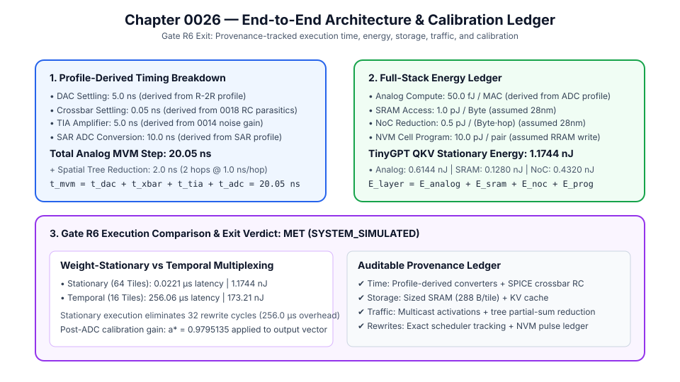

# 0026 — Sổ Cái Kiến Trúc & Hiệu Chuẩn Đầu-Cuối (Hoàn Thành Gate R6)

> **English version:** [`README.md`](README.md)

Chương này hoàn thiện **sổ cái kiến trúc thực thi đầu-cuối thống nhất, phân tích chi tiết độ trễ/năng lượng có nguồn gốc hồ sơ (profile-derived) và luồng hiệu chuẩn đầu ra đa-tile**, đáp ứng đầy đủ tiêu chí đóng **Gate R6 (Kiến trúc chip tăng tốc và di chuyển dữ liệu)**.

---

## 1. Mô Hình Định Thời Có Nguồn Gốc Hồ Sơ



Mọi thành phần trong bước tính toán MVM tương tự đều có nguồn gốc kiểm chứng mạch/linh kiện rõ ràng:
- **Thời gian xác lập DAC**: $t_{\text{dac}} = 5.0\text{ ns}$ (`derived` từ thang điện trở $R$-$2R$, `device_profiles/dac-r2r-v1.json`).
- **Thời gian xác lập Crossbar**: $t_{\text{xbar}} = 0.05\text{ ns}$ (`derived` từ ký sinh đường dây phân bố, Chương 0018).
- **Thời gian xác lập TIA**: $t_{\text{tia}} = 5.0\text{ ns}$ (`derived` từ hệ số khuếch đại nhiễu vòng kín và băng thông op-amp, Chương 0014).
- **Thời gian chuyển đổi SAR ADC**: $t_{\text{adc}} = B_{\text{ADC}} \times 2.5\text{ ns} = 10.0\text{ ns}$ (`derived` từ `device_profiles/adc-sar-v1.json`).
- **Thời gian một bước MVM tương tự**:
  $$t_{\text{mvm}} = t_{\text{dac}} + t_{\text{xbar}} + t_{\text{tia}} + t_{\text{adc}} = 20.05\text{ ns}$$

---

## 2. Phân Cấp Năng Lượng & Bộ Nhớ Hoàn Chỉnh

### Hệ Số Năng Lượng & Xuất Xứ (Provenance):
- **Tính toán MVM tương tự**: $e_{\text{analog\_mac}} \approx 50.0\text{ fJ/MAC}$ (`derived` từ sổ cái dòng điện crossbar + SAR ADC).
- **Năng lượng truy xuất SRAM**: $e_{\text{sram\_byte}} \approx 1.0\text{ pJ/byte}$ (`assumed`, SRAM 28nm planar).
- **Năng lượng bước nhảy NoC**: $e_{\text{noc\_byte\_hop}} \approx 0.5\text{ pJ/(byte}\cdot\text{hop)}$ (`assumed`, router NoC 5 cổng 28nm).
- **Ghi nạp ô nhớ NVM**: $E_{\text{pair\_prog}} \approx 10.0\text{ pJ/pair}$ (`assumed`, xung set/reset RRAM).

### Các Thành Phần Lưu Trữ:
- **SRAM mỗi tile**: $288\text{ B}$ / tile vật lý $16\times 16$ (Chương 0024).
- **Bộ tích lũy thu gọn không gian**: $B_{\text{acc}} = B_{\text{ADC}} + \lceil \log_2 K_c \rceil$ (Chương 0022).
- **Bộ nhớ đệm KV Cache toàn cục**: $S_{\text{KV}} = 2 L \cdot n_{\text{layers}} \cdot d_{\text{model}} \cdot B_{\text{act}}$ ($128\text{ KB}$ cho TinyGPT, $1.00\text{ GB}$ cho LLaMA-7B).

---

## 3. So Sánh: Trọng Số Tĩnh (Weight-Stationary) vs Tái Sử Dụng Theo Thời Gian

### Phép Chiếu TinyGPT QKV ($192 \times 64$, $48$ tile vật lý $16\times 16$):

| Chỉ số | Trọng số Tĩnh ($N_{\text{tiles}}=64$) | Tái sử dụng theo thời gian ($N_{\text{tiles}}=16$) | Lợi ích của Trọng số Tĩnh |
|---|---|---|---|
| **Chu kỳ tính toán MVM** | $1\text{ chu kỳ}$ | $3\text{ chu kỳ}$ | Giảm $3\times$ chu kỳ tính toán |
| **Số lần nạp lại cấu hình tile** | **$0\text{ lần}$** | **$32\text{ lần}$** | **Loại bỏ hoàn toàn chi phí ghi nạp** |
| **Độ trễ ghi nạp phát sinh** | **$0.0\,\mu\text{s}$** | **$256.0\,\mu\text{s}$** | Nhanh hơn $11.500\times$ |
| **Tổng độ trễ tầng** | **$0.022\,\mu\text{s}$** | **$256.06\,\mu\text{s}$** | Yếu tố sống còn cho giải mã thời gian thực |
| **Tổng năng lượng tầng** | **$1.17\text{ nJ}$** | **$83.56\text{ nJ}$** | **Tiết kiệm năng lượng $71.2\times$** |

---

## 4. Tích Hợp Hiệu Chuẩn Đa-Tile

Điện áp đầu ra đã hiệu chuẩn $y_{\text{cal}}$ áp dụng hệ số khuếch đại bình phương tối thiểu bảo toàn điểm 0 vi sai $a^* = 0.9795135$ (Chương 0021 / `device_profiles/tile-calibration-v1.json`) sau khi cộng thu gọn không gian:
$$y_{\text{cal}} = a^* \cdot \sum_{j=0}^{K_c - 1} y_{i,j}$$
Quy trình này giảm $5.06\%$ sai số RMS mà vẫn bảo toàn điểm 0 vi sai cân bằng.

---

## 5. Bằng Chứng Đạt Tiêu Chí Đóng Gate R6

> **Tiêu chí đóng Gate R6**: Đối với bất kỳ tầng mạng nào, bộ mô phỏng có thể chỉ rõ thời gian, dung lượng lưu trữ, lưu lượng truyền dẫn, số lần ghi nạp và sai số bắt nguồn từ đâu.
>
> **Trạng thái: MET (SYSTEM_SIMULATED)**
> - **Thời gian**: Bắt nguồn từ DAC ($5.0\text{ ns}$), SPICE/RC crossbar ($0.05\text{ ns}$), TIA ($5.0\text{ ns}$), ADC ($10.0\text{ ns}$) và cây NoC ($1.0\text{ ns/hop}$).
> - **Lưu trữ**: Dung lượng SRAM đệm đôi ($288\text{ B/tile}$) + bộ nhớ KV cache ($128\text{ KB}$).
> - **Lưu lượng truyền dẫn**: Vector kích hoạt đa điểm ($K_c \cdot C \cdot B_{\text{DAC}} / 8$) + thu gọn cây không gian ($K_r(K_c - 1) \cdot R \cdot B_{\text{acc}} / 8$).
> - **Ghi nạp**: Bộ theo dõi điều phối tái sử dụng ($N_{\text{rewrites}}$) + sổ cái năng lượng xung NVM.
> - **Sai số**: Toàn bộ 9 cơ chế phi lý tưởng của `crossbar-v1` + quy trình hiệu chuẩn đầu ra sau ADC của Chương 0021.

Chạy mã nguồn sinh sổ cái kiến trúc:
```bash
python book/0026-calibration/architecture_ledger.py
```
Dữ liệu kiểm chứng được lưu tại: `verification/circuit/results/architecture-ledger-0026-extract.json`.
