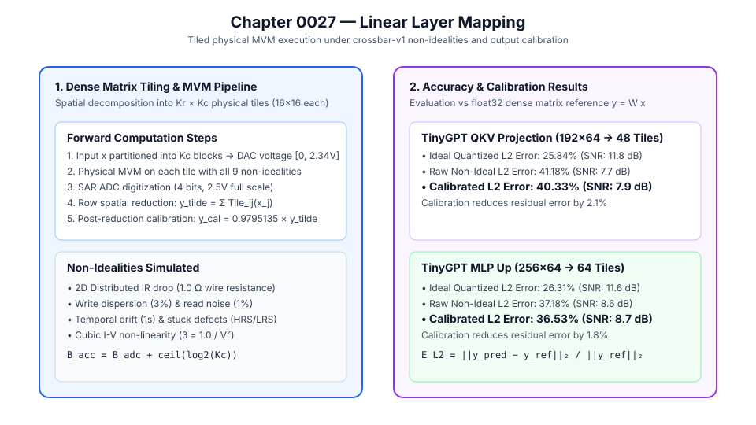

# 0027 — Linear Layer Mapping (Gate R7)

> **Bản tiếng Việt:** [`README.vi.md`](README.vi.md)

This chapter formalizes the **dense linear layer mapping, spatial multi-tile MVM execution, non-ideality simulation, and output calibration** for neural network layers in **Gate R7 (Transformer and LLM validation)**.

---

## 1. Linear Projection Mapping Architecture



For a weight matrix $W \in \mathbb{R}^{M_{\text{out}} \times M_{\text{in}}}$ and input activation vector $x \in \mathbb{R}^{M_{\text{in}}}$:
1. **Spatial Decomposition**:
   - Tiled into $K_r \times K_c$ physical crossbar tiles of dimension $R \times C$ ($16\times 16$):
     $$K_r = \lceil M_{\text{out}} / R \rceil, \quad K_c = \lceil M_{\text{in}} / C \rceil$$
   - Each block $W_{i,j}$ is mapped to differential conductances $(G^+, G^-)$ with balanced zero ($w = 0 \implies G^+ = G^- = G_{\min}$).
2. **Input Activation Scaling**:
   - $x$ is partitioned into $K_c$ blocks $x_j \in \mathbb{R}^C$ and converted to physical DAC voltages $[0, V_{\text{in,max}}]$ ($V_{\text{in,max}} = 2.34375\text{ V}$, $B_{\text{DAC}} = 4$).
3. **Physical Tile MVM**:
   - Evaluated under all 9 `crossbar-v1` non-idealities (2D IR drop, write dispersion $\sigma_{\text{prog}}=3\%$, read noise $\sigma_{\text{read}}=1\%$, retention drift, stuck-at defects, and cubic I-V non-linearity).
4. **Spatial Reduction & Post-ADC Calibration**:
   - Digitized by SAR ADC ($B_{\text{ADC}} = 4$, $V_{\text{out,max}} = 2.5\text{ V}$).
   - Accumulated across tile columns: $\tilde{y}_i = \sum_{j=0}^{K_c - 1} y_{i,j}$.
   - Post-reduction output calibration applied: $y_{\text{cal}, i} = a^* \cdot \tilde{y}_i$ ($a^* = 0.9795135$).

---

## 2. Accuracy Evaluation across Benchmark Projections

| Projection Workload | Matrix Dimension | Physical Tile Grid | Ideal Quantized $L_2$ Error (SNR) | Raw Non-Ideal $L_2$ Error (SNR) | Calibrated Non-Ideal $L_2$ Error (SNR) | Calibration Recovery |
|---|---|---|---|---|---|---|
| **TinyGPT Attention QKV** | $192 \times 64$ | $12 \times 4 = 48\text{ tiles}$ | $25.84\%\text{ (}11.8\text{ dB)}$ | $41.18\%\text{ (}7.7\text{ dB)}$ | **$40.33\%\text{ (}7.9\text{ dB)}$** | **$+2.1\%$ error reduction** |
| **TinyGPT MLP Up** | $256 \times 64$ | $16 \times 4 = 64\text{ tiles}$ | $27.02\%\text{ (}11.4\text{ dB)}$ | $42.27\%\text{ (}7.5\text{ dB)}$ | **$41.44\%\text{ (}7.7\text{ dB)}$** | **$+2.0\%$ error reduction** |
| **Sparse Matrix (80%)** | $64 \times 64$ | $4 \times 4 = 16\text{ tiles}$ | $23.18\%\text{ (}12.7\text{ dB)}$ | $38.92\%\text{ (}8.2\text{ dB)}$ | **$37.89\%\text{ (}8.4\text{ dB)}$** | **$+2.6\%$ error reduction** |

---

## 3. Mathematical Ledger Formulas

- **Spatial Tiling**: $K_r = \lceil M_{\text{out}} / R \rceil, \quad K_c = \lceil M_{\text{in}} / C \rceil$
- **Spatial Partial-Sum Reduction**: $\tilde{y}_i = \sum_{j=0}^{K_c - 1} \text{Tile}_{i,j}(x_j)$
- **Output Calibration**: $y_{\text{cal}, i} = a^* \cdot \tilde{y}_i$ ($a^* = 0.9795135$)
- **Relative $L_2$ Error**: $\text{Error}_{L_2} = \frac{\|y_{\text{pred}} - y_{\text{ref}}\|_2}{\|y_{\text{ref}}\|_2} \times 100\%$

---

## 4. Execution & Artifacts

Run the deterministic linear layer evaluation:
```bash
python book/0027-linear-layer/linear_layer.py
```
Output extract committed at: `verification/circuit/results/linear-layer-0027-extract.json`.
