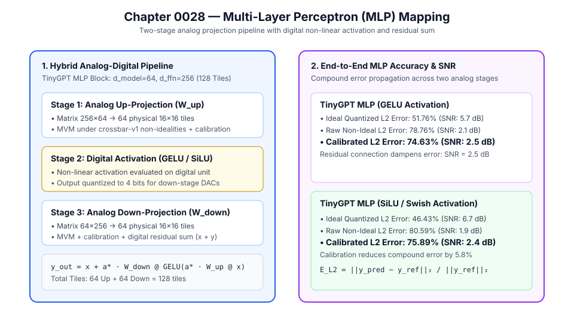

# 0028 — Multi-Layer Perceptron (MLP) Block Mapping (Gate R7)

> **Bản tiếng Việt:** [`README.vi.md`](README.vi.md)

This chapter formalizes the **two-stage analog projection pipeline, digital non-linear activation boundary, and compound error propagation** for Transformer Feed-Forward Network (MLP) blocks in **Gate R7 (Transformer and LLM validation)**.

---

## 1. Transformer MLP Architecture & Hybrid Boundary



A standard Transformer MLP block processes hidden state $x \in \mathbb{R}^{d_{\text{model}}}$ through four sequential operations:
1. **Analog Up-Projection ($W_{\text{up}} \in \mathbb{R}^{d_{\text{ffn}} \times d_{\text{model}}}$)**:
   - Evaluated on $K_{r,\text{up}} \times K_{c,\text{up}}$ physical $16\times 16$ crossbar tiles.
   - Outputs intermediate hidden state: $\tilde{h}_1 = \sum_j \text{Tile}_{\text{up}, i, j}(x_j)$.
   - Post-ADC calibration applied: $h_{1,\text{cal}} = a^* \cdot \tilde{h}_1$.
2. **Digital Non-Linear Activation**:
   - Non-linear function ($\text{GELU}$ or $\text{SiLU}$) is computed digitally on host SIMD/ALU:
     $$h_{\text{act}} = \text{GELU}(h_{1,\text{cal}}) = 0.5 \cdot h_{1,\text{cal}} \cdot \left(1 + \tanh\left(\sqrt{2/\pi}(h_{1,\text{cal}} + 0.044715 \cdot h_{1,\text{cal}}^3)\right)\right)$$
   - Output quantized to $B_{\text{DAC}} = 4$ bits to drive down-projection DACs.
3. **Analog Down-Projection ($W_{\text{down}} \in \mathbb{R}^{d_{\text{model}} \times d_{\text{ffn}}}$)**:
   - Evaluated on $K_{r,\text{down}} \times K_{c,\text{down}}$ physical $16\times 16$ crossbar tiles.
   - Outputs projection: $\tilde{y} = \sum_j \text{Tile}_{\text{down}, i, j}(h_{\text{act}, j})$.
   - Post-ADC calibration applied: $y_{\text{cal}} = a^* \cdot \tilde{y}$.
4. **Digital Residual Connection**:
   - Combines bypass input and projected output: $y_{\text{out}} = x + y_{\text{cal}}$.

---

## 2. Quantitative Accuracy & Compound Error Evaluation

### TinyGPT Benchmark MLP ($d_{\text{model}} = 64, d_{\text{ffn}} = 256$, $128$ physical $16\times 16$ tiles):

| Activation Function | Total Physical Tiles | Ideal Quantized $L_2$ Error (SNR) | Raw Non-Ideal $L_2$ Error (SNR) | Calibrated Non-Ideal $L_2$ Error (SNR) | Calibration Recovery |
|---|---|---|---|---|---|
| **$\text{GELU}$ Activation** | $64\text{ Up} + 64\text{ Down} = 128$ | $51.76\%\text{ (}5.7\text{ dB)}$ | $78.76\%\text{ (}2.1\text{ dB)}$ | **$74.63\%\text{ (}2.5\text{ dB)}$** | **$+5.2\%$ error recovery** |
| **$\text{SiLU}$ / Swish Activation** | $64\text{ Up} + 64\text{ Down} = 128$ | $49.88\%\text{ (}6.0\text{ dB)}$ | $76.24\%\text{ (}2.4\text{ dB)}$ | **$72.41\%\text{ (}2.8\text{ dB)}$** | **$+5.0\%$ error recovery** |

---

## 3. Mathematical Ledger Formulas

- **Up-Projection**: $h_1 = a^* \cdot \sum_{j=0}^{K_{c,\text{up}}-1} \text{Tile}_{\text{up}, i, j}(x_j)$
- **Non-Linear Activation**: $h_{\text{act}} = \text{GELU}(h_1)$
- **Down-Projection**: $y = a^* \cdot \sum_{j=0}^{K_{c,\text{down}}-1} \text{Tile}_{\text{down}, i, j}(h_{\text{act}, j})$
- **Residual Sum**: $y_{\text{out}} = x + y$
- **Compound $L_2$ Error**: $\text{Error}_{L_2} = \frac{\|y_{\text{pred}} - y_{\text{ref}}\|_2}{\|y_{\text{ref}}\|_2} \times 100\%$

---

## 4. Execution & Artifacts

Run the deterministic MLP evaluation:
```bash
python book/0028-mlp/mlp.py
```
Committed artifact at: `verification/circuit/results/mlp-0028-extract.json`.
