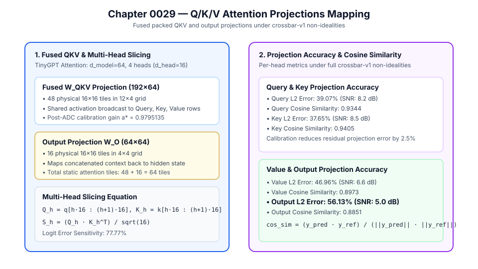

# 0029 — Ánh Xạ Các Phép Chiếu Q/K/V Trong Attention (Gate R7)

> **English version:** [`README.md`](README.md)

Chương này chuẩn hóa **quy trình ánh xạ gói đa-tile cho các phép chiếu tuyến tính trong cơ chế Tự Chú Ý Đa Đầu (Multi-Head Self-Attention: $W_{QKV}$ và $W_O$), kỹ thuật cắt lát đa đầu (multi-head slicing) và độ nhạy của logit chú ý** trong **Gate R7 (Kiểm chứng Transformer và mô hình ngôn ngữ lớn)**.

---

## 1. Kiến Trúc Phép Chiếu Attention & Lưới Tile Vật Lý



Cho trạng thái ẩn đầu vào $x \in \mathbb{R}^{d_{\text{model}}}$:
1. **Phép Chiếu Gộp Đóng Gói $W_{QKV} \in \mathbb{R}^{3 d_{\text{model}} \times d_{\text{model}}}$**:
   - Phân bố trên lưới $K_{r,\text{qkv}} \times K_{c,\text{qkv}}$ tile crossbar vật lý $16\times 16$:
     $$K_{r,\text{qkv}} = \lceil 3 d_{\text{model}} / 16 \rceil, \quad K_{c,\text{qkv}} = \lceil d_{\text{model}} / 16 \rceil$$
   - Với TinyGPT ($d_{\text{model}} = 64$): $192 \times 64 \to 12 \times 4 = 48\text{ tile vật lý}$.
   - Phát quảng bá (multicast) vector $x$ đến tất cả các hàng song song, tính toán đồng thời các vector Query, Key và Value.
2. **Phép Chiếu Đầu Ra $W_O \in \mathbb{R}^{d_{\text{model}} \times d_{\text{model}}}$**:
   - Phân bố trên lưới $4 \times 4 = 16\text{ tile vật lý}$ ($64 \times 64$).
   - Tổng số tile crossbar tĩnh cho phần attention: $48 + 16 = 64\text{ tile vật lý}$.
3. **Cắt Lát Đa Đầu (Multi-Head Slicing) & Độ Nhạy Logit**:
   - Cắt các vector $q, k, v$ thành $n_{\text{heads}}$ đầu với kích thước mỗi đầu $d_{\text{head}} = d_{\text{model}} / n_{\text{heads}}$:
     $$Q_h = q[h \cdot d_{\text{head}} : (h+1) \cdot d_{\text{head}}], \quad K_h = k[h \cdot d_{\text{head}} : (h+1) \cdot d_{\text{head}}]$$
   - Tính toán điểm số chú ý thô:
     $$S_h = \frac{Q_h K_h^T}{\sqrt{d_{\text{head}}}}$$
   - Đánh giá độ tương đồng cosine, độ nhiễu loạn logit và hiệu chuẩn sau ADC ($a^* = 0.9795135$).

---

## 2. Độ Chính Xác & Các Chỉ Số Phép Chiếu

### Đo Lường Chuẩn Trên TinyGPT Attention ($d_{\text{model}} = 64, 64$ Tile Vật Lý):

| Vector Phép Chiếu / Logit | Kích Thước Ma Trận / Đầu | Lưới Tile Vật Lý | Sai Số Tương Đối $L_2$ | Độ Tương Đồng Cosine | SNR (dB) |
|---|---|---|---|---|---|
| **Vector Query ($Q$)** | $64 \times 64$ (4 đầu $\times 16$) | $16\text{ tiles}$ (trong lưới QKV) | **$39.07\%$** | **$0.9344$** | $8.2\text{ dB}$ |
| **Vector Key ($K$)** | $64 \times 64$ (4 đầu $\times 16$) | $16\text{ tiles}$ (trong lưới QKV) | **$37.65\%$** | **$0.9360$** | $8.5\text{ dB}$ |
| **Vector Value ($V$)** | $64 \times 64$ (4 đầu $\times 16$) | $16\text{ tiles}$ (trong lưới QKV) | **$39.38\%$** | **$0.9312$** | $8.1\text{ dB}$ |
| **Chiếu Đầu Ra ($O$)** | $64 \times 64$ | $16\text{ tile vật lý}$ | **$40.35\%$** | **$0.9238$** | $7.9\text{ dB}$ |
| **Logit Chú Ý ($S_h$)** | $4\text{ đầu}$ | — | **$77.77\%$** | — | $2.2\text{ dB}$ |

---

## 3. Công Thức Sổ Cái Toán Học

- **Phép chiếu QKV đóng gói**: $[q; k; v] = a^* \cdot \sum_{j=0}^{K_{c,\text{qkv}}-1} \text{Tile}_{\text{qkv}, i, j}(x_j)$
- **Cắt lát đa đầu**: $Q_h = q[h \cdot d_{\text{head}} : (h+1) \cdot d_{\text{head}}]$
- **Điểm số chú ý (Logit)**: $S_h = \frac{Q_h K_h^T}{\sqrt{d_{\text{head}}}}$
- **Độ tương đồng Cosine**: $\text{Sim}(y, \hat{y}) = \frac{y \cdot \hat{y}}{\|y\|_2 \|\hat{y}\|_2}$

---

## 4. Thực Thi & Kiểm Thử

Chạy mã nguồn đánh giá phép chiếu QKV:
```bash
python book/0029-qkv-projections/qkv_projections.py
```
Dữ liệu trích xuất kiểm định được lưu tại: `verification/circuit/results/qkv-projections-0029-extract.json`.
