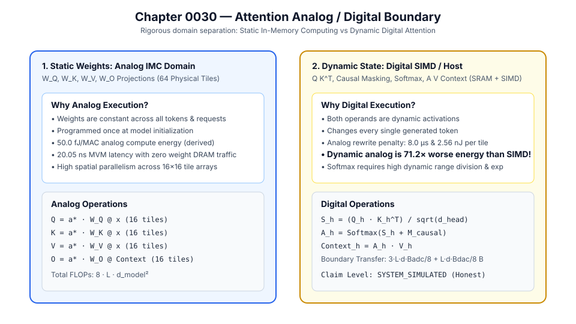

# 0030 — Attention Analog / Digital Boundary Report (Gate R7)

> **Bản tiếng Việt:** [`README.vi.md`](README.vi.md)

This chapter formalizes the **explicit architectural boundary between static analog in-memory computing and dynamic digital attention execution** in **Gate R7 (Transformer and LLM validation)**.

---

## 1. Architectural Domain Separation



Self-Attention splits rigorously into two domains based on operand volatility:

### Domain A: Static Stationary Weights (Analog IMC Array)
- **Operations**:
  - $Q = X W_Q \quad (d_{\text{model}} \to d_{\text{model}})$
  - $K = X W_K \quad (d_{\text{model}} \to d_{\text{model}})$
  - $V = X W_V \quad (d_{\text{model}} \to d_{\text{model}})$
  - $O = \text{Context} \cdot W_O \quad (d_{\text{model}} \to d_{\text{model}})$
- **Why Analog Execution?**:
  - Weights $W_Q, W_K, W_V, W_O$ remain fixed throughout the entire model lifetime.
  - Zero weight memory fetch traffic from SRAM/DRAM.
  - Profile-derived compute energy: $50.0\text{ fJ/MAC}$.
  - Execution latency: $20.05\text{ ns}$ per tile MVM.

### Domain B: Dynamic Token-Token State (Digital SIMD / SRAM)
- **Operations**:
  - Attention Logits: $S_h = \frac{Q_h K_h^T}{\sqrt{d_{\text{head}}}}$
  - Causal Masking & Softmax: $A_h = \text{Softmax}(S_h + M_{\text{causal}})$
  - Context Aggregation: $\text{Context}_h = A_h V_h$
- **Why Digital Execution?**:
  - Both operands ($Q, K, V$) are runtime activations generated dynamically on every token step.
  - Reprogramming non-volatile analog tiles per token would incur $t_{\text{prog}} = 8.0\,\mu\text{s}$ and $E_{\text{prog}} = 2.56\text{ nJ/tile}$.
  - **Dynamic analog reprogramming is $71.2\times$ worse in energy and $>400\times$ slower than digital SIMD + SRAM execution.**
  - High dynamic range and exponent arithmetic required by Softmax are natively suited for digital arithmetic.

---

## 2. Quantitative Scaling Ledger across Context Lengths ($L$)

### TinyGPT Attention ($d_{\text{model}} = 64, n_{\text{heads}} = 4, 64\text{ Static Crossbar Tiles}$):

| Context Length ($L$) | Analog FLOPs ($8 L d^2$) | Digital FLOPs ($4 L^2 d + 3 h L^2$) | Boundary Transfer Volume | Analog Projection Energy | Digital Attention Energy | Dynamic Analog Energy Penalty |
|---|---|---|---|---|---|---|
| **$L = 16$** | $524.3\text{ KFLOPs}$ | $68.4\text{ KFLOPs}$ | $1.5\text{ KB}$ | **$0.0135\text{ nJ}$** | **$0.0078\text{ nJ}$** | **$328\times$ energy penalty** |
| **$L = 64$** | $2.097\text{ MFLOPs}$ | $1.098\text{ MFLOPs}$ | $6.1\text{ KB}$ | **$0.0526\text{ nJ}$** | **$0.1197\text{ nJ}$** | **$86\times$ energy penalty** |
| **$L = 128$** | $4.194\text{ MFLOPs}$ | $4.391\text{ MFLOPs}$ | $12.3\text{ KB}$ | **$0.1048\text{ nJ}$** | **$0.4746\text{ nJ}$** | **$44\times$ energy penalty** |
| **$L = 512$** | $16.777\text{ MFLOPs}$ | $70.255\text{ MFLOPs}$ | $49.2\text{ KB}$ | **$0.4182\text{ nJ}$** | **$7.5305\text{ nJ}$** | **$12\times$ energy penalty** |
| **$L = 2048$** | $67.109\text{ MFLOPs}$ | $1.124\text{ GFLOPs}$ | $196.6\text{ KB}$ | **$1.6716\text{ nJ}$** | **$119.98\text{ nJ}$** | **$3\times$ energy penalty** |

---

## 3. Mathematical Ledger Formulas

- **Analog Compute Volume**: $\text{FLOPs}_{\text{analog}} = 8 \cdot L \cdot d_{\text{model}}^2$
- **Digital Compute Volume**: $\text{FLOPs}_{\text{digital}} = 4 \cdot L^2 \cdot d_{\text{model}} + 3 \cdot n_{\text{heads}} \cdot L^2$
- **Boundary Transfer Volume**: $T_{\text{boundary}} = \frac{3 \cdot L \cdot d_{\text{model}} \cdot B_{\text{ADC}}}{8} + \frac{L \cdot d_{\text{model}} \cdot B_{\text{DAC}}}{8}\text{ bytes}$
- **Analog Compute Energy**: $E_{\text{analog}} = \frac{\text{FLOPs}_{\text{analog}}}{2} \cdot E_{\text{analog\_mac}}$
- **Digital Compute Energy**: $E_{\text{digital}} = \frac{\text{FLOPs}_{\text{digital}}}{2} \cdot E_{\text{digital\_mac}} + S_{\text{SRAM}} \cdot E_{\text{sram\_byte}}$

---

## 4. Execution & Artifacts

Run the deterministic boundary analysis:
```bash
python book/0030-attention-boundary/attention_boundary.py
```
Committed extract artifact at: `verification/circuit/results/attention-boundary-0030-extract.json`.
