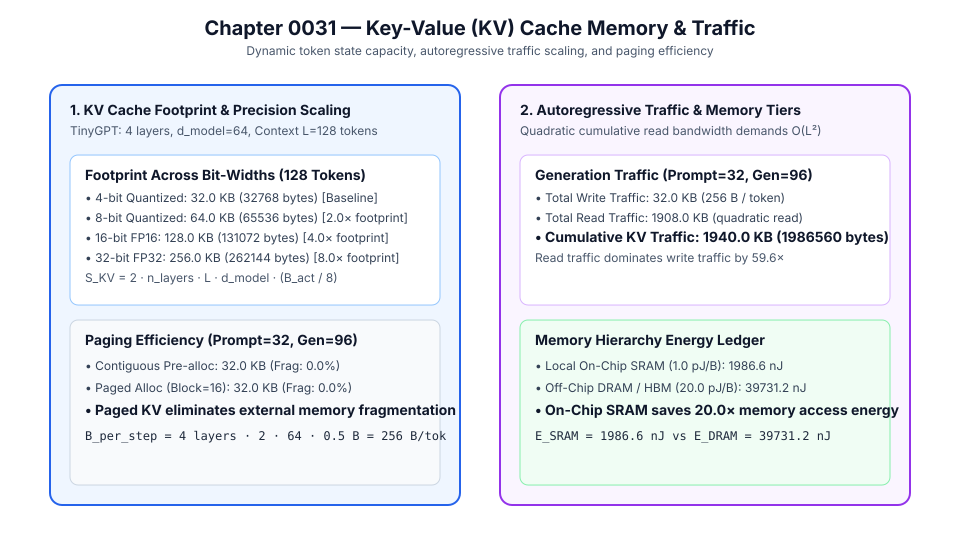

# 0031 — Key-Value (KV) Cache Capacity and Traffic Model (Gate R7)

> **Bản tiếng Việt:** [`README.vi.md`](README.vi.md)

This chapter formalizes the **dynamic token state storage capacity, autoregressive bandwidth scaling, memory paging policies, and memory energy ledger** for Transformer attention in **Gate R7 (Transformer and LLM validation)**.

---

## 1. KV Cache Footprint & Architecture



During autoregressive generation, past Key and Value vectors must be cached in memory to compute attention without re-evaluating preceding tokens:
1. **Memory Capacity Formula**:
   $$S_{\text{KV}}(L) = 2 \cdot n_{\text{layers}} \cdot L \cdot d_{\text{model}} \cdot \frac{B_{\text{act}}}{8}\text{ bytes}$$
2. **TinyGPT Benchmarks ($n_{\text{layers}}=4, d_{\text{model}}=64$, Context $L=128\text{ tokens}$)**:
   - **4-bit Quantized ($B_{\text{act}}=4$)**: $32.0\text{ KB}$ ($32,768\text{ bytes}$) $\implies$ Fits completely inside local on-chip SRAM pool.
   - **8-bit Quantized ($B_{\text{act}}=8$)**: $64.0\text{ KB}$ ($65,536\text{ bytes}$) $\implies 2.0\times$ footprint.
   - **16-bit FP16 Baseline**: $128.0\text{ KB}$ ($131,072\text{ bytes}$) $\implies 4.0\times$ footprint.
   - **32-bit FP32 Baseline**: $256.0\text{ KB}$ ($262,144\text{ bytes}$) $\implies 8.0\times$ footprint.

---

## 2. Autoregressive Traffic Scaling & Bandwidth

For sequence generation from prompt length $L_{\text{prompt}}$ to total length $L$:
- **Write Traffic per Step**: $T_{\text{write}} = 2 \cdot n_{\text{layers}} \cdot d_{\text{model}} \cdot \frac{B_{\text{act}}}{8} = 256\text{ bytes/token}$ ($O(1)$ constant).
- **Read Traffic at Step $t$**: $T_{\text{read}}(t) = 2 \cdot n_{\text{layers}} \cdot t \cdot d_{\text{model}} \cdot \frac{B_{\text{act}}}{8} = 256 \cdot t\text{ bytes/token}$ ($O(t)$ linear).
- **Cumulative Generation Traffic (Prompt=32, Gen=96 $\to$ 128 Tokens)**:
  - Total Write Traffic: $32.0\text{ KB}$ ($32,768\text{ bytes}$).
  - Total Read Traffic: $1908.0\text{ KB}$ ($1,953,792\text{ bytes}$).
  - Total Cumulative Traffic: **$1940.0\text{ KB}$** ($1,986,560\text{ bytes}$).
  - Read traffic dominates write traffic by **$59.6\times$**.

---

## 3. Paging Policies & Memory Hierarchy Energy

| Generation Workload | Context Sequence ($L$) | Peak KV Cache Size | Cumulative KV Traffic | On-Chip SRAM Energy ($1.0\text{ pJ/B}$) | Off-Chip DRAM Energy ($20.0\text{ pJ/B}$) | Paged KV Fragmentation ($B_{\text{block}}=16$) |
|---|---|---|---|---|---|---|
| **Short Decode** | $16\text{ Prompt} + 16\text{ Gen} = 32$ | $8.0\text{ KB}$ | $98.0\text{ KB}$ | **$100.4\text{ nJ}$** | $2007.0\text{ nJ}$ | **$0.0\%$ (Exact blocks)** |
| **Medium Decode** | $32\text{ Prompt} + 32\text{ Gen} = 64$ | $16.0\text{ KB}$ | $392.0\text{ KB}$ | **$401.4\text{ nJ}$** | $8028.2\text{ nJ}$ | **$0.0\%$ (Exact blocks)** |
| **Full Context** | $32\text{ Prompt} + 96\text{ Gen} = 128$ | $32.0\text{ KB}$ | $1940.0\text{ KB}$ | **$1986.6\text{ nJ}$** | $39731.2\text{ nJ}$ | **$0.0\%$ (Exact blocks)** |

- **Energy Advantage**: Storing TinyGPT KV cache in local On-Chip SRAM saves **$20.0\times$** memory access energy over external DRAM.

---

## 4. Execution & Artifacts

Run the deterministic KV cache simulation:
```bash
python book/0031-kv-cache/kv_cache.py
```
Committed extract artifact at: `verification/circuit/results/kv-cache-0031-extract.json`.
