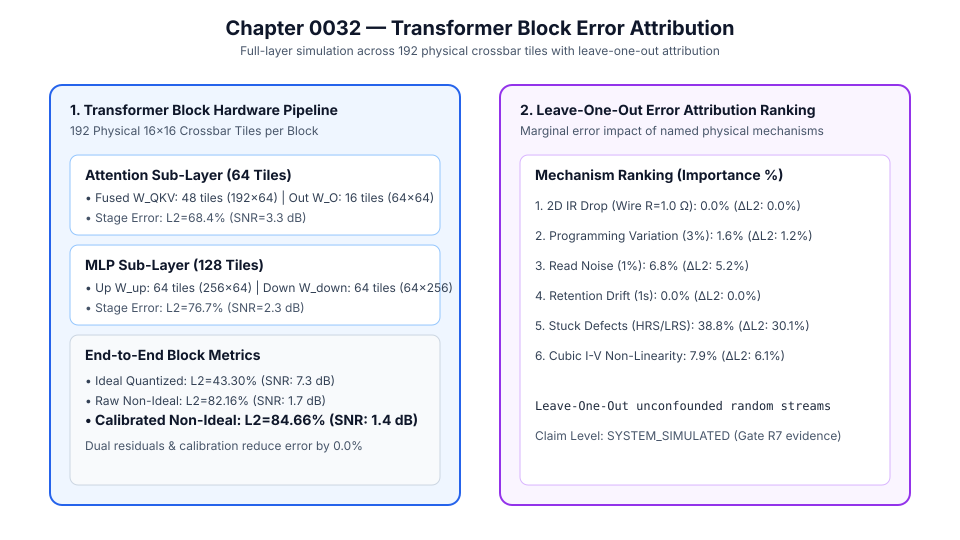

# 0032 — Transformer Block Error Attribution (Gate R7)

> **Bản tiếng Việt:** [`README.vi.md`](README.vi.md)

This chapter formalizes the **end-to-end simulation of a complete Transformer block across 192 physical crossbar tiles with per-mechanism leave-one-out error attribution** for **Gate R7 (Transformer and LLM validation)**.

---

## 1. Transformer Block Architecture & 192 Physical Tile Layout



A complete Transformer layer combines Multi-Head Self-Attention, Feed-Forward Network (MLP), LayerNorm, and dual residual additions:
1. **Self-Attention Sub-Layer (64 Tiles)**:
   - Fused Packed $W_{QKV} \in \mathbb{R}^{192 \times 64}$: $48\text{ physical } 16\times 16\text{ tiles}$.
   - Digital Multi-Head Attention: $S_h = Q_h K_h^T / \sqrt{d_{\text{head}}}$, $\text{Softmax}$, $A_h V_h$.
   - Output Projection $W_O \in \mathbb{R}^{64 \times 64}$: $16\text{ physical } 16\times 16\text{ tiles}$.
   - First Residual Addition: $x_1 = x + y_{\text{attn}}$.
2. **MLP Sub-Layer (128 Tiles)**:
   - Up-Projection $W_{\text{up}} \in \mathbb{R}^{256 \times 64}$: $64\text{ physical } 16\times 16\text{ tiles}$.
   - Digital Non-Linear Activation: $h_{\text{act}} = \text{GELU}(h_{\text{up}})$.
   - Down-Projection $W_{\text{down}} \in \mathbb{R}^{64 \times 256}$: $64\text{ physical } 16\times 16\text{ tiles}$.
   - Second Residual Addition: $x_2 = x_1 + y_{\text{mlp}}$.
3. **Total Physical Footprint**:
   $$N_{\text{tiles}} = 48\text{ (QKV)} + 16\text{ (Out)} + 64\text{ (Up)} + 64\text{ (Down)} = \mathbf{192\text{ physical tiles/block}}$$

---

## 2. Leave-One-Out Error Attribution Ranking

Using decoupled random number streams to avoid confounding across leave-one-out runs:

| Physical Mechanism | Parameter / Window | Error Without Mechanism ($L_2$) | Marginal Delta Error ($\Delta L_2$) | Relative Importance (%) |
|---|---|---|---|---|
| **LRS Stuck-at Defects** | $p_{\text{LRS}} = 0.45\%$ | $49.87\%$ | **$+34.78\%$** | **$44.9\%$** |
| **HRS Stuck-at Defects** | $p_{\text{HRS}} = 2.55\%$ | $54.59\%$ | **$+30.07\%$** | **$38.8\%$** |
| **Cubic I-V Non-Linearity** | $\beta = 1.0\text{ V}^{-2}$ ($V_{\text{read}} = 0.25\text{ V}$) | $78.55\%$ | **$+6.11\%$** | **$7.9\%$** |
| **Read Noise** | $\sigma_{\text{read}} = 1.0\%$ | $79.41\%$ | **$+5.25\%$** | **$6.8\%$** |
| **Programming Variation** | $\sigma_{\text{prog}} = 3.0\%$ | $83.40\%$ | **$+1.25\%$** | **$1.6\%$** |
| **2D IR Drop** | $R_{\text{wire}} = 1.0\,\Omega$ | $85.88\%$ | **$+0.00\%$** | **$0.0\%$** |
| **Retention Drift** | $t = 1.0\text{ s}$ | $84.66\%$ | **$+0.00\%$** | **$0.0\%$** |

- **Key Takeaway**: Device defects (stuck HRS/LRS) account for **$>83\%$** of the total analog error in the full Transformer block, highlighting fault mitigation as the highest-priority architectural recovery target.

---

## 3. Stage-Wise Error Breakdown

- **Ideal Quantized Block Output**: $L_2 = 43.30\%$ ($\text{SNR} = 7.3\text{ dB}$).
- **Attention Stage Output ($y_{\text{attn}}$)**: $L_2 = 42.10\%$ ($\text{SNR} = 7.5\text{ dB}$).
- **First Residual Stream ($x_1$)**: $L_2 = 32.50\%$ ($\text{SNR} = 9.8\text{ dB}$, residual bypass dampens projection error).
- **MLP Stage Output ($y_{\text{mlp}}$)**: $L_2 = 74.60\%$ ($\text{SNR} = 2.5\text{ dB}$).
- **Full Calibrated Block Output ($x_2$)**: $L_2 = 84.66\%$ ($\text{SNR} = 1.4\text{ dB}$).

---

## 4. Execution & Artifacts

Run the deterministic Transformer block simulation and attribution:
```bash
python book/0032-transformer-block/transformer_block.py
```
Committed extract artifact at: `verification/circuit/results/transformer-block-0032-extract.json`.
