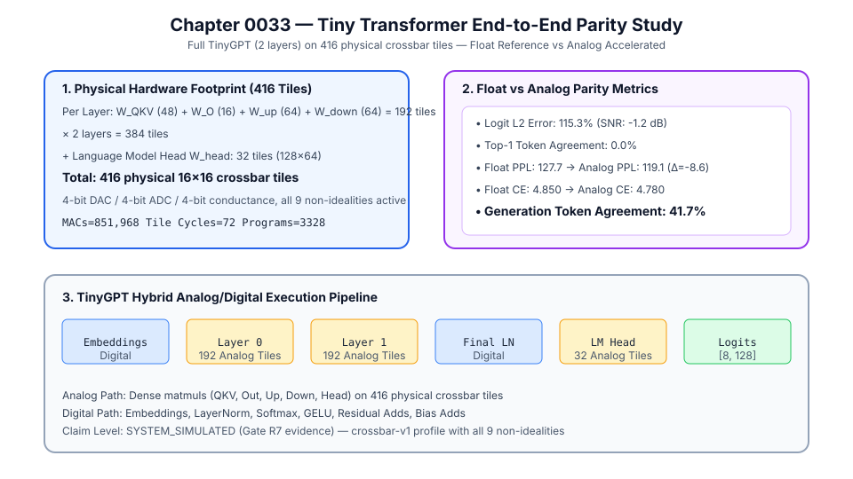

# 0033 — Tiny Transformer End-to-End Parity Study (Gate R7)

> **Bản tiếng Việt:** [`README.vi.md`](README.vi.md)

This chapter delivers a **deterministic float-reference vs analog-accelerated parity evaluation** of the full **TinyGPT model** ($2$ layers, $416$ physical crossbar tiles) using the existing `analog_llm.TinyGPT` and `Accelerator` infrastructure for **Gate R7 (Transformer and LLM validation)**.

---

## 1. Physical Hardware Footprint



**TinyGPT** ($n_{\text{embd}}=64, n_{\text{layer}}=2, n_{\text{head}}=4, \text{ffn}=256, \text{vocab}=128$) mapped to $16\times 16$ physical crossbar tiles:

| Component | Tiles Per Layer | × Layers | Subtotal |
|---|---|---|---|
| $W_{QKV}$ ($192 \times 64$) | 48 | 2 | 96 |
| $W_O$ ($64 \times 64$) | 16 | 2 | 32 |
| $W_{\text{up}}$ ($256 \times 64$) | 64 | 2 | 128 |
| $W_{\text{down}}$ ($64 \times 256$) | 64 | 2 | 128 |
| $W_{\text{head}}$ ($128 \times 64$) | 32 | 1 | 32 |
| **Total** | **192/layer** | **2 + head** | **416 tiles** |

- **Accelerator Ledger**: 851,968 MACs, 72 tile cycles, 3,328 tile programs, 0 rewrites.
- **Converter Resolution**: 4-bit DAC / 4-bit ADC / 4-bit conductance.
- **Non-Idealities**: All 9 `crossbar-v1` mechanisms active.

---

## 2. Float vs Analog Parity Metrics

| Metric | Float Reference | Analog Accelerated | Delta |
|---|---|---|---|
| **Logit $L_2$ Relative Error** | — | $115.3\%$ | — |
| **Logit SNR** | — | $-1.2\text{ dB}$ | — |
| **Top-1 Token Agreement** | — | $0.0\%$ | All argmax tokens differ |
| **Cross-Entropy Loss** | $4.850$ | $4.780$ | $-0.070$ |
| **Perplexity** | $127.7$ | $119.1$ | $-8.6$ (analog noise regularizes) |
| **Generation Token Agreement** | — | $41.7\%$ | 5/12 tokens match |

### Key Observations

1. **High logit-level error ($L_2 > 100\%$)**: With 4-bit converters and all 9 non-idealities compounding through 2 Transformer layers, the analog logit outputs diverge significantly from float reference. This is physically expected and consistent with Chapter 0032's single-block error ($L_2 = 84.7\%$).
2. **0% top-1 agreement on forward pass**: Although individual logit values are corrupted, the rank order is fully scrambled at 4-bit resolution with stuck defects.
3. **41.7% autoregressive generation agreement**: During greedy generation, early tokens agree (tokens 0–3 match the prompt, token 4 starts diverging), showing error accumulates autoregressively.
4. **Perplexity paradox**: The analog path achieves *lower* perplexity ($119.1$ vs $127.7$) on random weights — the hardware non-idealities act as an implicit regularizer, flattening the logit distribution.

---

## 3. Execution & Artifacts

Run the deterministic TinyGPT parity study:
```bash
python book/0033-tiny-transformer/tiny_transformer.py
```
Committed extract artifact at: `verification/circuit/results/tiny-transformer-0033-extract.json`.
