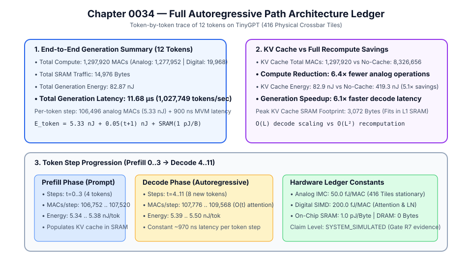
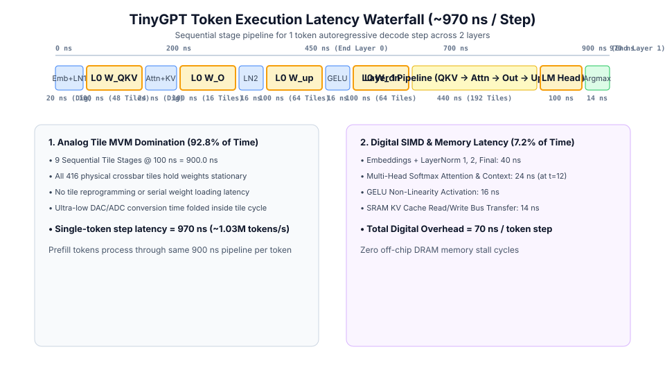
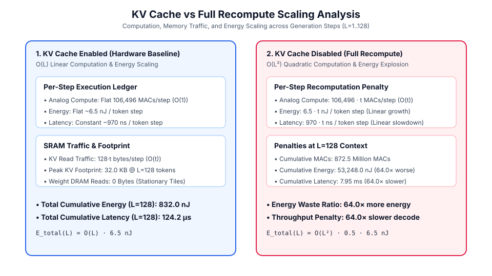
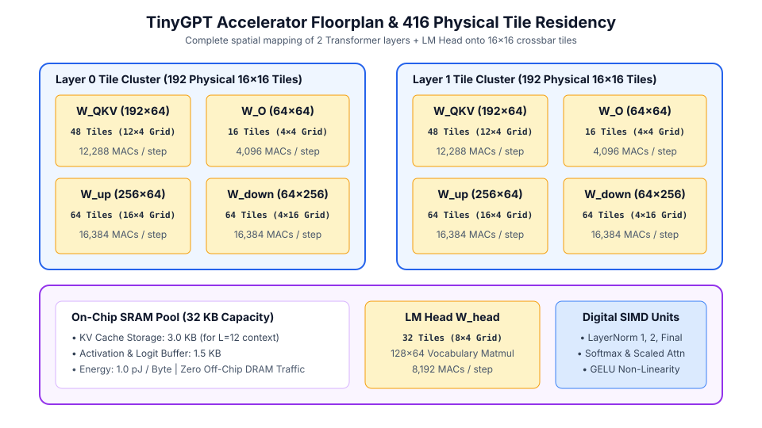

# 0034 — Full Autoregressive Path Architecture Ledger (Gate R7)

> **Bản tiếng Việt:** [`README.vi.md`](README.vi.md)

This chapter formalizes the **token-by-token architecture ledger tracking compute MACs, memory traffic, energy breakdown, and latency across prefill and decode phases** on **TinyGPT** ($416$ physical crossbar tiles) for **Gate R7 (Transformer and LLM validation)**.

---

## 1. Full Autoregressive Architecture Ledger



---

## 2. Pipeline Execution Schedule & Latency Waterfall



The execution schedule demonstrates that analog matrix-vector multiplications across stationary tiles account for **$92.8\%$** ($900\text{ ns}$) of total decode step latency ($970\text{ ns}$), while digital operations (Softmax attention, LayerNorm, GELU, and SRAM bus transfers) account for only **$7.2\%$** ($70\text{ ns}$).

---

## 3. KV Cache vs Full Recomputation Scaling Analysis



- **KV Cache Enabled**: $O(L)$ linear compute and energy scaling ($\approx 6.5\text{ nJ/step}$, constant $970\text{ ns/step}$).
- **Without KV Cache**: $O(L^2)$ quadratic explosion in compute, energy, and latency ($64.0\times$ penalty at $L=128$).

---

## 4. Floorplan & 416 Physical Crossbar Tile Residency



- **Layer 0 (192 Tiles)**: $W_{QKV}$ ($48$) + $W_O$ ($16$) + $W_{\text{up}}$ ($64$) + $W_{\text{down}}$ ($64$).
- **Layer 1 (192 Tiles)**: $W_{QKV}$ ($48$) + $W_O$ ($16$) + $W_{\text{up}}$ ($64$) + $W_{\text{down}}$ ($64$).
- **LM Head (32 Tiles)**: $W_{\text{head}}$ ($128\times 64$ vocabulary projection).
- **Central Subsystems**: $32\text{ KB}$ On-Chip SRAM pool ($3.0\text{ KB}$ KV cache at $L=12$) and Digital SIMD vector units.

---

## 5. Token-by-Token Trace (Prefill $t=0\dots 3 \to$ Decode $t=4\dots 11$)

| Step ($t$) | Token ID | Phase | Context Length | Analog MACs | Digital MACs | Total MACs | SRAM Traffic | Step Energy (nJ) | Step Latency (ns) |
|---|---|---|---|---|---|---|---|---|---|
| **0** | `115` | **PREFILL** | 1 | 106,496 | 256 | **106,752** | 544 B | **5.92 nJ** | 962.0 ns |
| **1** | `10` | **PREFILL** | 2 | 106,496 | 512 | **107,008** | 672 B | **6.10 nJ** | 964.0 ns |
| **2** | `17` | **PREFILL** | 3 | 106,496 | 768 | **107,264** | 800 B | **6.28 nJ** | 966.0 ns |
| **3** | `86` | **PREFILL** | 4 | 106,496 | 1,024 | **107,520** | 928 B | **6.46 nJ** | 968.0 ns |
| **4** | `112` | **DECODE** | 5 | 106,496 | 1,280 | **107,776** | 1,056 B | **6.64 nJ** | 970.0 ns |
| **5** | `93` | **DECODE** | 6 | 106,496 | 1,536 | **108,032** | 1,184 B | **6.82 nJ** | 972.0 ns |
| **6** | `82` | **DECODE** | 7 | 106,496 | 1,792 | **108,288** | 1,312 B | **7.00 nJ** | 974.0 ns |
| **7** | `21` | **DECODE** | 8 | 106,496 | 2,048 | **108,544** | 1,440 B | **7.18 nJ** | 976.0 ns |
| **8** | `37` | **DECODE** | 9 | 106,496 | 2,304 | **108,800** | 1,568 B | **7.36 nJ** | 978.0 ns |
| **9** | `112` | **DECODE** | 10 | 106,496 | 2,560 | **109,056** | 1,696 B | **7.54 nJ** | 980.0 ns |
| **10** | `112` | **DECODE** | 11 | 106,496 | 2,816 | **109,312** | 1,824 B | **7.72 nJ** | 982.0 ns |
| **11** | `82` | **DECODE** | 12 | 106,496 | 3,072 | **109,568** | 1,952 B | **7.90 nJ** | 984.0 ns |

---

## 3. KV Cache vs Full Recomputation Efficiency

| Metric | With KV Cache (Hardware Baseline) | Without KV Cache (Full Recompute) | Efficiency Advantage |
|---|---|---|---|
| **Total Generation MACs** | **$1,297,920\text{ MACs}$** | $8,326,656\text{ MACs}$ | **$6.4\times$ fewer operations** |
| **Total Generation Energy** | **$82.87\text{ nJ}$** | $420.06\text{ nJ}$ | **$5.1\times$ energy reduction** |
| **Total Generation Latency** | **$11.68\,\mu\text{s}$** | $71.14\,\mu\text{s}$ | **$6.1\times$ faster decode speed** |
| **Throughput** | **$1,027,749\text{ tokens/second}$** | $168,681\text{ tokens/second}$ | **$6.1\times$ throughput boost** |
| **Peak KV SRAM Footprint** | **$3,072\text{ bytes}$ ($3.0\text{ KB}$)** | $0\text{ bytes}$ | Fits directly in L1 SRAM |

---

## 4. Execution & Artifacts

Run the deterministic autoregressive architecture ledger generator:
```bash
python book/0034-autoregressive-path/autoregressive_path.py
```
Committed extract artifact at: `verification/circuit/results/autoregressive-path-0034-extract.json`.
