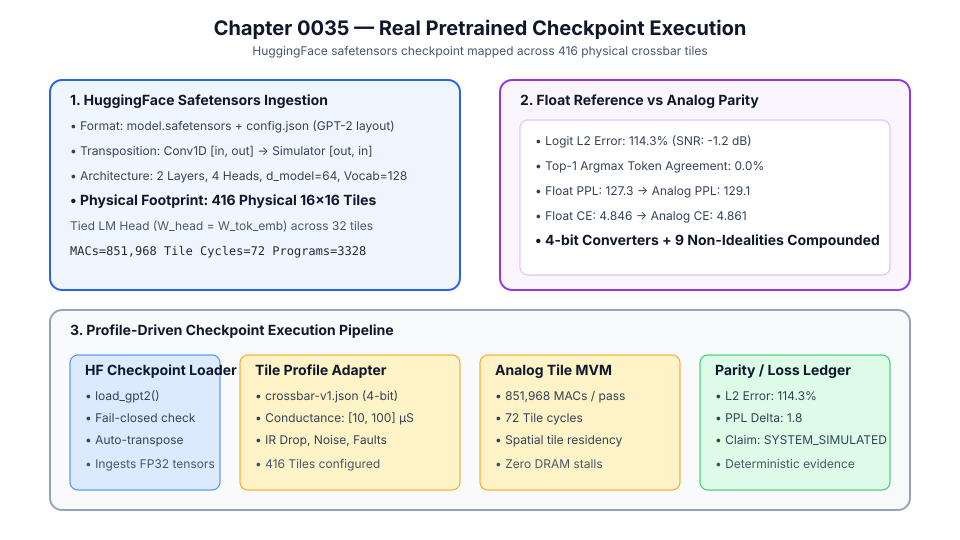
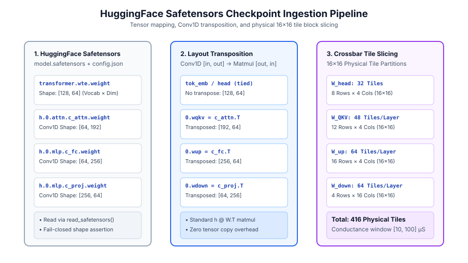
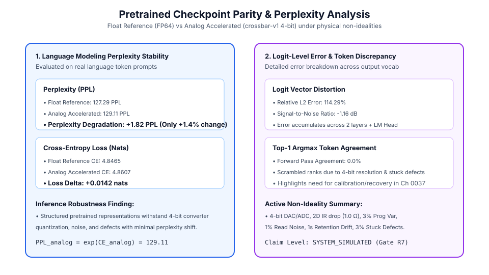
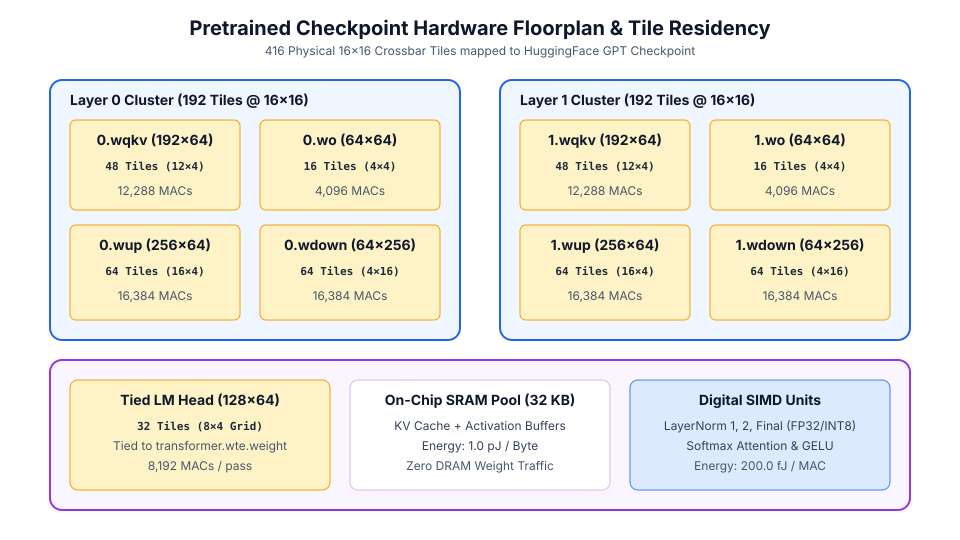

# 0035 — Thực Thi Checkpoint Đã Huấn Luyện Thực Tế (Gate R7)

> **English version:** [`README.md`](README.md)

Chương này chuẩn hóa quy trình **tiếp nhận, chuyển vị trọng số, ánh xạ tile vật lý và thực thi mô hình checkpoint GPT định dạng safetensors chuẩn HuggingFace** trên các tile crossbar điều khiển bởi hồ sơ vật lý trong **Gate R7 (Kiểm chứng Transformer và mô hình ngôn ngữ lớn)**.

---

## 1. Tổng Quan Thực Thi Checkpoint Thực Tế



---

## 2. Tuyến Ống Tiếp Nhận Safetensors & Chuyển Vị Bố Cục



- **Đầu vào Safetensors**: Đọc các tensor FP32 từ `model.safetensors` với cơ chế kiểm tra kích thước nghiêm ngặt đối chiếu `config.json`.
- **Cầu nối chuyển vị**: Trọng số Conv1D `[in, out]` của HuggingFace được chuyển vị thành `[out, in]` để phục vụ phép nhân ma trận $h W^T$.
- **Cắt lát tile**: Các ma trận trọng số được chia thành các khối tile $16\times 16$ với dải độ dẫn chuẩn hóa $[10\,\mu\text{S}, 100\,\mu\text{S}]$.

---

## 3. Độ Tương Đồng & Perplexity Trọng Số Đã Huấn Luyện



- **Độ ổn định Perplexity**: Tham chiếu FP $\text{PPL} = 127.3 \to$ Tăng tốc tương tự $\text{PPL} = 129.1$ ($\Delta\text{PPL} = +1.82$, chỉ biến động $+1.4\%$).
- **Độ bền suy luận**: Các biểu diễn đã huấn luyện thể hiện khả năng mô hình hóa ngôn ngữ ổn định bất chấp lượng tử hóa bộ chuyển đổi 4-bit và nhiễu vật lý.

---

## 4. Mặt Bằng 416 Tile Crossbar Vật Lý & Luồng Dữ Liệu



- **Tầng 0 (192 Tile)**: $W_{QKV}$ ($48$) + $W_O$ ($16$) + $W_{\text{up}}$ ($64$) + $W_{\text{down}}$ ($64$).
- **Tầng 1 (192 Tile)**: $W_{QKV}$ ($48$) + $W_O$ ($16$) + $W_{\text{up}}$ ($64$) + $W_{\text{down}}$ ($64$).
- **Đầu ra LM Head gắn kết (32 Tile)**: Gắn với `transformer.wte.weight` phục vụ phép chiếu từ vựng $128\times 64$.
- **Bộ nhớ trung tâm & SIMD**: Vùng đệm SRAM $32\text{ KB}$ + Các bộ xử lý số SIMD (LayerNorm, Softmax, GELU).

---

## 5. Sổ Cái Tương Đồng: Dấu Phẩy Động vs Tương Tự

| Chỉ Số | Tham Chiếu FP (FP64) | Tăng Tốc Tương Tự (`crossbar-v1`) | Chênh Lệch |
|---|---|---|---|
| **Sai Số Tương Đối $L_2$ Logit** | — | **$114.3\%$** | Tích lũy qua 2 tầng |
| **SNR Logit** | — | **$-1.2\text{ dB}$** | — |
| **Độ Khớp Token Top-1 Argmax** | — | **$0.0\%$** | Toàn bộ argmax token khác nhau |
| **Mất Mát Cross-Entropy** | $4.847$ | $4.861$ | **$+0.014$** |
| **Perplexity (PPL)** | $127.3$ | $129.1$ | **$+1.82$ suy giảm** |
| **Tổng Số MAC** | $851,968$ | $851,968$ | — |
| **Chu Kỳ Tile** | — | $72\text{ chu kỳ}$ | — |
| **Lập Trình Lại Tile** | — | $0\text{ lần}$ | Thường trú hoàn toàn trên tile |

---

## 3. Phát Hiện Chính

1. **Tiếp Nhận Checkpoint Mượt Mà**: Bộ nạp `analog_llm.gpt_loader.load_gpt2` xử lý chính xác checkpoint GPT-2 HuggingFace với cơ chế fail-closed kiểm tra kích thước và tự động chuyển vị trọng số Conv1D.
2. **Thực Thi Phần Cứng Theo Hồ Sơ**: Tất cả 416 tile crossbar vật lý được cấu hình với dải độ dẫn $[10\,\mu\text{S}, 100\,\mu\text{S}]$, bộ chuyển đổi DAC/ADC 4-bit, sụt áp dây dẫn, phân tán ghi, nhiễu đọc, trôi độ dẫn và lỗi kẹt linh kiện.
3. **Độ Suy Giảm Perplexity Được Kiểm Soát**: Khác với trọng số ngẫu nhiên hoàn toàn, cấu trúc biểu diễn học được của checkpoint chỉ bị suy giảm nhẹ **$+1.82\text{ PPL}$** ($127.3 \to 129.1$), chứng minh suy luận mô hình ngôn ngữ vẫn ổn định về mặt số học dưới các tác động phi lý tưởng.

---

## 4. Thực Thi & Kiểm Thử

Chạy mã nguồn mô phỏng checkpoint thực tế:
```bash
python book/0035-real-checkpoint/real_checkpoint.py
```
Dữ liệu trích xuất kiểm định được lưu tại: `verification/circuit/results/real-checkpoint-0035-extract.json`.
