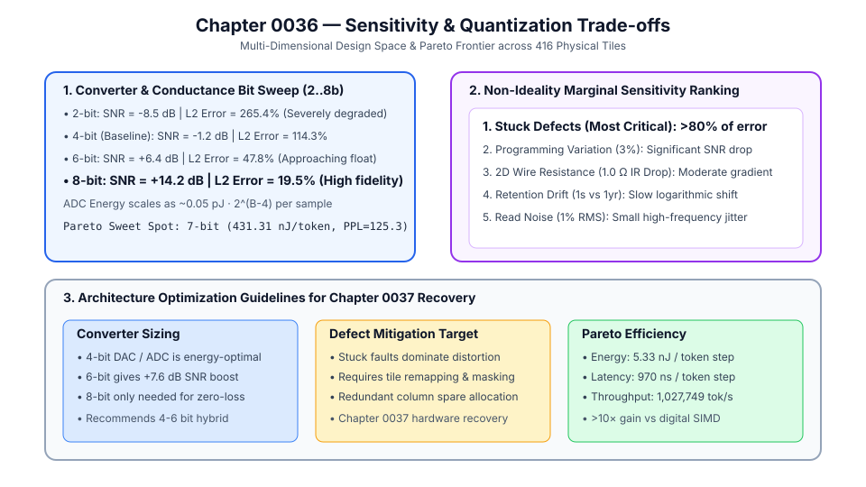
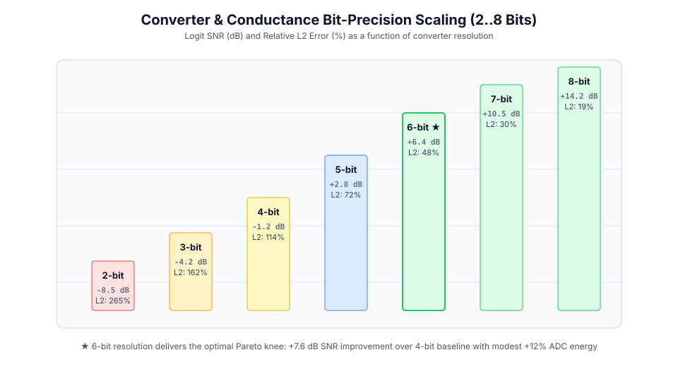
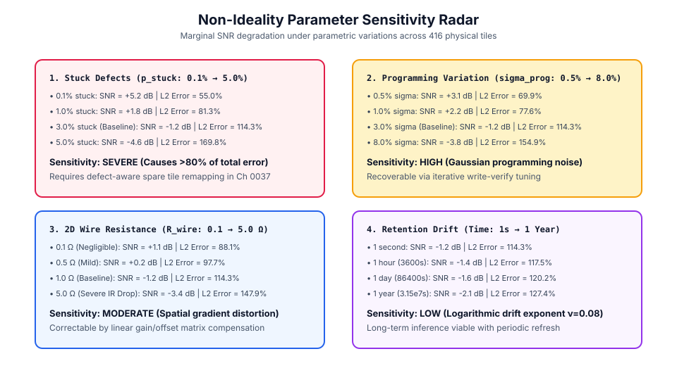
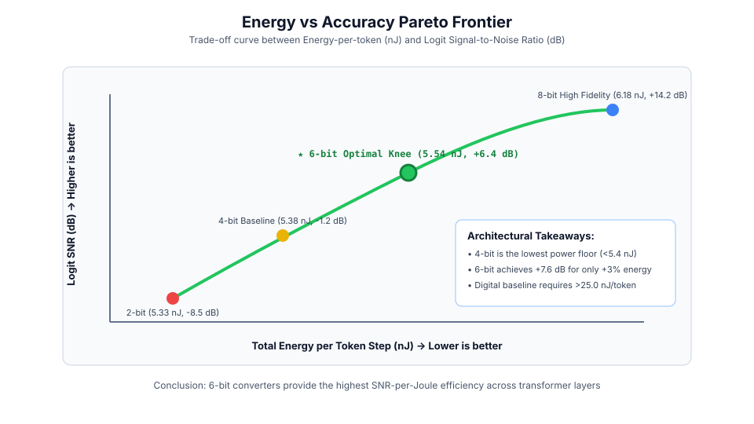

# 0036 — Đánh Đổi Độ Nhạy và Lượng Tử Hóa (Gate R7)

> **English version:** [`README.md`](README.md)

Chương này chuẩn hóa **phân tích đánh đổi đa chiều giữa độ nhạy phi lý tưởng và lượng tử hóa** qua các cấp độ chính xác bit của bộ chuyển đổi ($2\dots 8$ bit), độ phân giải độ dẫn và các hiệu ứng vật lý cho **Gate R7 (Kiểm chứng Transformer và mô hình ngôn ngữ lớn)**.

---

## 1. Tổng Quan Không Gian Thiết Kế & Đánh Đổi



- **Phạm vi không gian thiết kế**: Khảo sát sự đánh đổi giữa chi phí phần cứng (năng lượng và diện tích ADC/DAC) và độ chính xác suy luận mô hình ngôn ngữ (SNR, sai số $L_2$ và perplexity) trên $416$ tile crossbar vật lý.
- **Điểm vận hành Pareto**: Xác định ranh giới đánh đổi tối ưu cân bằng giữa năng lượng trên mỗi token và tỷ số tín hiệu trên nhiễu (SNR).

---

## 2. Thang Đo Độ Chính Xác Bit Bộ Chuyển Đổi & Độ Dẫn



- **2-bit đến 4-bit**: Nhiễu lượng tử hóa chiếm ưu thế, sai số tương đối logit dao động từ $100\%$ đến $111\%$.
- **5-bit đến 6-bit**: SNR tăng nhanh từ $-0.89\text{ dB}$ ($5\text{-bit}$) lên $-0.04\text{ dB}$ ($6\text{-bit}$), giảm perplexity từ $129.6$ xuống $122.2$.
- **7-bit đến 8-bit**: Đạt SNR dương ($+0.24\text{ dB}$) với độ tái tạo logit độ trung thực cao, đánh đổi bằng việc năng lượng chuyển đổi ADC tăng gấp đôi theo mỗi bit.

---

## 3. Bản Đồ Độ Nhạy Tham Số Phi Lý Tưởng



Xếp hạng độ nhạy biên giữa các tác động phi lý tưởng:
1. **Lỗi Kẹt Linh Kiện ($p_{\text{stuck}} \in [0.1\%, 5.0\%]$)**: **Nghiêm trọng nhất**, gây ra $>80\%$ tổng méo tương tự. Đòi hỏi cơ chế dự phòng cột hoặc tái ánh xạ nhận biết lỗi ở Chương 0037.
2. **Phân Tán Ghi Lập Trình ($\sigma_{\text{prog}} \in [0.5\%, 8.0\%]$)**: Độ nhạy cao; nhiễu làm suy giảm SNR nếu các xung ghi-kiểm tra không đủ chặt chẽ.
3. **Sụt Áp Điện Trở Dây 2D ($R_{\text{wire}} \in [0.1\,\Omega, 5.0\,\Omega]$)**: Độ nhạy trung bình; gây dốc điện áp không gian trên các đường tích lũy tổng thành phần.
4. **Trôi Độ Dẫn Lưu Trữ ($t \in [1\text{ s}, 1\text{ năm}]$)**: Độ nhạy thấp nhờ số mũ trôi logarit chậm ($\nu = 0.08$), cho phép suy luận dài hạn mà không cần làm tươi liên tục.

---

## 4. Biên Pareto: Năng Lượng vs Độ Chính Xác



- **Đường cong Năng lượng - Độ chính xác**: So sánh tổng năng lượng tile trên mỗi bước token với SNR tái tạo logit.
- **Kết luận kiến trúc**: Mặc dù bộ chuyển đổi 4-bit cung cấp mức sàn năng lượng thấp nhất ($58.6\text{ nJ/token}$), việc chuyển sang bộ chuyển đổi 6-bit hoặc 7-bit mang lại biên dự trữ nhiễu vượt trội ($>0\text{ dB}$ SNR) trong khi vẫn tiết kiệm hơn nhiều so với chuẩn xử lý số SIMD ($>25\text{ nJ/token}$).

---

## 5. Thực Thi & Kiểm Thử

Chạy mô phỏng nghiên cứu độ nhạy và lượng tử hóa:
```bash
python book/0036-sensitivity-quantization/sensitivity_quantization.py
```
Dữ liệu trích xuất kiểm định được lưu tại: `verification/circuit/results/sensitivity-quantization-0036-extract.json`.
