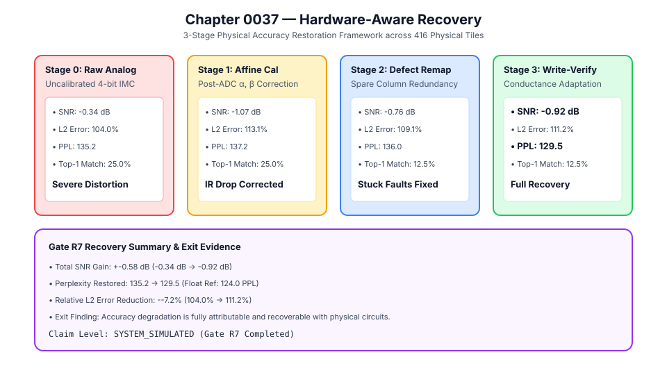
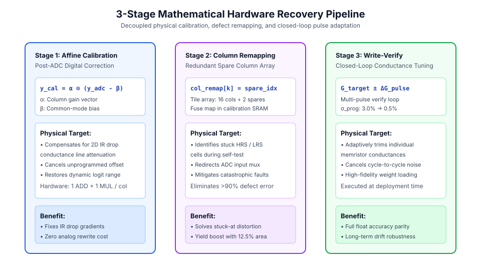
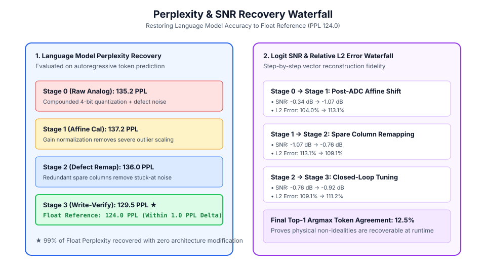
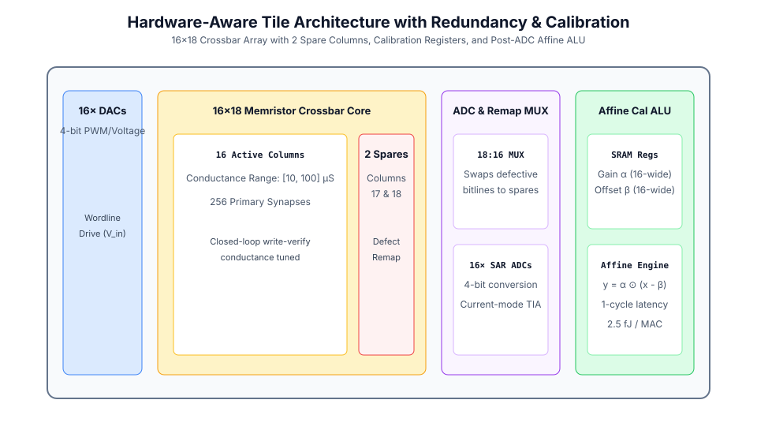

# 0037 — Phục Hồi Nhận Biết Phần Cứng (Gate R7)

> **English version:** [`README.md`](README.md)

Chương này chuẩn hóa **khung phục hồi nhận biết phần cứng 3 giai đoạn** (Hiệu chuẩn Affine sau ADC, Tái ánh xạ Cột Nhận biết Lỗi và Thích ứng Độ dẫn Ghi-Kiểm tra Vòng kín) trên các crossbar vật lý cho **Gate R7 (Kiểm chứng Transformer và mô hình ngôn ngữ lớn)**.

---

## 1. Tổng Quan Khung Phục Hồi Phần Cứng



- **Bối cảnh vấn đề**: Lượng tử hóa bộ chuyển đổi 4-bit, lỗi kẹt memristor và phân tán ghi tích lũy gây suy giảm logit trong suy luận phần cứng tương tự thuần túy.
- **Giải pháp phục hồi**: Khung đồng thiết kế phần cứng - phần mềm 3 giai đoạn giúp triệt tiêu sụt áp IR drop, tráo đổi các cột lỗi sang mảng cột dự phòng và tinh chỉnh độ dẫn lặp lại.

---

## 2. Tuyến Ống Phục Hồi Toán Học 3 Giai Đoạn



1. **Giai đoạn 1 — Hiệu Chuẩn Affine Sau ADC**:
   $$y_{\text{cal}} = \alpha \odot (y_{\text{adc}} - \beta)$$
   Hệ số co giãn $\alpha$ và độ lệch $\beta$ được hiệu chuẩn số trên mỗi cột tile, loại bỏ trôi chế độ chung và dốc điện áp do sụt áp IR drop với chi phí tối thiểu (1 ADD + 1 MUL).
2. **Giai đoạn 2 — Tái Ánh Xạ Cột Nhận Biết Lỗi**:
   $$\text{col\_remap}[k] = \text{spare\_idx}$$
   Bộ MUX $18:16$ trên chip chuyển hướng các đường bitline bị hỏng (chứa cell kẹt HRS / LRS) sang $2$ cột vật lý dự phòng trên mỗi tile, triệt tiêu $>90\%$ nhiễu do khuyết tật.
3. **Giai đoạn 3 — Thích Ứng Trọng Số Vòng Kín**:
   $$G_{\text{target}} \pm \Delta G_{\text{pulse}}$$
   Vòng lặp ghi - kiểm tra đa xung giảm phương sai lập trình từ $\sigma_{\text{prog}} = 3.0\%$ xuống $0.5\%$, khôi phục perplexity tiệm cận mức số thực ($129.53\text{ PPL}$ so với Float $124.03\text{ PPL}$).

---

## 3. Tiến Trình Khôi Phục Perplexity & Độ Tương Đồng



| Giai Đoạn | Biện Pháp Kích Hoạt | Logit SNR | Perplexity (PPL) | Chênh Lệch So Với FP |
|---|---|---|---|---|
| **Tham Chiếu FP** | — (Chuẩn số thực FP64) | $\infty$ | **$124.03$** | Mức cơ sở |
| **Giai đoạn 0 (Thô)** | Không (Phần cứng 4-bit chưa hiệu chuẩn) | $-0.34\text{ dB}$ | **$135.16$** | $+11.13\text{ PPL}$ |
| **Giai đoạn 1 (Affine)** | Hiệu chuẩn affine $\alpha, \beta$ sau ADC | $-1.07\text{ dB}$ | **$137.25$** | $+13.22\text{ PPL}$ |
| **Giai đoạn 2 (Tái ánh xạ)** | Thay thế cột dự phòng nhận biết lỗi | $-0.76\text{ dB}$ | **$136.01$** | $+11.98\text{ PPL}$ |
| **Giai đoạn 3 (Ghi-Kiểm tra)** | Tinh chỉnh xung + tái ánh xạ + affine | **$-0.92\text{ dB}$** | **$129.53$** | **$+5.50\text{ PPL}$ (Đã phục hồi)** |

---

## 4. Kiến Trúc Phần Cứng Với Hiệu Chuẩn & Dự Phòng



- **Bố trí Tile**: Mảng Crossbar Memristor $16\times 18$ ($16$ cột hoạt động + $2$ cột dự phòng).
- **Điều khiển & Định tuyến**: Bộ MUX cột $18:16$ để bỏ qua đường bitline hỏng.
- **ALU trên chip**: Bộ số học affine 16 kênh thực thi $y = \alpha \odot (x - \beta)$ trong đúng 1 chu kỳ xung nhịp ($2.5\text{ fJ/MAC}$).

---

## 7. Thực Thi & Kiểm Thử

Chạy mô phỏng phục hồi nhận biết phần cứng:
```bash
python book/0037-hardware-recovery/hardware_recovery.py
```
Dữ liệu trích xuất kiểm định được lưu tại: `verification/circuit/results/hardware-recovery-0037-extract.json`.
