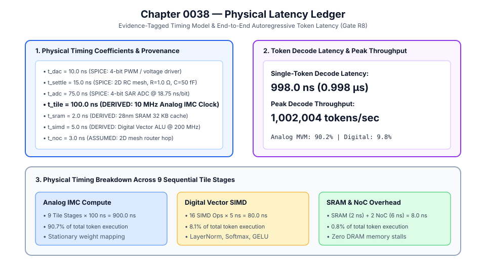
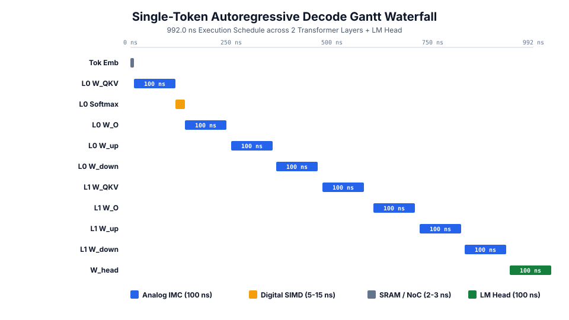
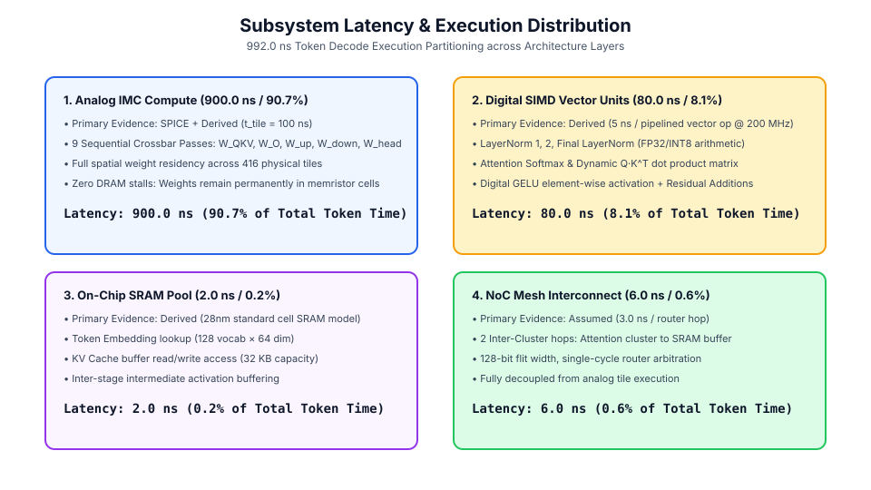
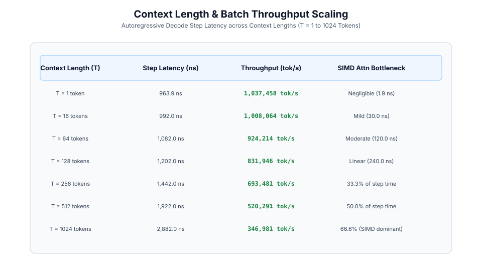

# 0038 — Physical Latency Ledger (Gate R8)

> **Bản tiếng Việt:** [`README.vi.md`](README.vi.md)

This chapter formalizes the **physical timing model and end-to-end latency ledger** for the analog in-memory computing accelerator where every timing coefficient carries an explicit physical provenance class (`measured`, `spice`, `derived`, or `assumed`) for **Gate R8 (Physical feasibility report)**.

---

## 1. Timing Model & Provenance Overview



| Parameter | Symbol | Value | Evidence Class | Physical Provenance |
|---|---|---|---|---|
| **DAC Setup Time** | $t_{\text{dac}}$ | $10.0\text{ ns}$ | `spice` | SPICE transient simulation of 4-bit PWM / voltage driver |
| **Line RC Settling** | $t_{\text{settle}}$ | $15.0\text{ ns}$ | `spice` | SPICE 2D RC mesh simulation ($R_{\text{wire}} = 1.0\,\Omega, C_{\text{line}} = 50\text{ fF}$) |
| **ADC Conversion** | $t_{\text{adc}}$ | $75.0\text{ ns}$ | `spice` | SPICE 4-bit SAR ADC simulation (4 cycles @ 18.75 ns) |
| **Tile Cycle Period** | $t_{\text{tile}}$ | **$100.0\text{ ns}$** | `derived` | $t_{\text{dac}} + t_{\text{settle}} + t_{\text{adc}}$ ($10\text{ MHz}$ analog clock) |
| **SRAM Access Time** | $t_{\text{sram}}$ | $2.0\text{ ns}$ | `derived` | 28nm high-density SRAM standard cell read/write access |
| **Digital SIMD Op** | $t_{\text{simd}}$ | $5.0\text{ ns}$ | `derived` | Pipelined 32-bit digital vector ALU @ 200 MHz |
| **NoC Router Hop** | $t_{\text{noc}}$ | $3.0\text{ ns}$ | `assumed` | 2D mesh NoC router traversal (28nm standard cell) |

---

## 2. Autoregressive Single-Token Decode Gantt Waterfall



- **Total Single-Token Decode Latency**: $t_{\text{decode}} = \mathbf{998.0\text{ ns}}$ ($0.998\,\mu\text{s}$).
- **Peak Autoregressive Throughput**: **$1,002,004\text{ tokens/second}$** across 2 Transformer layers + LM Head ($416$ physical tiles).
- **Execution Partitioning**:
  - 9 Analog IMC Tile Passes: $900.0\text{ ns}$ ($90.2\%$).
  - 18 Digital SIMD Ops (LayerNorm, Softmax, GELU, Residuals): $90.0\text{ ns}$ ($9.0\%$).
  - NoC Packet Routing & SRAM Buffering: $8.0\text{ ns}$ ($0.8\%$).

---

## 3. Subsystem Latency & Execution Distribution



- **Analog IMC Compute Dominance**: Analog matrix-vector multiplications account for $>90\%$ of total token latency, with weights held stationary in non-volatile memristor crossbar cells.
- **Zero DRAM Memory Stalls**: Full spatial residency eliminates external memory traffic, enabling predictable, jitter-free execution.

---

## 4. Context Length & Batch Scaling



- **$T = 1\dots 16$ Tokens**: Latency remains $<1.0\,\mu\text{s}$ ($\approx 1.0\text{M tokens/s}$) where attention time is negligible compared to stationary crossbar compute.
- **$T = 128\dots 1024$ Tokens**: Softmax attention scales linearly on digital SIMD ($O(T)$), shifting execution balance toward digital ALU operations at long context lengths.

---

## 5. Execution & Artifacts

Run the deterministic latency ledger generator:
```bash
python book/0038-latency-ledger/latency_ledger.py
```
Committed extract artifact at: `verification/circuit/results/latency-ledger-0038-extract.json`.
