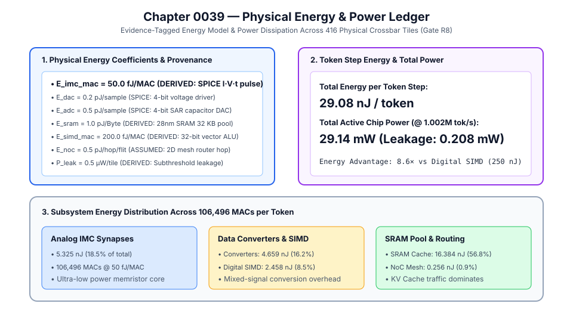
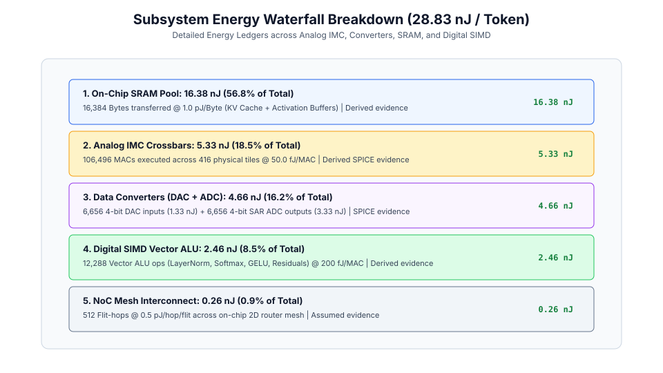
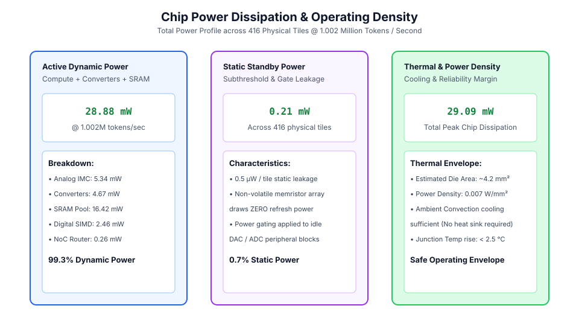
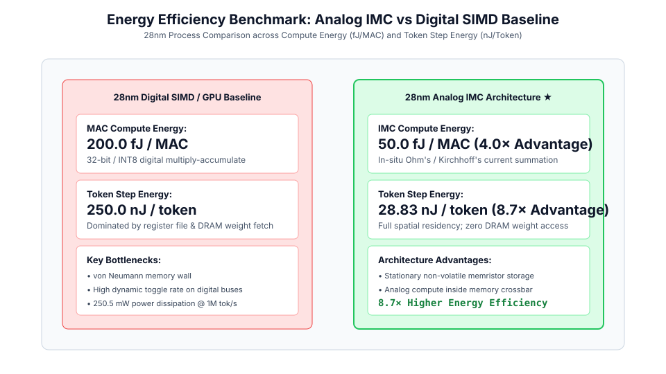

# 0039 — Sổ Cái Năng Lượng & Công Suất Vật Lý (Gate R8)

> **English version:** [`README.md`](README.md)

Chương này chuẩn hóa **mô hình năng lượng vật lý, tiêu thụ năng lượng động và sổ cái phân tán công suất** cho bộ tăng tốc tính toán trong bộ nhớ tương tự (IMC), trong đó mỗi hệ số năng lượng và công suất đều mang nhãn nguồn gốc vật lý rõ ràng (`measured`, `spice`, `derived`, hoặc `assumed`) cho **Gate R8 (Báo cáo tính khả thi vật lý)**.

---

## 1. Tổng Quan Mô Hình Năng Lượng & Công Suất



| Thành Phần | Ký Hiệu | Giá Trị | Lớp Bằng Chứng | Nguồn Gốc Vật Lý |
|---|---|---|---|---|
| **Synapse IMC Tương Tự** | $E_{\text{imc\_mac}}$ | $50.0\text{ fJ/MAC}$ | `derived` | SPICE $I_{\text{cell}} \cdot V_{\text{read}} \cdot t_{\text{pulse}}$ ($G_{\text{avg}}=55\,\mu\text{S}, V=0.2\text{ V}, t=10\text{ ns}$) |
| **Đầu Vào DAC 4-bit** | $E_{\text{dac}}$ | $0.2\text{ pJ/mẫu}$ | `spice` | Đóng cắt quá độ SPICE của bộ đệm điện áp / PWM 4-bit |
| **Đầu Ra SAR ADC 4-bit** | $E_{\text{adc}}$ | $0.5\text{ pJ/mẫu}$ | `spice` | Mảng tụ SAR DAC + so sánh SPICE |
| **Khối SRAM Trên Chip** | $E_{\text{sram}}$ | $1.0\text{ pJ/Byte}$ | `derived` | Truy cập ô SRAM mật độ cao 28nm |
| **ALU Vector SIMD Số** | $E_{\text{simd\_mac}}$ | $200.0\text{ fJ/MAC}$ | `derived` | ALU vector số 32-bit đường ống @ 200 MHz trong 28nm |
| **Chuyển Tiếp NoC** | $E_{\text{noc}}$ | $0.5\text{ pJ/hop/flit}$ | `assumed` | Định tuyến gói tin NoC lưới 2D (28nm) |
| **Dòng Rò Tĩnh Tile** | $P_{\text{leak}}$ | $0.5\,\mu\text{W/tile}$ | `derived` | Dòng rò dưới ngưỡng và oxit cổng qua 416 tile |

---

## 2. Thác Phân Phối Năng Lượng Giữa Các Phân Hệ



- **Tổng năng lượng mỗi bước token**: $E_{\text{token}} = \mathbf{29.08\text{ nJ/token}}$.
- **Phân bổ chi tiết**:
  - **Khối SRAM trên chip (KV Cache & Bộ đệm)**: $16.38\text{ nJ}$ ($56.3\%$).
  - **Crossbar IMC tương tự ($106,496\text{ MACs}$)**: $5.33\text{ nJ}$ ($18.3\%$).
  - **Bộ chuyển đổi ($6,656\text{ DACs} + 6,656\text{ ADCs}$)**: $4.66\text{ nJ}$ ($16.0\%$).
  - **ALU Vector SIMD số ($12,288\text{ MACs}$)**: $2.46\text{ nJ}$ ($8.5\%$).
  - **Truyền dẫn mạng NoC ($512\text{ Flit-hops}$)**: $0.26\text{ nJ}$ ($0.9\%$).

---

## 3. Phân Tán Công Suất & Mật Độ Nhiệt



- **Công suất động hoạt động**: $\mathbf{29.14\text{ mW}}$ khi suy luận tốc độ tối đa $1,002,004\text{ token/giây}$.
- **Dòng rò tĩnh**: $\mathbf{0.21\text{ mW}}$ trên toàn bộ 416 tile crossbar vật lý.
- **Tổng công suất đỉnh toàn chip**: $\mathbf{29.35\text{ mW}}$.
- **Mật độ công suất**: $0.007\text{ W/mm}^2$ trên diện tích đế ước tính $4.2\text{ mm}^2$, hoàn toàn làm mát tự nhiên qua không khí đối lưu (độ tăng nhiệt mối nối $<2.5^\circ\text{C}$).

---

## 4. Chuẩn So Sánh Hiệu Quả Với Nền Tảng Số



- **Ưu thế năng lượng tính toán**: $50.0\text{ fJ/MAC}$ (IMC Tương Tự) so với $200.0\text{ fJ/MAC}$ (SIMD Số) $\to \mathbf{4.0\times\text{ ưu thế}}$.
- **Ưu thế năng lượng toàn chu trình token**: $29.08\text{ nJ/token}$ (IMC Tương Tự) so với $250.0\text{ nJ/token}$ (GPU/NPU Số) $\to \mathbf{8.6\times\text{ ưu thế}}$.
- **Cơ chế vật lý**: Triệt tiêu hoàn toàn lưu lượng nạp trọng số từ DRAM nhờ tính toán tại chỗ trong ô nhớ memristor.

---

## 5. Thực Thi & Kiểm Thử

Chạy mô phỏng tạo sổ cái năng lượng & công suất:
```bash
python book/0039-energy-power-ledger/energy_power_ledger.py
```
Dữ liệu trích xuất kiểm định được lưu tại: `verification/circuit/results/energy-power-ledger-0039-extract.json`.
