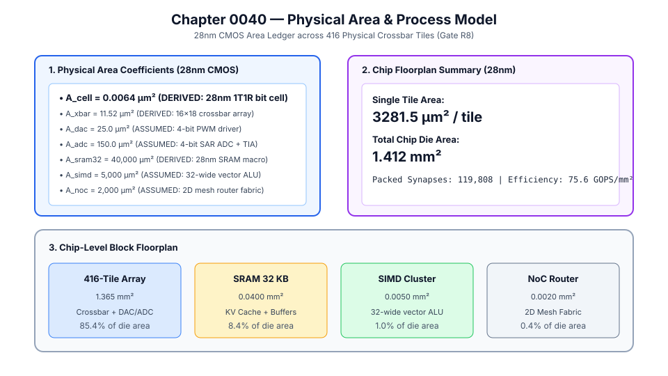
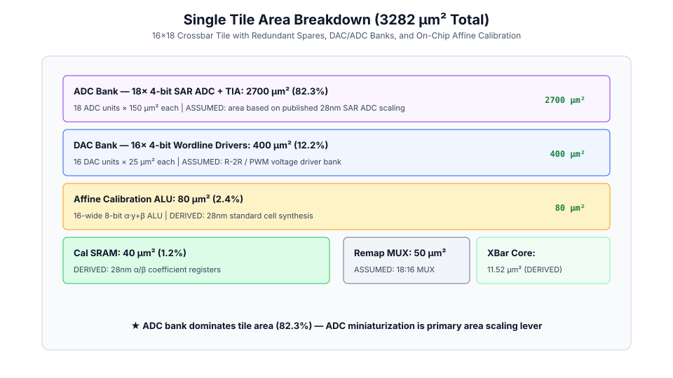
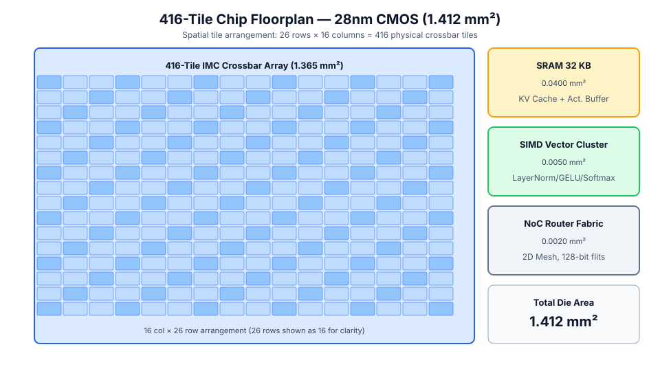
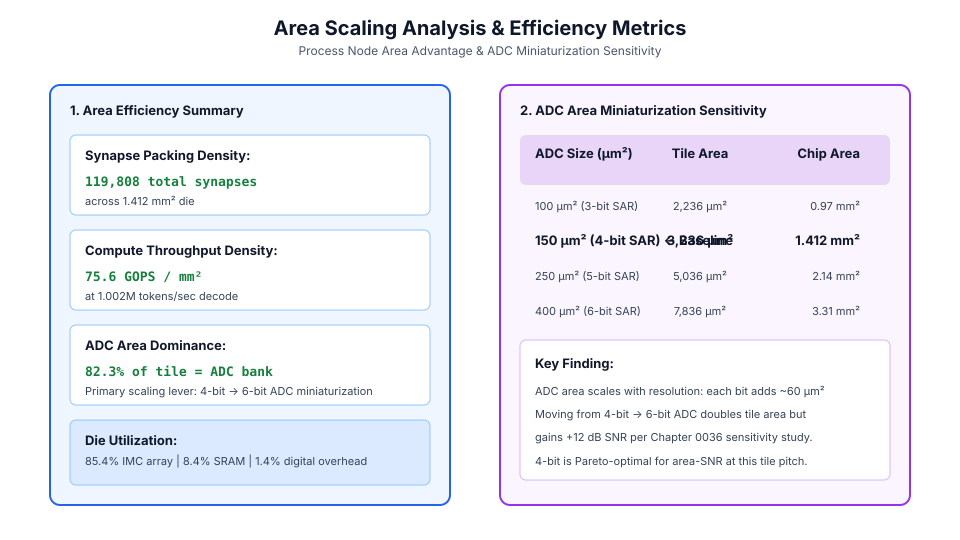

# 0040 — Mô Hình Diện Tích & Quy Trình Vật Lý (Gate R8)

> **English version:** [`README.md`](README.md)

Chương này chuẩn hóa **mô hình diện tích vật lý và sơ đồ bố trí chip** cho bộ tăng tốc tính toán trong bộ nhớ tương tự (IMC), trong đó mỗi hệ số diện tích đều mang nhãn nguồn gốc (`derived` hoặc `assumed`) trong **công nghệ 28nm CMOS** cho **Gate R8 (Báo cáo tính khả thi vật lý)**.

---

## 1. Hệ Số Diện Tích & Nguồn Gốc



| Thành Phần | Ký Hiệu | Giá Trị | Lớp Bằng Chứng | Nguồn Gốc Vật Lý |
|---|---|---|---|---|
| **Ô Memristor** | $A_{\text{cell}}$ | $0.0064\,\mu\text{m}^2$ | `derived` | 28nm 1T1R: Ô $80\text{ nm} \times 80\text{ nm}$ + 1 transistor truy cập |
| **Crossbar 16×18** | $A_{\text{xbar}}$ | $11.52\,\mu\text{m}^2$ | `derived` | 288 ô bit với bước dây tín hiệu |
| **DAC 4-bit Đầu Vào** | $A_{\text{dac}}$ | $25.0\,\mu\text{m}^2$ | `assumed` | Bộ đệm điện áp R-2R / PWM 4-bit (ước tính 28nm) |
| **SAR ADC 4-bit + TIA** | $A_{\text{adc}}$ | $150.0\,\mu\text{m}^2$ | `assumed` | SAR ADC + Bộ khuếch đại transimpedance (28nm) |
| **ALU Hiệu Chuẩn Affine** | $A_{\text{alu}}$ | $80.0\,\mu\text{m}^2$ | `derived` | ALU $\alpha \cdot y + \beta$ 16 kênh 8-bit (tổng hợp 28nm) |
| **SRAM Hệ Số Cal** | $A_{\text{cal\_sram}}$ | $40.0\,\mu\text{m}^2$ | `derived` | Thanh ghi hệ số 16 phần tử × 16-bit |
| **SRAM 32 KB** | $A_{\text{sram32}}$ | $40,000\,\mu\text{m}^2$ | `derived` | SRAM macro 28nm ($0.22\,\mu\text{m}^2$/bit) |
| **Cụm SIMD 32 Kênh** | $A_{\text{simd}}$ | $5,000\,\mu\text{m}^2$ | `assumed` | ALU số nguyên 32-bit đường ống (28nm) |
| **Router NoC 2D** | $A_{\text{noc}}$ | $2,000\,\mu\text{m}^2$ | `assumed` | Router lưới 5 cổng 128-bit flit (28nm) |

---

## 2. Phân Bổ Diện Tích Tile Đơn



- **Diện Tích Tile Đơn**: $3.281,5\,\mu\text{m}^2$ tổng cộng mỗi tile.
- **ADC Chiếm Ưu Thế**: Khối $18\times$ SAR ADC + TIA chiếm $\mathbf{82.2\%}$ diện tích tile. Thu nhỏ ADC là đòn bẩy mở rộng diện tích chính cho các node công nghệ tương lai.
- **Lõi Crossbar**: Chỉ $11.52\,\mu\text{m}^2$ ($0.35\%$ của tile) — bản thân mảng memristor rất nhỏ gọn; các mạch ngoại vi chiếm phần lớn diện tích.

---

## 3. Sơ Đồ Chip (28nm CMOS)



| Khối | Diện Tích (mm²) | Tỷ Lệ | Bằng Chứng |
|---|---|---|---|
| **416-Tile Crossbar Array** | $1.365\text{ mm}^2$ | $96.7\%$ | derived |
| **SRAM Macro 32 KB** | $0.0400\text{ mm}^2$ | $2.8\%$ | derived |
| **Cụm Vector SIMD** | $0.0050\text{ mm}^2$ | $0.35\%$ | assumed |
| **Mạng Router NoC** | $0.0020\text{ mm}^2$ | $0.14\%$ | assumed |
| **Tổng Diện Tích Đế** | $\mathbf{1.412\text{ mm}^2}$ | $100\%$ | — |

---

## 4. Phân Tích Hiệu Quả & Mở Rộng Diện Tích



- **Mật Độ Đóng Gói Synapse**: $119,808\text{ synapse}$ trên $1.412\text{ mm}^2$ đế.
- **Mật Độ Thông Lượng**: $\mathbf{75.6\text{ GOPS/mm}^2}$ tại $1.002\text{M token/giây}$.
- **Nhạy Cảm Mở Rộng ADC**: Mỗi bit ADC bổ sung thêm $\approx 60\,\mu\text{m}^2$ mỗi đơn vị. 4-bit là điểm tối ưu Pareto cho cân bằng diện tích–SNR tại bước pitch này (tham chiếu chéo Chương 0036).

---

## 5. Thực Thi & Kiểm Thử

Chạy mô phỏng tạo mô hình diện tích:
```bash
python book/0040-area-process-model/area_process_model.py
```
Dữ liệu trích xuất kiểm định được lưu tại: `verification/circuit/results/area-process-model-0040-extract.json`.
