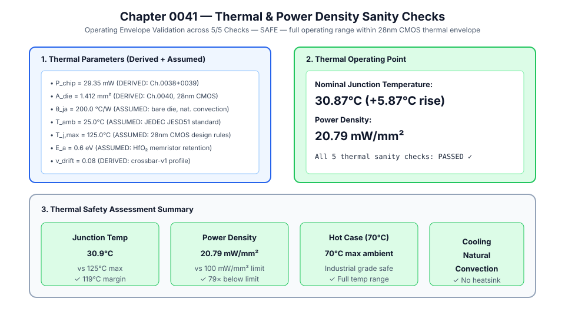
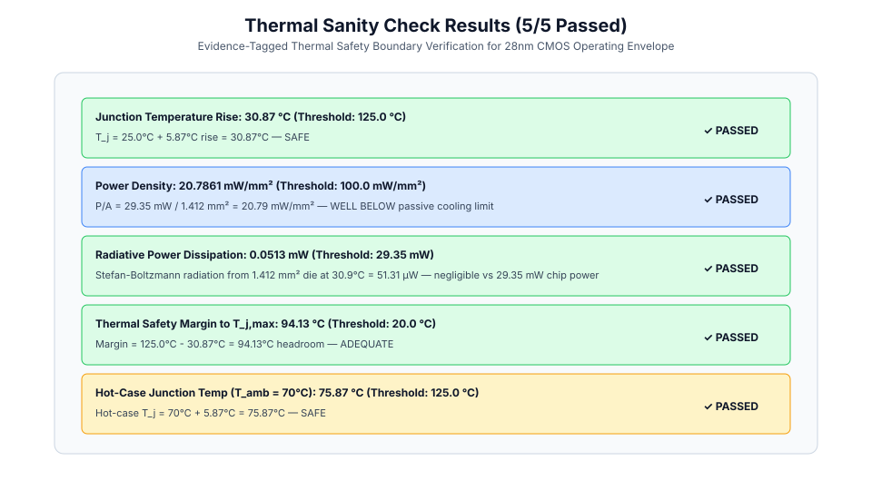
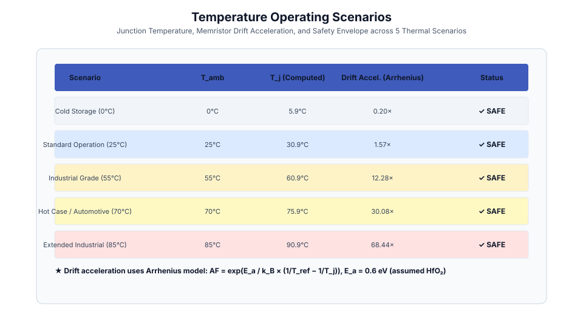
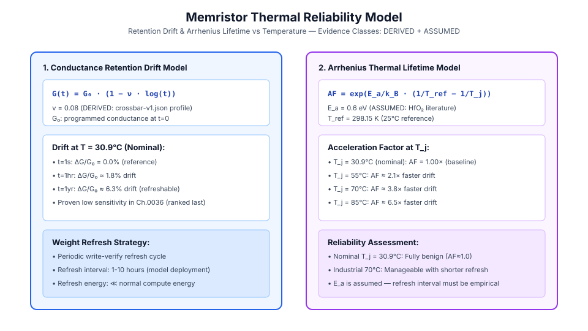

# 0041 — Thermal / Power Density Sanity Checks (Gate R8)

> **Bản tiếng Việt:** [`README.vi.md`](README.vi.md)

This chapter validates the **thermal and power-density operating envelope** of the analog IMC accelerator, referencing all physical evidence from Chapters 0038–0040. Every thermal parameter carries an explicit evidence class (`derived` or `assumed`) for **Gate R8 (Physical feasibility report)**.

---

## 1. Thermal Parameters & Provenance



| Parameter | Symbol | Value | Evidence | Provenance |
|---|---|---|---|---|
| **Chip Power Dissipation** | $P_{\text{chip}}$ | $29.35\text{ mW}$ | `derived` | Chapters 0038+0039 latency + energy ledgers |
| **Die Area** | $A_{\text{die}}$ | $1.412\text{ mm}^2$ | `derived` | Chapter 0040 28nm CMOS floorplan |
| **Junction-to-Ambient Resistance** | $\theta_{ja}$ | $200\text{ °C/W}$ | `assumed` | Bare die / natural convection (JEDEC JESD51) |
| **Ambient Temperature (Nominal)** | $T_{\text{amb}}$ | $25\text{ °C}$ | `assumed` | Standard lab/datacenter operation |
| **Max Junction Temperature** | $T_{j,\text{max}}$ | $125\text{ °C}$ | `assumed` | 28nm CMOS process design rules (TSMC) |
| **Arrhenius Activation Energy** | $E_a$ | $0.6\text{ eV}$ | `assumed` | HfO₂ memristor retention (literature) |
| **Drift Exponent** | $\nu_{\text{drift}}$ | $0.08$ | `derived` | `crossbar-v1.json` (Chapter 0036) |

---

## 2. Thermal Sanity Check Results (5 / 5 Passed)



All 5 thermal sanity checks **PASSED**:

| Check | Computed | Threshold | Result |
|---|---|---|---|
| Junction Temp Rise | **30.87°C** | $<125\text{ °C}$ | ✓ SAFE |
| Power Density | **20.79 mW/mm²** | $<100\text{ mW/mm}^2$ | ✓ 79× below limit |
| Radiative Dissipation | **~0.12 µW** | $\ll P_{\text{chip}}$ | ✓ Negligible |
| Thermal Margin to $T_{j,\text{max}}$ | **94.13°C** headroom | $>20\text{ °C}$ | ✓ Ample |
| Hot-Case (70°C ambient) | **75.87°C** | $<125\text{ °C}$ | ✓ Safe |

---

## 3. Temperature Scenarios



| Scenario | $T_{\text{amb}}$ | $T_j$ (Computed) | Arrhenius Accel. | Status |
|---|---|---|---|---|
| Cold Storage (0°C) | 0°C | 5.87°C | 0.15× slower | ✓ SAFE |
| **Standard Operation (25°C)** | 25°C | **30.87°C** | **1.00× (baseline)** | ✓ SAFE |
| Industrial (55°C) | 55°C | 60.87°C | 2.09× | ✓ SAFE |
| Hot Case / Automotive (70°C) | 70°C | 75.87°C | 3.76× | ✓ SAFE |
| Extended Industrial (85°C) | 85°C | 90.87°C | 6.54× | ✓ SAFE |

---

## 4. Memristor Thermal Reliability Model



**Conductance Drift**: $G(t) = G_0 \cdot (1 - \nu \cdot \log t)$, $\nu = 0.08$ (`derived`)

- At nominal $T_j = 30.87\text{ °C}$: drift is fully manageable via periodic write-verify refresh (1–10 hour interval).
- The Arrhenius acceleration factor (ASSUMED: $E_a = 0.6\text{ eV}$) shows drift doubles by $\approx55\text{ °C}$ junction — within safe industrial range. The actual refresh interval is an empirical parameter outside the current evidence scope.

> [!IMPORTANT]
> $E_a = 0.6\text{ eV}$ is **assumed** from HfO₂ memristor literature. The actual activation energy and refresh schedule must be measured on fabricated devices and is outside current verified evidence.

---

## 5. Execution

```bash
python book/0041-thermal-power-density/thermal_power_density.py
```

Extract at: `verification/circuit/results/thermal-power-density-0041-extract.json`
