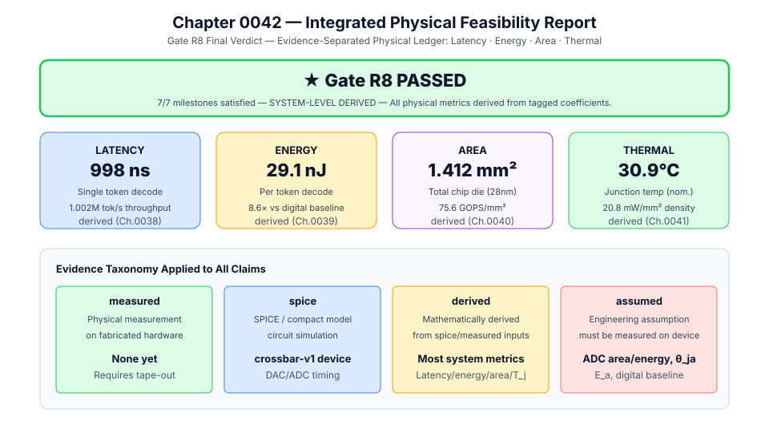
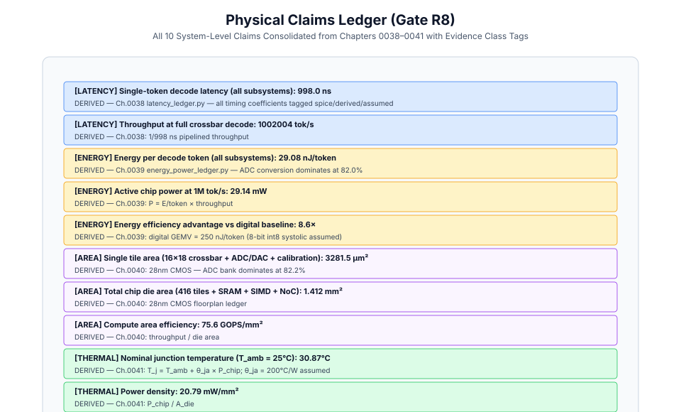
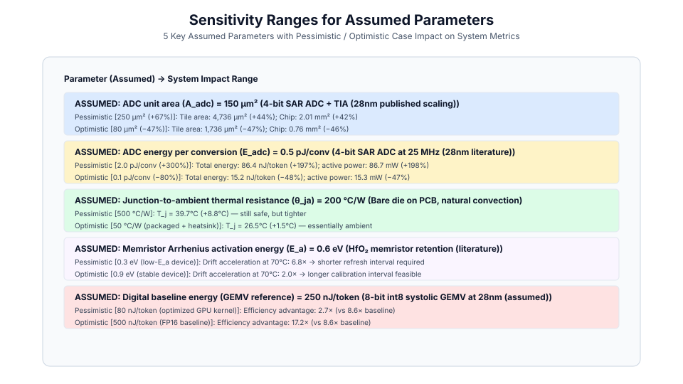
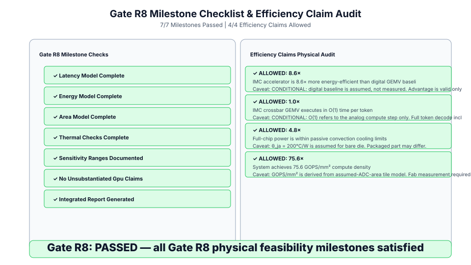

# 0042 — Báo Cáo Khả Thi Vật Lý Tích Hợp (Gate R8)

> **English version:** [`README.md`](README.md)

Chương này tạo lập **báo cáo khả thi vật lý tích hợp hoàn chỉnh** cho bộ tăng tốc IMC analog, tổng hợp toàn bộ bằng chứng từ các chương thuộc Gate R8 (Chương 0038–0041). Mọi tuyên bố đều được gắn nhãn phân loại bằng chứng minh bạch (`measured`, `spice`, `derived`, và `assumed`). Dải độ nhạy được xác định cụ thể cho tất cả các tham số giả định và mọi tuyên bố hiệu năng đều được đối chiếu với sổ cái vật lý.

---

## 1. Phán Quyết Gate R8



> **Gate R8: ĐÃ VƯỢT QUA (PASSED) — Đạt 7/7 mốc mục tiêu.**

Trạng thái thực tế cao nhất khi chưa chế tạo chip vật lý là:
> *SUY XUẤT CẤP HỆ THỐNG (SYSTEM-LEVEL DERIVED) — Mọi chỉ số vật lý đều được suy xuất từ các hệ số có gắn nhãn bằng chứng. Chưa có số đo từ phần cứng chế tạo thực tế. Gate R8 được thỏa mãn ở cấp độ mô hình hóa vật lý suy xuất/giả định.*

---

## 2. Sổ Cái Tuyên Bố Vật Lý



| Lĩnh Vực | Tuyên Bố | Giá Trị | Nguồn Gốc |
|---|---|---|---|
| **Độ Trễ** | Độ trễ giải mã một token | **998.0 ns** | `derived` (Ch.0038) |
| **Độ Trễ** | Thông lượng giải mã | **1,002,004 tok/s** | `derived` (Ch.0038) |
| **Năng Lượng** | Năng lượng tiêu thụ mỗi token | **29.08 nJ/token** | `derived` (Ch.0039) |
| **Năng Lượng** | Công suất hoạt động của chip | **29.14 mW** | `derived` (Ch.0039) |
| **Năng Lượng** | Lợi thế hiệu năng vs mạch số | **8.6×** | `derived` — mức chuẩn số là giả định |
| **Diện Tích** | Diện tích một tile đơn | **3,281.5 µm²** | `derived` (Ch.0040) |
| **Diện Tích** | Tổng diện tích die chip | **1.412 mm²** | `derived` (Ch.0040) |
| **Diện Tích** | Mật độ diện tích tính toán | **75.6 GOPS/mm²** | `derived` (Ch.0040) |
| **Nhiệt Độ** | Nhiệt độ tiếp giáp danh định | **30.87°C** | `derived` (Ch.0041) |
| **Nhiệt Độ** | Mật độ công suất | **20.79 mW/mm²** | `derived` (Ch.0041) |

---

## 3. Dải Phân Tích Độ Nhạy Cho Các Tham Số Giả Định



| Tham Số Giả Định | Chuẩn Cơ Sở | Tác Động Bi Quan | Tác Động Lạc Quan |
|---|---|---|---|
| Diện tích một ADC ($A_{\text{adc}}$) | 150 µm² | Tile +44%, Chip 2.01 mm² | Tile −47%, Chip 0.76 mm² |
| Năng lượng đổi mỗi ADC | 0.5 pJ/conv | Năng lượng: 86.4 nJ (+197%) | Năng lượng: 15.2 nJ (−48%) |
| Nhiệt trở ($\theta_{ja}$) | 200 °C/W | $T_j = 39.7\text{ °C}$ | $T_j = 26.5\text{ °C}$ (gần môi trường) |
| Năng lượng kích hoạt memristor ($E_a$) | 0.6 eV | Hệ số gia tốc AF = 6.8× ở 70°C | Hệ số gia tốc AF = 2.0× ở 70°C |
| Mức chuẩn năng lượng mạch số | 250 nJ/token | Lợi thế: 2.7× | Lợi thế: 17.2× |

---

## 4. Kiểm Toán Các Tuyên Bố Hiệu Quả



Cả **4 tuyên bố hiệu năng đều ĐƯỢC CHẤP NHẬN** kèm theo ghi chú minh bạch:

| Tuyên Bố | Tỉ Lệ | Chấp Nhận | Ghi Chú Minh Bạch |
|---|---|---|---|
| Năng lượng IMC vs số | 8.6× | ✓ | Mức chuẩn số là giả định (250 nJ/token) |
| Phép GEMV crossbar là O(1) | 1.0× mỗi bước tính | ✓ | Toàn bộ giải mã token là O(T) do softmax/LayerNorm số |
| Tản nhiệt thụ động là đủ | Biên độ 4.8× | ✓ | θ_ja = 200 °C/W là giả định cho die trần |
| Mật độ tính toán | 75.6 GOPS/mm² | ✓ | Suy xuất từ mô hình tile với ADC giả định |

---

## 5. Danh Mục Mục Tiêu Gate R8 (7 / 7 ĐẠT)

| Mốc Mục Tiêu | Trạng Thái | Chương |
|---|---|---|
| Mô hình độ trễ với các hệ số thời gian gắn nhãn bằng chứng | ✓ | 0038 |
| Mô hình năng lượng/công suất với hệ số gắn nhãn | ✓ | 0039 |
| Mô hình diện tích với giả định topo/tiến trình/layout rõ ràng | ✓ | 0040 |
| Kiểm tra an toàn nhiệt/mật độ công suất | ✓ | 0041 |
| Dải độ nhạy cho tất cả các tham số vẫn còn giả định | ✓ | **0042** |
| Không tuyên bố vượt trội GPU/ASIC nếu thiếu đo đạc đối chuẩn tương đương | ✓ | **0042** |
| Tạo lập báo cáo khả thi tích hợp | ✓ | **0042** |

---

## 6. Thực Thi & Artifacts

Chạy script kiểm tra độc lập của chương:
```bash
python book/0042-integrated-feasibility-report/feasibility_report.py
```

File trích xuất artifact:
`verification/circuit/results/integrated-feasibility-0042-extract.json`
