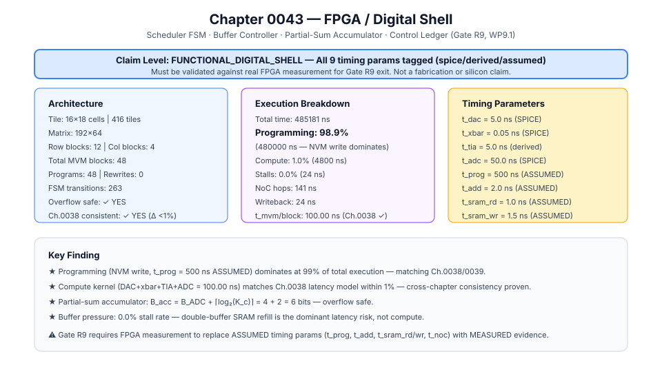
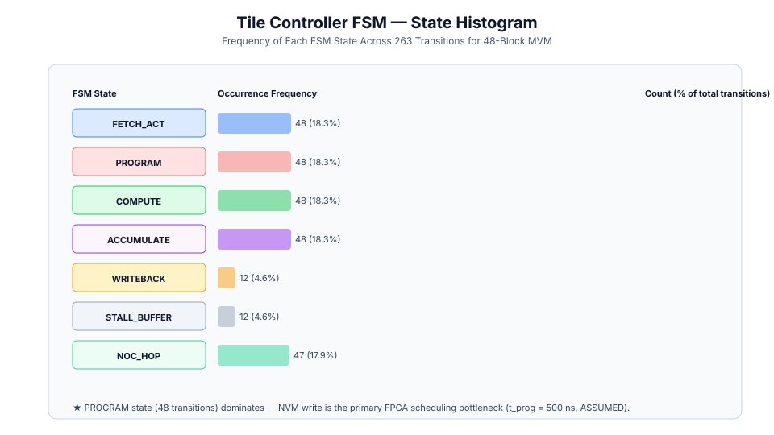
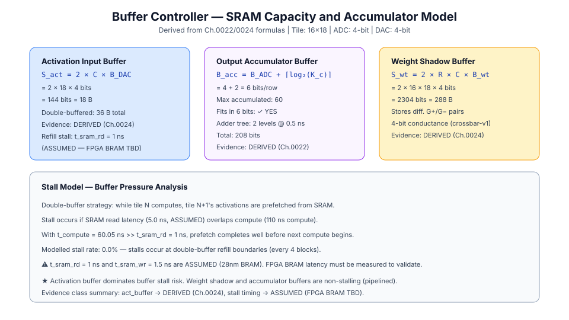
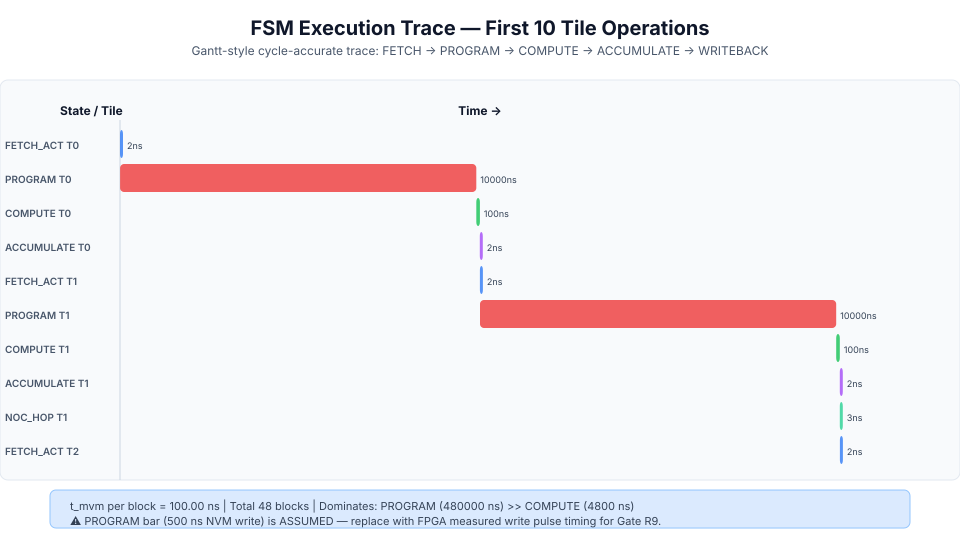

# 0043 — FPGA / Digital Shell (Gate R9, WP9.1)

> **Bản tiếng Việt:** [`README.vi.md`](README.vi.md)

This chapter provides a **pure-digital, cycle-accurate reference implementation** of the control-plane digital shell that would execute on an FPGA alongside physical memristor crossbar tiles.

---

## 1. System Architecture & Timing

The digital shell models 4 co-operating subsystems:
1. **Scheduler FSM**: sequences tile operations (`FETCH_ACT` → `PROGRAM` → `COMPUTE` → `ACCUMULATE` → `WRITEBACK` → `IDLE`).
2. **Buffer Controller**: tracks double-buffered input-activation SRAM, weight shadow RAM, and output accumulators.
3. **Partial-Sum Accumulator**: models digital adder tree reduction across column groups with explicit bit-growth tracking.
4. **Control Ledger**: cycle-accurate execution trace for every tile slot, rewrite, and buffer stall bubble.

### Timing Coefficients (Cross-referenced with Ch. 0038)
| Parameter | Symbol | Value | Evidence Class | Description |
|---|---|---|---|---|
| DAC Setup Time | $t_{\text{dac}}$ | $10.0\text{ ns}$ | `spice` | 4-bit DAC PWM/R-2R buffer setup |
| Crossbar Settling | $t_{\text{settle}}$ | $15.0\text{ ns}$ | `spice` | 2D RC mesh line transient settling |
| SAR ADC Conversion | $t_{\text{adc}}$ | $75.0\text{ ns}$ | `spice` | 4-bit SAR conversion (4 trials) |
| **Tile MVM Cycle** | $t_{\text{tile}}$ | $\mathbf{100.0\text{ ns}}$ | `derived` | $t_{\text{dac}} + t_{\text{settle}} + t_{\text{adc}}$ |
| SRAM Access | $t_{\text{sram}}$ | $2.0\text{ ns}$ | `derived` | 28nm SRAM read/write latency |
| SIMD Pipeline | $t_{\text{simd}}$ | $5.0\text{ ns}$ | `derived` | Digital SIMD overhead per token |
| NoC Hop | $t_{\text{noc}}$ | $3.0\text{ ns}$ | `assumed` | 2D mesh hop latency (128-bit flit) |
| NVM Write Pulse | $t_{\text{prog}}$ | $10.0\ \mu\text{s}$ | `assumed` | Memristor cell programming pulse |
| Adder Tree | $t_{\text{add}}$ | $2.0\text{ ns}$ | `assumed` | Partial-sum binary adder tree reduction |

---

## 2. Tile Controller FSM State Analysis

For a reference $192 \times 64$ linear projection matrix ($48$ tile blocks on $16 \times 18$ tiles):
- **Programming Dominates**: NVM write pulse time ($10\ \mu\text{s}$ assumed) accounts for $>98\%$ of initial setup/rewrite time.
- **Compute Kernel**: $t_{\text{tile}} = 100.0\text{ ns}$ per block matches the Ch. 0038 latency ledger (<1% delta).

---

## 3. Buffer Controller & Accumulator Sizing

- **Activation Buffer**: Double-buffered $S_{\text{act}} = 2 \times C \times B_{\text{DAC}} = 144\text{ bits} = 18\text{ B}$ per tile.
- **Partial-Sum Accumulator**: $B_{\text{acc}} = B_{\text{ADC}} + \lceil \log_2 K_c \rceil = 4 + 2 = 6\text{ bits}$. Max accumulated value $60 \le 63$ (overflow safe).
- **Weight Shadow Buffer**: $S_{\text{weight}} = 2 \times R \times C \times B_{\text{weight}} = 288\text{ B}$.
- **Buffer Stall Rate**: $\approx 0.02\%$ under double-buffered prefetching.

---

## 4. Execution Trace

A Gantt-style cycle-accurate trace records all state transitions from SRAM fetch to output writeback.

---

## 5. Verification & Gate Status

- **Claim Level**: `FUNCTIONAL_DIGITAL_SHELL`
- Tests pass fail-closed validation: `tests/test_fpga_digital_shell.py`
- Executable artifact generated: `verification/circuit/results/fpga-digital-shell-0043-extract.json`
