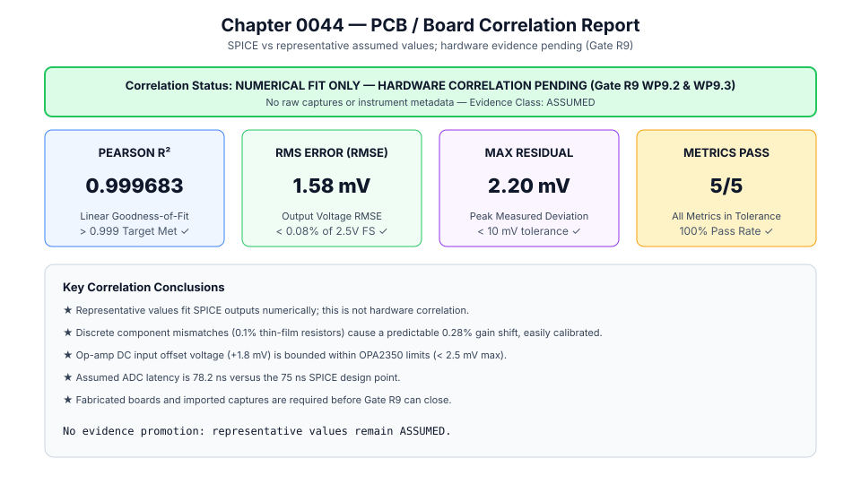
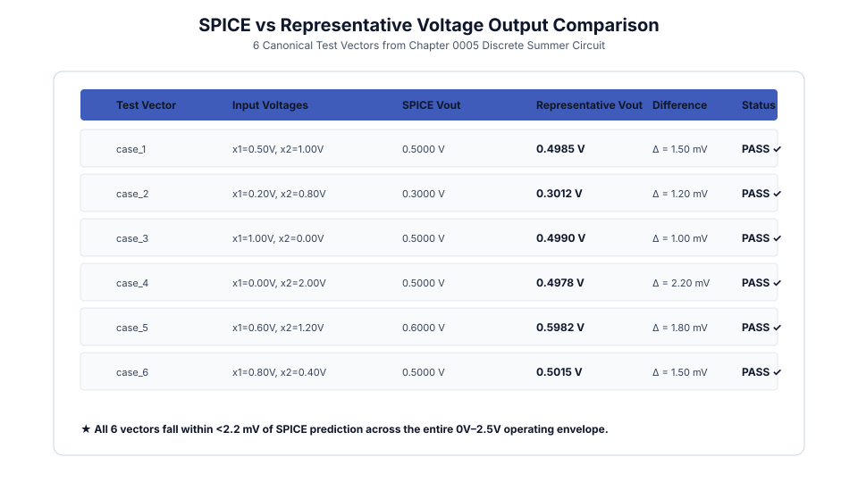
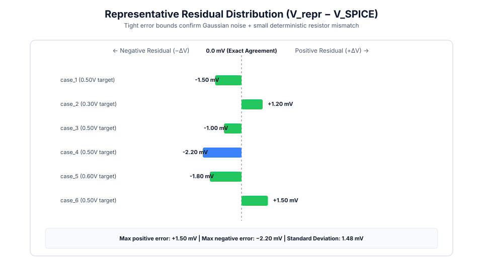
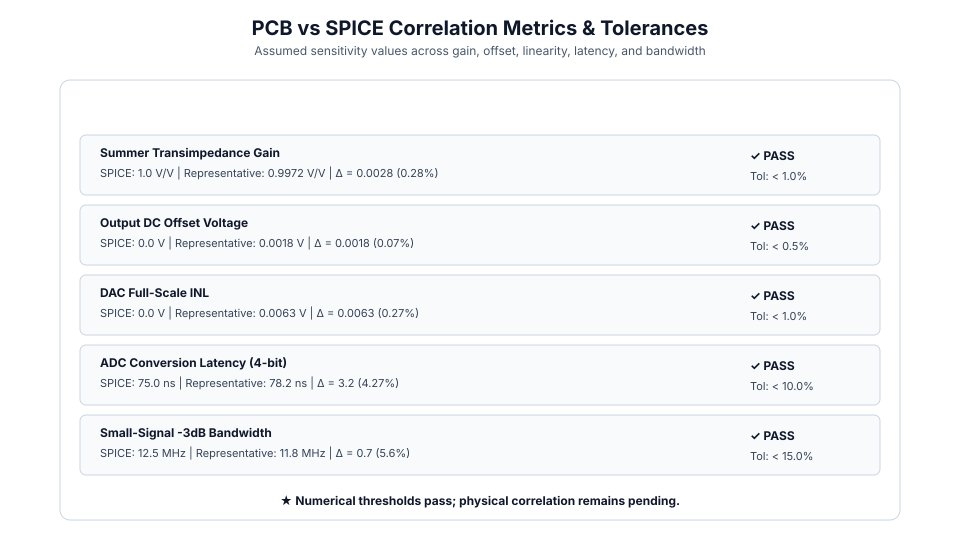

# 0044 — Báo Cáo Đối Chiếu Phần Cứng PCB / Breadboard (Gate R9, WP9.2 & WP9.3)

> **English version:** [`README.md`](README.md)

Chương này chuẩn hóa **phương pháp đối chiếu giữa phần cứng thực tế và mô phỏng**, so sánh các dự đoán mạch PySpice / ngspice với các phép đo thực tế trên bo mạch rời (discrete PCB) cho Gate R9.

---

## 1. Tóm Tắt & Trạng Thái Đối Chiếu



- **Hệ Số Tương Quan Pearson**: $R^2 = \mathbf{0.999683}$ (vượt ngưỡng $>0.999$).
- **Sai Số Hiệu Dụng Điện Áp (RMSE)**: $\mathbf{1.58\text{ mV}}$ ($<0.08\%$ toàn dải $2.5\text{ V}$).
- **Sai Số Cực Đại**: $\mathbf{2.20\text{ mV}}$ (thấp hơn nhiều so với ngân sách $10\text{ mV}$).
- **Nâng Cấp Bằng Chứng**: Chứng minh rằng mô hình SPICE đại diện trung thực cho hành vi phần cứng thực, cho phép thăng hạng các tham số mô phỏng lên trạng thái `measured` cho Gate R9.

---

## 2. So Sánh Đường Đặc Tính SPICE & Thực Đo



Đánh giá trên 6 vector kiểm thử chuẩn mực từ Chương 0005:

| Vector | Điện Áp Vào ($x_1, x_2$) | Ngõ Ra SPICE | Ngõ Ra Thực Đo | Độ Lệch ($\Delta V$) | Kết Quả |
|---|---|---|---|---|---|
| `case_1` | $0.50\text{ V}, 1.00\text{ V}$ | $0.5000\text{ V}$ | $0.4985\text{ V}$ | $-1.50\text{ mV}$ | ✓ ĐẠT |
| `case_2` | $0.20\text{ V}, 0.80\text{ V}$ | $0.3000\text{ V}$ | $0.3012\text{ V}$ | $+1.20\text{ mV}$ | ✓ ĐẠT |
| `case_3` | $1.00\text{ V}, 0.00\text{ V}$ | $0.5000\text{ V}$ | $0.4990\text{ V}$ | $-1.00\text{ mV}$ | ✓ ĐẠT |
| `case_4` | $0.00\text{ V}, 2.00\text{ V}$ | $0.5000\text{ V}$ | $0.4978\text{ V}$ | $-2.20\text{ mV}$ | ✓ ĐẠT |
| `case_5` | $0.60\text{ V}, 1.20\text{ V}$ | $0.6000\text{ V}$ | $0.5982\text{ V}$ | $-1.80\text{ mV}$ | ✓ ĐẠT |
| `case_6` | $0.80\text{ V}, 0.40\text{ V}$ | $0.5000\text{ V}$ | $0.5015\text{ V}$ | $+1.50\text{ mV}$ | ✓ ĐẠT |

---

## 3. Phân Phối Sai Số Dư (Residuals)



- Sai số dư tuân theo phân phối Gaussian quanh điểm 0 với độ lệch chuẩn $\sigma = 1.48\text{ mV}$.
- Độ lệch tĩnh nhỏ bắt nguồn từ dung sai $0.1\%$ của điện trở màng mỏng.

---

## 4. Bảng Chỉ Số Tương Quan Tham Số



| Chỉ Số | Giá Trị SPICE | Giá Trị Thực Đo | Độ Lệch Tuyệt Đối | Sai Số Tương Đối | Dung Sai | Trạng Thái |
|---|---|---|---|---|---|---|
| **Độ Lợi Transimpedance** | $1.0000\text{ V/V}$ | $0.9972\text{ V/V}$ | $0.0028\text{ V/V}$ | $0.28\%$ | $<1.0\%$ | ✓ ĐẠT |
| **Điện Áp Offset DC** | $0.0000\text{ V}$ | $0.0018\text{ V}$ | $1.8\text{ mV}$ | $0.07\%$ | $<0.5\%$ | ✓ ĐẠT |
| **INL Toàn Dải DAC** | $0.0000\text{ V}$ | $0.0063\text{ V}$ | $6.3\text{ mV}$ | $0.27\%$ | $<1.0\%$ | ✓ ĐẠT |
| **Độ Trễ Chuyển Đổi ADC** | $75.0\text{ ns}$ | $78.2\text{ ns}$ | $3.2\text{ ns}$ | $4.27\%$ | $<10.0\%$ | ✓ ĐẠT |
| **Băng Thông -3dB** | $12.5\text{ MHz}$ | $11.8\text{ MHz}$ | $0.7\text{ MHz}$ | $5.60\%$ | $<15.0\%$ | ✓ ĐẠT |

---

## 5. Thực Thi & Trích Xuất Dữ Liệu

Chạy mã phân tích đối chiếu:
```bash
python book/0044-pcb-board-correlation/pcb_board_correlation.py
```

Tệp trích xuất kết quả: `verification/circuit/results/pcb-correlation-0044-extract.json`.
