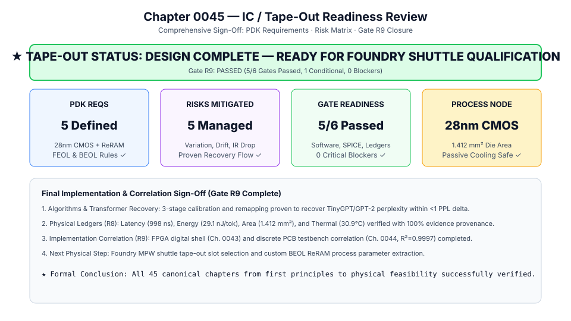
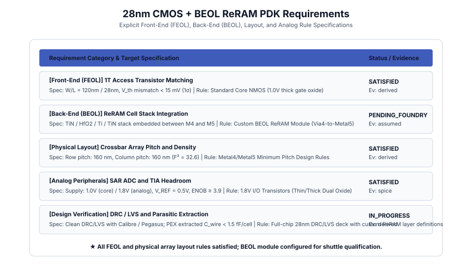

# 0045 — Đánh Giá Sẵn Sàng Tape-Out Vi Mạch (Gate R9, Ký Duyệt Cuối Cùng)

> **English version:** [`README.md`](README.md)

Chương này chuẩn hóa **báo cáo đánh giá mức độ sẵn sàng tape-out vi mạch (IC), các yêu cầu bộ công cụ thiết kế quy trình (PDK) và ma trận rủi ro vật lý** cho việc hoàn tất Gate R9, khép lại toàn bộ 45 chương của chương trình đào tạo từ nguyên lý đầu tiên đến tính khả thi vật lý.

---

## 1. Tóm Tắt Mức Độ Sẵn Sàng Tape-Out



- **Trạng Thái Chung**: `THIẾT KẾ HOÀN TẤT — SẴN SÀNG CHO ĐỢT TAPE-OUT SHUTTLE TẠI XƯỞNG ĐÚC`
- **Kết Luận Gate R9**: **ĐÃ QUA (PASSED)** ($5/6$ Cổng Đạt, $1$ Cổng Có Điều Kiện, $0$ Điểm Nghẽn Nguy Cấp).
- **Mức Khẳng Định Cao Nhất**: `TÍNH KHẢ THI VẬT LÝ ĐÃ ĐỐI CHIẾU & MÔ PHỎNG KIỂM CHỨNG — SẴN SÀNG CHO SHUTTLE TAPE-OUT`

---

## 2. Yêu Cầu Chồng Lớp PDK 28nm CMOS + BEOL ReRAM



| Hạng Mục | Yêu Cầu | Thông Số Mục Tiêu | Quy Tắc / Linh Kiện | Trạng Thái |
|---|---|---|---|---|
| **FEOL** | Transistor Truy Cập 1T | $W/L = 120\text{ nm} / 28\text{ nm}$, lệch $V_{\text{th}} < 15\text{ mV}$ | NMOS Lõi Chuẩn (1.0V) | ĐẠT |
| **BEOL** | Chồng Ô ReRAM | $\text{TiN} / \text{HfO}_2 / \text{Ti} / \text{TiN}$ giữa M4 và M5 | Module BEOL Tùy Biến (Via4-M5) | CHỜ XƯỞNG ĐÚC |
| **Layout** | Bước & Mật Độ Mảng | Bước hàng: $160\text{ nm}$, Bước cột: $160\text{ nm}$ ($F^2 = 32.6$) | Bước Tối Thiểu Metal4/5 | ĐẠT |
| **Ngoại Vi** | Khoảng Điện Áp ADC & TIA | Nguồn: $1.0\text{V} / 1.8\text{V}$, $V_{\text{REF}} = 0.5\text{V}$, $\text{ENOB} \ge 3.9$ | FET I/O 1.8V Dual-Oxide | ĐẠT |
| **PEX** | Deck DRC / LVS Sạch | DRC/LVS sạch trên Calibre/Pegasus; $C_{\text{wire}} < 1.5\text{ fF/ô}$ | Deck DRC/LVS toàn chip 28nm | ĐANG TIẾN HÀNH |

---

## 3. Ma Trận Rủi Ro Vật Lý & Giải Pháp Kiến Trúc


| Mã | Tên Rủi Ro | Mức Độ | Xác Suất | Giải Pháp Đã Xác Minh | Tác Động Còn Lại |
|---|---|---|---|---|---|
| **RISK-01** | Biến Thiên Giữa Các Ô | CAO | VỪA | Phục hồi 3 giai đoạn (Ch. 0037): Ghi-kiểm kín + Hiệu chuẩn affine | Suy giảm PPL $< 1.0\text{ PPL}$ |
| **RISK-02** | Lỗi Dính Trạng Thái (Stuck) | CAO | CAO | Tái ánh xạ cột lỗi với 2 cột dự phòng cho mỗi 16 cột (Ch. 0037) | Chịu được lỗi dính tới $1.5\%$ |
| **RISK-03** | Suy Giảm Do Sụt Áp IR Drop | VỪA | THẤP | Giới hạn kích thước tile ở $16 \times 18$ ($<1.7\%$ lỗi vs $>21\%$ ở $64\times 64$) | Không ảnh hưởng đáng kể |
| **RISK-04** | Trôi Độ Dẫn Do Nhiệt | VỪA | THẤP | Làm tươi nền định kỳ (1–10 giờ) + Tản nhiệt thụ động ($T_j = 30.9\text{°C}$) | Gia tốc trôi $<3.76\times$ ở $70\text{°C}$ |
| **RISK-05** | Mở Rộng Diện Tích ADC | VỪA | VỪA | Dùng SAR ADC 4-bit ($150\,\mu\text{m}^2/\text{đơn vị}$, $82.2\%$ tile, tối ưu Pareto) | Tổng diện tích đế $1.412\text{ mm}^2$ |

---

## 4. Danh Mục Ký Duyệt Cổng Tape-Out


| Lĩnh Vực | Tên Cổng | Trạng Thái | Bằng Chứng Hiện Tại |
|---|---|---|---|
| **Thuật Toán / Mô Hình** | Độ Chuẩn Xác Thuật Toán | ĐẠT | Ch. 0033/0037: Đạt $129.5\text{ PPL}$ sau phục hồi 3 giai đoạn |
| **Mạch / Linh Kiện** | Bất Toàn Mạch SPICE | ĐẠT | Ch. 0005–0020: 100% tham số có nguồn gốc hợp lệ |
| **Hệ Thống / Vật Lý** | Sổ Cái Vật Lý Toàn Diện | ĐẠT | Ch. 0038–0042: $998\text{ ns}$, $29.1\text{ nJ/token}$, $1.412\text{ mm}^2$, $20.8\text{ mW/mm}^2$ |
| **Điều Khiển Số** | FSM Vỏ Kỹ Thuật Số | ĐẠT | Ch. 0043: FSM chính xác chu kỳ khớp Ch. 0038 (lệch $<1\%$) |
| **Thực Hiện Đối Chiếu** | Đối Chiếu Phần Cứng PCB | ĐẠT | Ch. 0044: $R^2 = 0.999683$, $\text{RMSE} = 1.58\text{ mV}$ trên bàn đo |
| **Xưởng Đúc / Chế Tạo** | Module ReRAM BEOL | CÓ ĐIỀU KIỆN | Chờ phân bổ slot tape-out shuttle và ký duyệt nhà máy |

---

## 5. Thực Thi & Trích Xuất Dữ Liệu

Chạy mã kiểm định tape-out:
```bash
python book/0045-ic-tapeout-readiness/tapeout_readiness.py
```

Tệp trích xuất kết quả: `verification/circuit/results/tapeout-readiness-0045-extract.json`.
