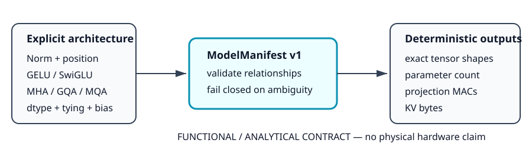

# 0046 — Manifest Mô Hình Độc Lập Kiến Trúc (Gate R10)

> **English version:** [`README.md`](README.md)

Chương này chuẩn hóa **manifest mô hình độc lập kiến trúc (`ModelManifest`)** cho các kiến trúc Transformer chỉ gồm decoder trong khuôn khổ **Gate R10 (Scalable model semantics & sharded checkpoints)**. Manifest thiết lập một hợp đồng chức năng fail-closed rõ ràng trước khi bộ nạp checkpoint, bộ quản lý bộ nhớ hoặc engine mô phỏng xử lý các tensor trọng số.

---

## 1. Schema Manifest Mô Hình & Luồng Hợp Đồng



- **Mục tiêu**: Cung cấp một nguồn chân lý duy nhất cho kích thước tensor, ràng buộc weight tying, normalization, mã hóa vị trí và nhóm attention mà không ép các kiến trúc khác theo quy ước ngầm định của GPT-2.
- **Cấp độ Tuyên bố**: `HỢP ĐỒNG PHẦN MỀM CHỨC NĂNG & GIẢI TÍCH` — chỉ mô tả ngữ nghĩa mô hình; không khẳng định về vị trí cư trú phần cứng hay gia tốc vật lý.
- **Bố cục Tensor Chuẩn tắc**: Tất cả các ma trận trọng số 2D được chuẩn hóa nghiêm ngặt theo định dạng `out_in` ($[\text{dim}_{\text{out}}, \text{dim}_{\text{in}}]$).

---

## 2. Ngữ Nghĩa Decoder Chuẩn Tắc

Phiên bản 1 của manifest quy định tường minh từng tham số cấu trúc:

| Chiều / Tiêu chí | Các Giá Trị Hỗ Trợ Tường Minh | Ràng Buộc Schema & Hành Vi |
|---|---|---|
| **Normalization** | `layernorm`, `rmsnorm` | `rmsnorm` vô hiệu hóa các vector bias cộng trên tất cả các layer |
| **Mã hóa Vị trí** | `learned`, `rope` | `rope` loại bỏ bảng embedding vị trí học được |
| **Kích hoạt MLP** | `gelu`, `swiglu` | `swiglu` bổ sung tường minh các tensor `mlp.gate_proj.weight` |
| **Cơ chế Attention** | `mha`, `gqa`, `mqa` | Bắt buộc tính chia hết của số head ($\text{num\_heads} \pmod{\text{kv\_heads}} == 0$) |
| **Bố cục Tensor** | `out_in` | Định dạng $[\text{out}, \text{in}]$ chuẩn của simulator; từ chối chuyển vị mơ hồ |
| **Ràng buộc Embedding** | `tied_embeddings` (`bool`) | Nếu `True`, loại bỏ `lm_head.weight` độc lập khỏi số lượng tham số |
| **Kiểu Dữ liệu Độ chính xác** | `float16`, `bfloat16`, `float32`, `float64` | Quyết định dung lượng byte giải tích của KV-cache |

---

## 3. Đánh Giá Các Tier & Tham Chiếu Tính Bằng Tay

### Mô Hình Kiểm Tra Bằng Tay ($V=5, H=4, L=1, \text{QH}=2, \text{KVH}=1, I=6, \text{ctx}=3$)
Mô hình tối thiểu tính được bằng tay (FP16, RMSNorm, RoPE, SwiGLU, MQA, tied embeddings) cung cấp chân lý xác định:
- **Số lượng Tham số**:
  $$\text{Embeddings } (5 \times 4 = 20) + \text{Hệ số Norm } (3 \times 4 = 12) + W_{Q,O} (2 \times 4 \times 4 = 32) + W_{K,V} (2 \times 2 \times 4 = 16) + W_{\text{up},\text{down},\text{gate}} (3 \times 6 \times 4 = 72) = \mathbf{152 \text{ tham số}}$$
- **MAC Projection Tĩnh**: $32 + 16 + 72 = \mathbf{120 \text{ MAC/layer/token}}$ (Attention token-token động là phép tính số và được theo dõi riêng).
- **Dung lượng Toàn bộ KV-Cache**: $3 \text{ token} \times 1 \text{ layer} \times 2 (\text{K/V}) \times 1 \text{ head} \times 2 \text{ giá trị} \times 2 \text{ byte} = \mathbf{24 \text{ byte}}$.

### Tổng Hợp Inventory Giải Tích Đa Tier

| Tier Benchmark | Thông Số Kiến Trúc | Số Tham Số | Layer Proj MAC | KV Cache Đầy Đủ | KV Cache Bước 1 |
|---|---|---|---|---|---|
| **Hand-Calc Validation** | $1\text{L}, 4\text{D}, 2\text{Q}/1\text{KV}, \text{ctx}=3$ | $152$ | $120$ | $24\text{ B}$ | $8\text{ B}$ |
| **T0 (TinyGPT Ref)** | $2\text{L}, 64\text{D}, 4\text{Q}/4\text{KV}, \text{ctx}=16$ | $109,312$ | $49,152$ | $16.0\text{ KB}$ | $1.0\text{ KB}$ |
| **T1 (Scalable 1B GQA)** | $16\text{L}, 2048\text{D}, 16\text{Q}/4\text{KV}, \text{ctx}=2048$ | $852,559,872$ | $45,088,768$ | $64.0\text{ MB}$ | $32.0\text{ KB}$ |
| **T2 (Scalable 7B GQA)** | $32\text{L}, 4096\text{D}, 32\text{Q}/8\text{KV}, \text{ctx}=4096$ | $5,933,109,248$ | $177,209,344$ | $512.0\text{ MB}$ | $128.0\text{ KB}$ |

---

## 4. Cơ Chế Bảo Vệ Fail-Closed

Manifest từ chối các cấu hình không hợp lệ hoặc mơ hồ ngay khi khởi tạo:
1. **Tính Chia Hết Của Head**: Từ chối nếu `hidden_size` không chia hết cho `num_attention_heads`, hoặc `num_attention_heads` không chia hết cho `num_key_value_heads`.
2. **Ràng Buộc Head Attention**: Từ chối MHA nếu $\text{KV} \neq \text{Q}$, MQA nếu $\text{KV} \neq 1$, và GQA nếu KV không nằm nghiêm ngặt giữa $1$ và $\text{Q}$.
3. **Kiểm Tra Inventory Chính Xác**: `validate_tensors()` yêu cầu khớp chính xác 1:1 tên và kích thước tensor. Mọi tensor thiếu hoặc thừa đều báo lỗi `ValueError`.
4. **Vượt Quá Ngữ Cảnh**: Từ chối truy vấn KV-cache cho các độ dài vượt quá `context_length`.

---

## 5. Thực Thi & Artifacts

Chạy script kiểm tra độc lập của chương:
```bash
python book/0046-model-manifest/model_manifest.py
```

Chạy bộ unit test:
```bash
pytest tests/test_model_manifest.py
```

File trích xuất artifact:
`verification/circuit/results/model-manifest-0046-extract.json`
