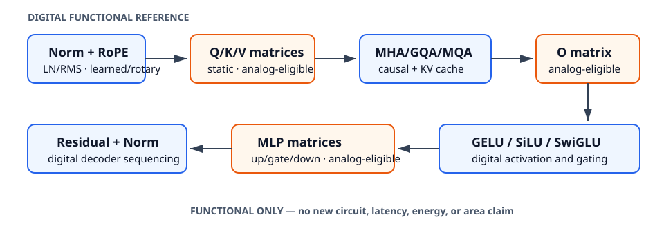

# 0047 — Reusable decoder primitives

This WP10.2 slice extracts architecture-neutral **functional** operations from
the TinyGPT reference while retaining GPT-2 behavior. It adds RMSNorm, RoPE,
SwiGLU, and grouped-query attention without changing the physical evidence from
R0–R9.



## Hybrid boundary

```text
static Q/K/V/O and MLP projection weights  → analog-eligible consumer boundary
normalization, RoPE, activation, attention → digital NumPy functional reference
```

`TinyGPT` now consumes the shared LayerNorm, GELU, causal-attention, and cached-
attention functions. Its static projection routing remains unchanged: the float
backend uses NumPy and the profile-driven consumer may route those matrices
through simulated crossbar tiles. This refactor is not physical acceleration.

## Tiny hand calculations

* RMSNorm of `[3,4]` uses `RMS²=(9+16)/2=12.5`, with a stated dimensionless
  epsilon of `1e-6`.
* A two-value RoPE vector `[1,0]` at position 1 rotates by one radian to
  `[cos(1), sin(1)]`; RoPE angles are dimensionless.
* `SwiGLU([0, ln(3)], [4,2]) = [0, 1.5 ln(3)]` because
  `sigmoid(ln(3))=3/4`.

## Attention and cache evidence

The common causal attention contract accepts Q `[tokens, query_heads, head_dim]`
and K/V `[tokens, kv_heads, head_dim]`. Repetition is explicit and requires query
heads to divide evenly into KV groups. Tests cover:

* MHA: four query heads and four KV heads;
* GQA: four query heads and two KV heads;
* MQA: four query heads and one KV head.

For each form, full-context output is compared with both a scalar-loop reference
and position-by-position KV-cache output. Invalid odd RoPE dimensions, unequal
SwiGLU shapes, and non-divisible attention groups fail closed.

Run `pytest tests/test_decoder_primitives.py tests/test_transformer.py
tests/test_kv_cache.py tests/test_tiny_transformer_parity.py` for deterministic
evidence. A later slice will assemble these operations into the complete
manifest-driven generalized decoder before WP10.2 is marked complete.
