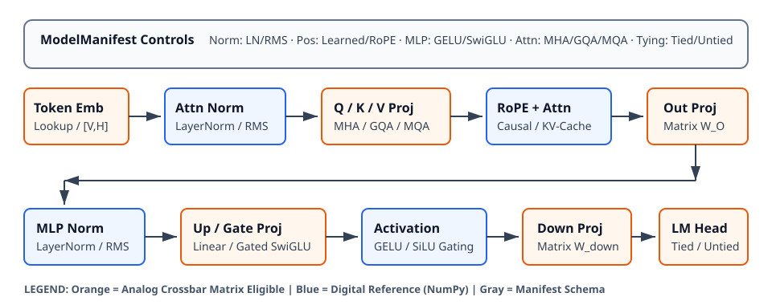

# 0048 — Generalized Decoder Functional Reference (Gate R10)

> **Bản tiếng Việt:** [`README.vi.md`](README.vi.md)

This chapter formalizes the **manifest-driven generalized decoder reference engine (`GeneralizedDecoder`)** for **Gate R10 (Scalable model semantics & sharded checkpoints)**. It unifies the schema contracts from Chapter 0046 ([`ModelManifest`](../0046-model-manifest/)) and mathematical primitives from Chapter 0047 ([`decoder_primitives`](../0047-decoder-primitives/)) into an architecture-neutral execution engine capable of evaluating modern decoder transformer variants (GPT-2 MHA, LLaMA GQA, Hand-Calc MQA) under strict float reference and profile-driven analog acceleration.

---

## 1. Generalized Decoder Architecture & Hybrid Compute Boundary



- **Manifest-Driven Configuration**: Dynamically configures normalization (`layernorm` / `rmsnorm`), position embeddings (`learned` / `rope`), activation functions (`gelu` / `swiglu`), attention mechanisms (`mha` / `gqa` / `mqa`), and weight tying without coercing modern models into legacy GPT-2 structures.
- **Strict Hybrid Compute Boundary**:
  - **Analog-Accelerated**: Dense linear projection weight matrices ($W_Q, W_K, W_V, W_O$ and $W_{\text{gate}}, W_{\text{up}}, W_{\text{down}}$, plus untied $W_{\text{head}}$) route through stationary crossbar tiles via [`Accelerator`](../../analog_llm/accelerator.py).
  - **Digital Functional Reference**: Normalization, RoPE coordinate rotations, nonlinear activations, softmax exponentiation, and dynamic token-token attention scaling remain explicitly digital in NumPy.
- **Claim Level**: `FUNCTIONAL & SOFTWARE REFERENCE` — establishes model parity and hybrid routing; does not prove large model hardware residency.

---

## 2. Supported Architecture Combinations

| Architecture Paradigm | Normalization | Positional Encoding | MLP Activation | Attention Mode | Embedding Tying |
|---|---|---|---|---|---|
| **GPT-2 Family** | LayerNorm (with bias) | Learned Table | GELU | MHA ($Q_H = KV_H$) | Tied / Untied |
| **LLaMA / Mistral** | RMSNorm (no bias) | RoPE (Rotary) | SwiGLU (Gated) | GQA ($1 < KV_H < Q_H$) | Untied |
| **Mobile / Hand-Calc** | RMSNorm (no bias) | RoPE (Rotary) | SwiGLU (Gated) | MQA ($KV_H = 1$) | Tied |

---

## 3. Parity Verification & KV-Cache Consistency

The engine implements both full-context forward pass (`forward_logits`) and incremental single-token cached decoding (`forward_step` / `generate_kvcache`):

| Model Benchmark | Architecture Configuration | Parameters | Full vs Cached Max Logit Delta | Greedy Token Parity |
|---|---|---|---|---|
| **Hand-Calc MQA** | $1\text{L}, 4\text{D}, 2\text{Q}/1\text{KV}$, RMSNorm, RoPE, SwiGLU | $152$ | $6.94 \times 10^{-18}$ | **MATCH** |
| **GPT-2 Style MHA** | $2\text{L}, 64\text{D}, 4\text{Q}/4\text{KV}$, LayerNorm, Learned, GELU | $109,312$ | $4.72 \times 10^{-16}$ | **MATCH** |
| **LLaMA Style GQA** | $2\text{L}, 64\text{D}, 4\text{Q}/2\text{KV}$, RMSNorm, RoPE, SwiGLU | $115,008$ | $2.78 \times 10^{-16}$ | **MATCH** |

*All architectures achieve machine-precision parity ($\Delta < 10^{-12}$) between full-sequence recompute and single-step KV-cache generation.*

---

## 4. Analog Tile Integration & Execution Ledger

When an [`Accelerator`](../../analog_llm/accelerator.py) instance is supplied, linear projections are partitioned across $16 \times 16$ crossbar tiles:
- **LLaMA-Style GQA Verification (3-token prompt)**:
  - **Analog MACs Executed**: $319,488\text{ MACs}$
  - **Tile Dimensions**: $16 \times 16$ crossbar tiles
  - **Ledger Parity**: All MVM passes physically counted and verified through the accelerator ledger.

---

## 5. Execution & Artifacts

Run the standalone chapter verification script:
```bash
python book/0048-generalized-decoder/generalized_decoder.py
```

Run test suite:
```bash
pytest tests/test_generalized_decoder.py
```

Deterministic extract artifact:
`verification/circuit/results/generalized-decoder-0048-extract.json`
