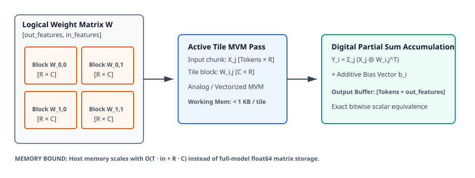

# 0049 — Thực Thi Tuyến Tính Dạng Block-Streamed & Giới Hạn Bộ Nhớ (Gate R11)

> **English version:** [`README.md`](README.md)

Chương này chuẩn hóa **phương thức thực thi tuyến tính dạng block-streamed và giới hạn bộ nhớ host** trong khuôn khổ **Gate R11 (Memory-bounded large-model simulator)**. Cơ chế này thay thế việc chuyển vị ma trận toàn thể $\text{float64}$ và sao chép mảng tốn kém trước đây bằng kỹ thuật streaming theo khối tile bảo toàn dtype, khớp trực tiếp với kiến trúc phân vùng phần cứng crossbar vật lý ($16 \times 16$).

---

## 1. Kiến Trúc Block-Streamed & Phân Vùng Tile



- **Streaming Theo Khối Tile**: Các ma trận trọng số projection lớn $W \in \mathbb{R}^{\text{out} \times \text{in}}$ được chia thành các khối con $(R \times C)$ độc lập $W_{i,j}$ (mặc định $16 \times 16$), khớp với biên crossbar tile vật lý.
- **Bảo Toàn Kiểu Dữ Liệu**: Trọng số được giữ nguyên ở độ chính xác gốc ($\text{float16}, \text{bfloat16}$) trong quá trình streaming mà không cần cấp phát các bản sao $\text{float64}$ hàng gigabyte.
- **Biên Lai Ghép Nghiêm Ngặt**:
  - Các phép tính MVM trên từng khối tile được thực thi trên tile analog cố định (qua [`Accelerator`](../../analog_llm/accelerator.py)) hoặc qua kernel số vector hóa.
  - Phép tích lũy partial sum qua các khối hàng ($\sum_j X_j W_{i,j}^T$) và cộng bias được thực hiện bằng số.

---

## 2. Công Thức Toán Học & Tích Lũy Partial Sum

Với ma trận kích hoạt đầu vào $X \in \mathbb{R}^{T \times \text{in}}$ được chia thành các lát cột $X_j \in \mathbb{R}^{T \times R}$ và ma trận trọng số $W \in \mathbb{R}^{\text{out} \times \text{in}}$ được chia thành các khối $(C \times R)$ $W_{i,j}$:

$$Y_i = \sum_{j=0}^{N_{\text{row}}-1} X_j W_{i,j}^T + b_i$$

- **Tính Tương Đương Tuyệt Đối**: Tích lũy block-streamed đạt độ chính xác máy tính ($\Delta < 10^{-12}$) so với phép nhân ma trận - vector nguyên khối.
- **Xử Lý Biên Kích Thước**: Các chiều không chia hết cho kích thước tile được đệm số 0 tự động đến biên $(R \times C)$ và cắt bỏ phần đệm tại bước tích lũy số.

---

## 3. Giới Hạn Bộ Nhớ Khả Dụng & Phân Tích Đa Tier

Mô phỏng nguyên khối truyền thống chuyển toàn bộ ma trận sang $\text{float64}$ ($8\text{ byte/tham số}$). Thực thi block-streamed giới hạn bộ nhớ làm việc đỉnh của host theo công thức:

$$M_{\text{peak}} = (R \cdot C \cdot \text{dtype\_bytes}) + (T \cdot \text{in} \cdot 8) + (T \cdot \text{out} \cdot 8)$$

| Benchmark Projection | Kích Thước ($[\text{out}, \text{in}]$) | Số Khối Tile ($16 \times 16$) | Bộ Nhớ FP64 Nguyên Khối | Bộ Nhớ Streamed Làm Việc | Hệ Số Giảm Bộ Nhớ |
|---|---|---|---|---|---|
| **Hand-Calc ($2 \times 2$)** | $4 \times 6$ | $6$ | $192\text{ B}$ | $88\text{ B}$ | **$2.2\times$** |
| **T0 (TinyGPT Proj)** | $64 \times 64$ | $16$ | $32.0\text{ KB}$ | $1.5\text{ KB}$ | **$21.3\times$** |
| **T1 (1B Attention Proj)** | $2048 \times 2048$ | $16,384$ | $32.0\text{ MB}$ | $32.5\text{ KB}$ | **$1,008.2\times$** |
| **T2 (7B Attention Proj)** | $4096 \times 4096$ | $65,536$ | $128.0\text{ MB}$ | $64.5\text{ KB}$ | **$2,032.1\times$** |

*Với các projection của mô hình lớn (T1/T2), thực thi block-streamed giảm bộ nhớ làm việc đỉnh hơn $1000\times$ trong quá trình giải mã autoregressive đơn token.*

---

## 4. Mở Rộng Giữa Prefill Theo Lô và Giải Mã Đơn Token

- **Giải Mã Đơn Token ($T=1$)**: Bộ nhớ đỉnh bị chi phối bởi dung lượng một khối tile ($R \cdot C \cdot \text{dtype\_bytes} \approx 512\text{ B}$), đảm bảo mức chiếm dụng RSS của tiến trình ở mức tối thiểu.
- **Prefill Theo Lô ($T=16\dots 64$)**: Bộ nhớ tăng tuyến tính theo chiều dài ngữ cảnh ($O(T \cdot (\text{in} + \text{out}))$), trong khi việc nạp trọng số vẫn được giới hạn nghiêm ngặt tại một khối tile tại một thời điểm.

---

## 5. Thực Thi & Artifacts

Chạy script kiểm tra độc lập của chương:
```bash
python book/0049-block-streamed-execution/block_streamed_execution.py
```

Chạy bộ unit test:
```bash
pytest tests/test_block_stream.py
```

File trích xuất artifact:
`verification/circuit/results/block-streamed-0049-extract.json`
