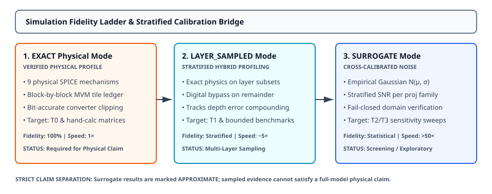

# 0050 — Mô Hình Thay Thế Thống Kê Cho Phi Lý Tưởng (Gate R11)

> **English version:** [`README.md`](README.md)

Chương này chuẩn hóa **các chế độ đánh giá phi lý tưởng có khả năng mở rộng và mô hình thay thế (surrogate) thống kê được hiệu chuẩn** trong khuôn khổ **Gate R11 (Memory-bounded large-model simulator)**. Chương thiết lập một hệ thống phân tầng mô phỏng 3 cấp độ rõ ràng (`EXACT`, `LAYER_SAMPLED`, `STATISTICAL_SURROGATE`), được hiệu chuẩn chéo với mô phỏng tile vật lý để hỗ trợ đánh giá nhanh, giới hạn bộ nhớ cho các mô hình hàng tỷ tham số mà không gây nhầm lẫn giữa mô hình thống kê xấp xỉ và gia tốc phần cứng vật lý.

---

## 1. Phân Tầng Độ Trung Thực Mô Phỏng & Phân Loại Chế Độ



| Chế Độ Đánh Giá | Nhãn Xuất Xứ (Provenance) | Độ Trung Thực Vật Lý | Tốc Độ Tăng Tốc | Đối Tượng Áp Dụng |
|---|---|---|---|---|
| **`EXACT`** | `VERIFIED PHYSICAL` | $100\%$ (Đầy đủ 9 cơ chế vật lý trên tile $16 \times 16$) | $1.0\times$ | T0 & kiểm tra ma trận nhỏ |
| **`LAYER_SAMPLED`** | `SAMPLED HYBRID` | Phân tầng (Mô phỏng chính xác trên tập con $L \in \{0, L/2, L-1\}$, bỏ qua bằng float ở phần còn lại) | $\approx 4\text{--}8\times$ | T1 & nghiên cứu lan truyền sai số qua các layer sâu |
| **`STATISTICAL_SURROGATE`** | `APPROXIMATE STATISTICAL` | Nhiễu Gaussian thực nghiệm $\mathcal{N}(\mu, \sigma^2)$ được hiệu chuẩn theo từng họ projection | $>50\times$ | T2/T3 sàng lọc nhanh thăm dò |

*Quy tắc: Bộ mô phỏng phân định nghiêm ngặt giữa mô phỏng vật lý và xấp xỉ thống kê. Các kết quả surrogate hoặc lấy mẫu không bao giờ được báo cáo là gia tốc vật lý đã kiểm chứng.*

---

## 2. Phương Pháp Hiệu Chuẩn Phân Tầng

Các tham số surrogate được trích xuất bằng cách quét thực thi tile vật lý qua các bộ benchmark projection:
- **Thống Kê Nhiễu**: Sai số trung bình $\mu_{\text{err}} = \mathbb{E}[y_{\text{exact}} - y_{\text{float}}]$, độ lệch chuẩn $\sigma_{\text{err}} = \text{std}(y_{\text{exact}} - y_{\text{float}})$.
- **Tỷ Lệ Tín Hiệu Trên Nhiễu (SNR)**:
  $$\text{SNR}_{\text{dB}} = 10 \log_{10}\left(\frac{\mathbb{E}[y_{\text{float}}^2]}{\mathbb{E}[(y_{\text{exact}} - y_{\text{float}})^2]}\right)$$
- **Sai Số $L_2$ Tương Đối**:
  $$\text{Rel } L_2 (\%) = \frac{\sqrt{\text{MSE}}}{\text{RMS}(y_{\text{float}})} \times 100$$

---

## 3. Hồ Sơ Hiệu Chuẩn Phân Tầng Theo Họ Projection

Được hiệu chuẩn trên tile crossbar $16 \times 16$ với DAC/ADC 8-bit, sai số lập trình tương đối ($\sigma_{\text{prog}}=1.5\%$), nhiễu đọc ($\sigma_{\text{read}}=0.8\%$), và nhiễu Gaussian của ADC ($\sigma_{\text{adc}}=0.5\%$):

| Họ Projection | Sai Số Trung Bình ($\mu$) | Độ Lệch Chuẩn ($\sigma$) | SNR (dB) | Sai Số $L_2$ Tương Đối | Giới Hạn $W_{\text{max}}$ |
|---|---|---|---|---|---|
| **`attention.q_proj`** | $-6.45 \times 10^{-4}$ | $3.71 \times 10^{-2}$ | $32.90\text{ dB}$ | $2.26\%$ | $0.40$ |
| **`attention.k_proj`** | $-6.45 \times 10^{-4}$ | $3.71 \times 10^{-2}$ | $32.90\text{ dB}$ | $2.26\%$ | $0.40$ |
| **`attention.v_proj`** | $-6.45 \times 10^{-4}$ | $3.71 \times 10^{-2}$ | $32.90\text{ dB}$ | $2.26\%$ | $0.40$ |
| **`attention.out_proj`** | $-8.44 \times 10^{-4}$ | $4.13 \times 10^{-2}$ | $31.81\text{ dB}$ | $2.57\%$ | $0.40$ |
| **`mlp.gate_proj`** | $+4.11 \times 10^{-5}$ | $3.63 \times 10^{-2}$ | $33.00\text{ dB}$ | $2.24\%$ | $0.40$ |
| **`mlp.up_proj`** | $-1.26 \times 10^{-3}$ | $3.83 \times 10^{-2}$ | $32.17\text{ dB}$ | $2.46\%$ | $0.40$ |
| **`mlp.down_proj`** | $+4.11 \times 10^{-5}$ | $3.63 \times 10^{-2}$ | $33.00\text{ dB}$ | $2.24\%$ | $0.40$ |

---

## 4. Cơ Chế Bảo Vệ Fail-Closed & Ranh Giới Miền Giá Trị

Bộ đánh giá surrogate áp dụng các ràng buộc fail-closed nghiêm ngặt trước khi thêm nhiễu:
1. **Ranh Giới Biên Độ Trọng Số**: Từ chối đánh giá nếu $\max(|W|) > 1.5 \times W_{\text{calibrated\_max}}$ nhằm tránh ngoại suy ra ngoài vùng dẫn tuyến tính.
2. **Khớp Hình Học Tile**: Báo lỗi nếu phân vùng tile đánh giá (ví dụ $16 \times 16$) sai khác với kích thước tile của hồ sơ hiệu chuẩn.
3. **Gắn Nhãn Tường Minh**: Mọi kết quả đầu ra đều mang nhãn `is_physical_simulation` (`bool`) và `mode_description` để tránh việc gán nhầm xuất xứ.

---

## 5. Thực Thi & Artifacts

Chạy script hiệu chuẩn và kiểm tra độc lập của chương:
```bash
python book/0050-nonideality-surrogates/nonideality_surrogates.py
```

Chạy bộ unit test:
```bash
pytest tests/test_surrogate.py
```

File trích xuất artifact:
`verification/circuit/results/nonideality-surrogates-0050-extract.json`
